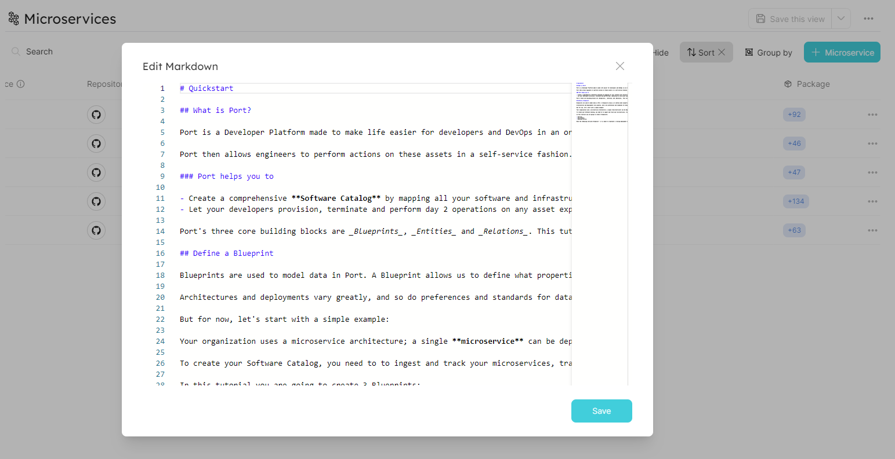

# Markdown

With Port, you can import and display [Markdown](https://en.wikipedia.org/wiki/Markdown) files as tabs.

By using the combination of `"type": "string` and `"format": "markdown"` in a [Blueprint property](../port-components/blueprint.md#blueprint-properties), Port will format and display the markdown text in the [Specific Entity Page](../port-components/page.md#entity-page).

## Definition in Blueprint

```json showLineNumbers
{
  "title": "Markdown Property",
  "type": "string",
  "format": "markdown",
  "description": "A Markdown property"
}
```

## Example

Here is how the Markdown tab in the Specific Entity Page appears when markdown text is provided:



