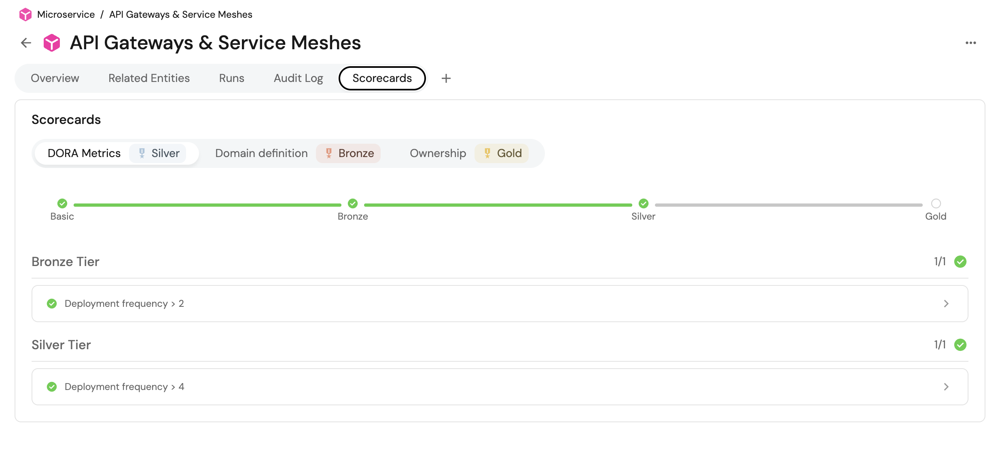
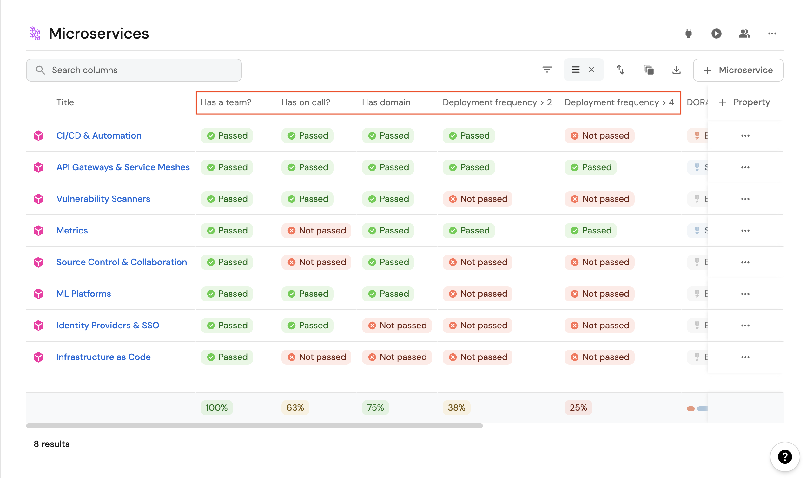

import CombinatorIntro from "/docs/search-and-query/\_combinator_intro.md"
import PortTooltip from "/src/components/tooltip/tooltip.jsx"

import Tabs from "@theme/Tabs"
import TabItem from "@theme/TabItem"

# Promote scorecards

## What is a Scorecard?

**Scorecards** enable us to define and track metrics/standards for our Port entities, based on their properties.
Each scorecard consists of a set of rules, where each rule defines one or more conditions that need to be met.

Each rule has a `level` property whose value can be defined per to the way you define standards in your organization,
for example:

- Service maturity can be defined as `Basic`, `Bronze`, `Silver`, `Gold`.
- Security standards can be defined as `Low`, `Medium`, `High`, `Critical`.
- Production readiness can be defined as traffic light colors `Red`, `Orange`, `Yellow`, `Green`.
- Engineering quality can be defined as `Poor`, `Fair`, `Good`, `Excellent`.
- Service response time can be defined as `A`, `B`, `C`, `D`, `F`.

## 💡 Scorecard use cases

Scorecards can be used to evaluate the maturity, production readiness and engineering quality of any entity in your software catalog, for example:

- Does a service have an on-call defined?
- Does a README.md file exist in the repository?
- Is Grafana defined for the K8s cluster?
- Is the relation of a certain entity empty?

In this [live demo](https://demo.getport.io/serviceEntity?identifier=authentication&activeTab=1) example, you can see the scorecards defined on a service and their evaluation. 🎬

## Scorecard structure table

A single scorecard defines a category to group different checks, validations and evaluations. Here is the structure of a single scorecard:

| Field                        | Type     | Description                                                                                                                                         |
|------------------------------|----------|-----------------------------------------------------------------------------------------------------------------------------------------------------|
| `title`                      | `String` | Scorecard name that will be shown in the UI                                                                                                         |
| `identifier`                 | `String` | The unique identifier of the `Scorecard`. The identifier is used for API calls, programmatic access and distinguishing between different scorecards |
| [`filter`](#filter-elements) | `Object` | Optional set of [conditions](#conditions) to filter entities that will be evaluated by the scorecard                                                |
| [`levels`](#levels)          | `Array`  | The levels that we define for the scorecard, for example `Basic`, `Bronze`, `Silver`, `Gold`                                                        |
| [`rules`](#rule-elements)    | `Object` | The rules that we create for each scorecard to determine its level                                                                                  |

A scorecard contains and groups multiple rules that are relevant to its specific category, for example a scorecard for _service maturity_ can contain 3 rules, while the _production readiness_ scorecard can contain 2 completely different rules.

## Levels

Levels are the different stages that an entity can be in, according to the rules that it passes.  
By default, the levels are: `Basic`, `Bronze`, `Silver`, `Gold`.

The levels can be customized according to your organization's standards and with the colors that you prefer.


<br/><br/>

Here is an example of a few level types that can be defined:

:::tip Level Hierarchy 
The levels are defined in the order of importance, where the first level is the most basic level and the last level is the most advanced.  
The basic level is the default level for all entities.  

If the entity didn't pass any rule, it will be at the `Basic` level, and thus can't have a rule associated with it.
:::


<Tabs queryString="Levels" defaultValue="Default">

<TabItem value="Default">
```json showLineNumbers
{
  "identifier": "Ownership",
  "title": "Ownership",
  # highlight-start
  "levels": [
    {
      "color": "paleBlue",
      "title": "Basic"
    },
    {
      "color": "bronze",
      "title": "Bronze"
    },
    {
      "color": "silver",
      "title": "Silver"
    },
    {
      "color": "gold",
      "title": "Gold"
    }
  ],
	# highlight-end
  "rules": [
    {
      "identifier": "has-resp-team",
      "title": "Has responsible team",
      "description": "The service has a designated responsible team assigned, ensuring clear ownership and accountability for the service's development, maintenance, and support, promoting effective collaboration, timely issue resolution, and efficient decision-making.",
      "level": "Bronze",
      "query": {
        "combinator": "and",
        "conditions": [
          {
            "operator": "isNotEmpty",
            "property": "$team"
          }
        ]
      }
    }
  ]
}
```
</TabItem>


<TabItem value="Custom">
```json
{
  "identifier": "monitoringMaturity",
  "title": "Monitoring Maturity",
  # highlight-start
  "levels": [
    {
      "color": "paleBlue",
      "title": "low"
    },
    {
      "color": "bronze",
      "title": "medium"
    },
    {
      "color": "gold",
      "title": "high"
    }
  ],
	# highlight-end
  "rules": []
}
```

</TabItem>

<TabItem value="Traffic Light">
```json
{
  "identifier": "ProductionReadiness",
  "title": "Production Readiness",
	# highlight-start
  "levels": [
    {
      "color": "red",
      "title": "Red"
    },
    {
      "color": "orange",
      "title": "Orange"
    },
    {
      "color": "yellow",
      "title": "Yellow"
    },
    {
      "color": "green",
      "title": "Green"
    }
  ],
	# highlight-end
  "rules": []
}
```

</TabItem>

</Tabs>

## Rule elements

Rules enable you to generate checks inside a scorecard only for entities and properties.

A scorecard rule is a single evaluation consisting of multiple checks, each rule has a level which directly translates to how important it is for the check to pass (the more basic the check, the lower its level):

| Field         | Type     | Description                                                                                                                                                   |
|---------------|----------|---------------------------------------------------------------------------------------------------------------------------------------------------------------|
| `title`       | `String` | `Rule` name that will be shown in the UI                                                                                                                      |
| `description` | `String` | Description that will be shown in the UI when the rule is expanded. Value that contains markdown is also supported and will be displayed in a markdown format |
| `identifier`  | `String` | The unique identifier of the `Rule`                                                                                                                           |
| `level`       | `String` | One of the levels defined in the scorecard [levels key](#levels)                                                                                              |
| `query`       | `Object` | The query is built from a [`combinator`](#combinator) (or / and) and an array of [`conditions`](#conditions)                                                  |

### Combinator

<CombinatorIntro />

<Tabs groupId="combinators" defaultValue="and" values={[
{label: "And", value: "and"},
{label: "Or", value: "or"}
]}>

<TabItem value="and">

```json showLineNumbers
{
  // highlight-next-line
  "combinator": "and",
  "conditions": [
    {
      "operator": "isNotEmpty",
      "property": "on_call"
    },
    {
      "operator": "<",
      "property": "open_incidents",
      "value": 5
    }
  ]
}
```

</TabItem>

<TabItem value="or">

```json showLineNumbers
{
  // highlight-next-line
  "combinator": "or",
  "conditions": [
    {
      "operator": "isNotEmpty",
      "property": "on_call"
    },
    {
      "operator": "<",
      "property": "open_incidents",
      "value": 5
    }
  ]
}
```

</TabItem>

</Tabs>

### Conditions

Conditions are small boolean checks that help when determining the final status of a `query` according to the specified [`combinator`](#combinator):

| Field      | Description                                                                                                                                                                                                                                                                                                                                                                                                                                                                                                                                                                                                              |
|------------|--------------------------------------------------------------------------------------------------------------------------------------------------------------------------------------------------------------------------------------------------------------------------------------------------------------------------------------------------------------------------------------------------------------------------------------------------------------------------------------------------------------------------------------------------------------------------------------------------------------------------|
| `operator` | Search operator to use when evaluating this rule, for example `=`, `!=`, `contains`, `doesNotContains`, `isEmpty`, `isNotEmpty` (see all available operators below)                                                                                                                                                                                                                                                                                                                                                                                                                                                                                    |
| `property` | Property to filter by according to its value. It can be a [meta-property](/build-your-software-catalog/customize-integrations/configure-data-model/setup-blueprint/properties/meta-properties.md) such as `$identifier`, or any other standard entity property such as `slack_channel` including [Mirror Properties](/build-your-software-catalog/customize-integrations/configure-data-model/setup-blueprint/properties/mirror-property) and [Calculation Properties](/build-your-software-catalog/customize-integrations/configure-data-model/setup-blueprint/properties/calculation-property/calculation-property.md) |
| `value`    | Value to compare to (not required in isEmpty and isNotEmpty operators)                                                                                                                                                                                                                                                                                                                                                                                                                                                                                                                                                   |

#### Available operators

| Operator            | Supported Types                                  | Description                                                           |
|---------------------|--------------------------------------------------|-----------------------------------------------------------------------|
| `=`                 | `String`, `Number`, `Boolean`                    | checks if the rule value is equal to the entity value                 |
| `!=`                | `String`, `Number`, `Boolean`                    | checks if the rule value is not equal to the entity value             |
| `<=`                | `Number`                                         | checks if the rule value is less than or equal to the entity value    |
| `>=`                | `Number`                                         | checks if the rule value is greater than or equal to the entity value |
| `<`                 | `Number`                                         | checks if the rule value is less than the entity value                |
| `>`                 | `Number`                                         | checks if the rule value is greater than the entity value             |
| `contains`          | `String`, `Number`                               | checks if the rule value is contained within the entity value         |
| `containsAny`       | `Array`                                          | checks if any of the specified strings exist in the target array      |
| `doesNotContains`   | `String`, `Number`                               | checks if the rule value is not contained within the entity value     |
| `endsWith`          | `String`, `Number`                               | checks if the rule value ends with the entity value                   |
| `doesNotEndsWith`   | `String`, `Number`                               | checks if the rule value does not end with the entity value           |
| `beginsWith`        | `String`, `Number`                               | checks if the rule value begins with the entity value                 |
| `doesNotBeginsWith` | `String`, `Number`                               | checks if the rule value does not begin with the entity value         |
| `isEmpty`           | `String`, `Number`, `Boolean`, `Array`, `Object` | checks if the rule value is an empty string, array, or object         |
| `isNotEmpty`        | `String`, `Number`, `Boolean`, `Array`, `Object` | checks if the rule value is not an empty string, array, or object     |

## Scorecard total level calculation

A Scorecard is built from several rules, and each one of them has a `level` property.

Each scorecard has a set of levels, for example

```json
{
  "levels": [
    {
      "color": "paleBlue",
      "title": "Basic"
    },
    {
      "color": "bronze",
      "title": "Bronze"
    },
    {
      "color": "silver",
      "title": "Silver"
    },
    {
      "color": "gold",
      "title": "Gold"
    }
  ]
}
```

An entity **always** starts at the **`Basic`** level of the scorecard, and it can progress to higher levels by passing the rules of each level.

Once an entity passes all the rules for a certain level, its level changes accordingly, for example:

1. An entity starts at level `Basic`.
2. It has two rules with level `Bronze`.
3. Once the entity passes those two rules, its level would be `Bronze`.
4. It has four rules with level `Silver`.
5. Once the entity passes those four rules (and the rules from `Bronze` level), its level would be `Silver`.

:::note multiple rules scenario
In the example listed above, let's assume the entity passes just one of the two `Bronze` rules, but it passes all of
the `Silver` rules. The `level` of the scorecard will still be `Basic`, because not all `Bronze` rules have been
satisfied.
:::

## Filter elements

Filters allow you to apply scorecard checks only for entities that meet certain criteria.

Filters follow the same querying structure as [rules](#rule-elements).

A scorecard filter is used to make sure only relevant entities are evaluated, only entities that the filter evaluates to `true` on will have the specified rule checked:

| Field                       | Description                                               |
|-----------------------------|-----------------------------------------------------------|
| [`combinator`](#combinator) | Defines the logical operation to apply to the query rules |
| [`conditions`](#conditions) | An array of boolean conditions to filter entities with    |

## Scorecard UI indications

After configuring scorecards for the blueprint, each entity created from it will have a `Scorecards` tab in
its [entity page](/customize-pages-dashboards-and-plugins/page/entity-page), detailing the different checks and their results:



Additionally, the [catalog page](/customize-pages-dashboards-and-plugins/page/catalog-page) of each blueprint will automatically have a column for each scorecard rule.  
For example, this `service` blueprint has 4 rules configured, and we can see a column for each of them in the catalog:



### Customizing views

You can use table operations (sort, edit, group-by, etc.) to create various helpful views of your scorecards.  
For example, here are the scores of all `Services` in an organization grouped by team:


Note that every column (scorecard metric) in the table has an aggregation in the bottom, hover over it to see the compliance of this metric across all entities in the table.

### Rule result summaries

Scorecard rules are automatically added as columns in the relevant catalog page, and each such column is summarized on the bottom.  
For example, these services have some rules defined in their scorecards, and we can see that:

- 100% of `Team Batman's` services have an on-call defined, but only 67% of them have a PR cycle time shorter than 1500
	minutes.
- The bottom of the table contains an aggregation of the results of each rule for all services (across all teams). 11
	out of 18 services in total have a build success rate that is higher than 70%.


## Define a scorecard

Scorecards can be created by three methods:

-   Port's UI (see below)
-   [Port's API](/api-reference/port-api)
-   [Terraform](../../build-your-software-catalog/custom-integration/iac/terraform/)

**From the UI**

To create a scorecard from the UI:

1. Go to your [Data model](https://app.getport.io/settings/data-model) page of your portal.
2. Expand the relevant blueprint, and click on the `Scorecards` tab.
3. Click on the `+ New scorecard` button, then follow the steps below:
   - In the first tab (`Basic Details`), specify the scorecard's basic information:
     - `title` - The scorecard's title.
     - `identifier` - The scorecard's identifier.
     - `Blueprint` - Set to the blueprint you selected.
     - `Filter` - 
   - In the second tab (`Rules`), specify the scorecard's rules:
     - Add [rule elements](/#rule-elements) to each [level](#levels), you can also edit the level names or add more levels.
4. Click `Save` to create the scorecard.

**Scorecard JSON structure**

If you prefer, you can create the scorecard in a JSON form.  
Click on the `{...} Edit JSON` button in the top right corner of the scorecard creation form. An editor window will open with the current JSON array of the defined Scorecards. Since there is no Scorecard configured on the Blueprint at the moment, the `scorecard` arrays will be empty.  

Paste the following content inside the editor to create the scorecards of this example:

<details>
<summary><b>JSON create example (click to expand)</b></summary>

  ```json showLineNumbers
  [
    {
      "identifier": "Ownership",
      "title": "Ownership",
      "rules": [
        {
          "identifier": "hasSlackChannel",
          "title": "Has Slack Channel",
          "level": "Silver",
          "query": {
            "combinator": "and",
            "conditions": [
              {
                "operator": "isNotEmpty",
                  "property": "slackChannel"
              }
            ]
          }
        },
        {
          "identifier": "hasTeam",
          "title": "Has Team",
          "level": "Bronze",
          "query": {
            "combinator": "and",
            "conditions": [
              {
                "operator": "isNotEmpty",
                "property": "$team"
              }
            ]
          }
        }
      ]
    }
  ]
  ```
</details>

**From Terraform**

In order to create a scorecard from the [Terraform provider](../../build-your-software-catalog/custom-integration/iac/terraform/) , you will need to use the `port_scorecard` resource.

Here is an example of how to create an Ownership scorecard with the Terraform provider:

<details>
<summary><b>Terraform create example (click to expand)</b></summary>

    ```hcl showLineNumbers
    resource "port_scorecard" "ownership" {
      blueprint = "microservice"
      identifier = "Ownership"
      title = "Ownership"
      rules = [
        {
          identifier = "hasSlackChannel"
          title = "Has Slack Channel"
          level = "Silver"
          query = {
            combinator = "and"
            conditions = [
              jsonencode({
                operator = "isNotEmpty"
                property = "slackChannel"
              })
            ]
          }
        },
        {
          identifier = "hasTeam"
          title = "Has Team"
          level = "Bronze"
          query = {
            combinator = "and"
            conditions = [
              jsonencode({
                operator = "isNotEmpty"
                property = "$team"
              })
            ]
          }
        }
      ]
    }
    ```
</details>

### Update Scorecards

To update Scorecards, we can use the same URL and payload we have used before with the `id` that the backend generated for that scorecard.

And just as we have shown earlier in the tutorial, you can update a Scorecard from the UI or from the API.

**From the UI**

In order to update a Scorecard from the UI, go to the DevPortal Builder page, expand the desired blue print, and switch to the Scorecards tab.

An editor window will open with the current scorecards of the Blueprint. In order to update the Scorecard, change the wanted scorecard within the scorecards array, click on `save` at the bottom right corner of the editor and view the updated Scorecards.

**From Terraform**

In order to update a scorecard with the Terraform provider, you will need to run the `terraform apply -target=port_scorecard.<resourceId>` command with the updated scorecard resource.

### Delete Scorecards

:::danger
A Scorecard cannot be restored after deletion!
:::

You can delete Scorecards through the UI or the API:

**From the UI**

To delete a Scorecard through the UI, go to the Builder page, expand the Blueprint and switch to the Scorecards tab. Hover the desired Scorecard and select "Delete Scorecard" from the three dot menu.

**From Terraform**

In order to delete a scorecard using the Terraform provider, use the `terraform destroy -target=port_scorecard.<resourceId>` command with the scorecard resource you want to delete. (remember that it is also possible to remove the definition of the `port_scorecard` resource from the `.tf` file and run `terraform apply`)

## Next steps

[Dive into advanced operations on Scorecards with our API ➡️ ](/api-reference/port-api)

## Scorecards as Blueprints

Port allows you to manage scorecards as <PortTooltip id="blueprint">blueprints</PortTooltip>.   
This feature enables you to create and manage scorecards using dedicated blueprints, allowing for rich customization, visualization and automation of your scorecards.  

To learn more, refer to the [scorecards as blueprints](/promote-scorecards/scorecards-as-blueprints) page.