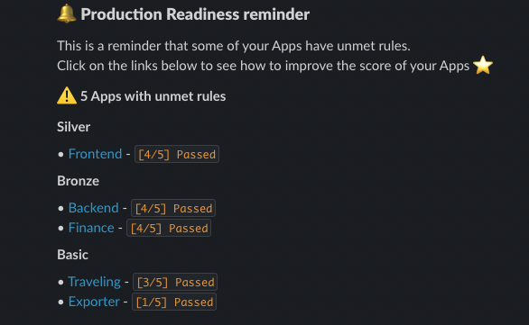
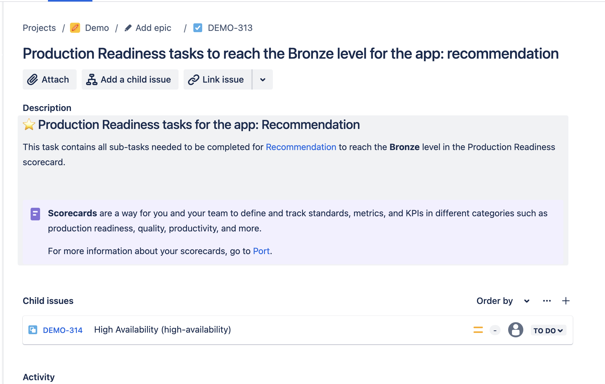
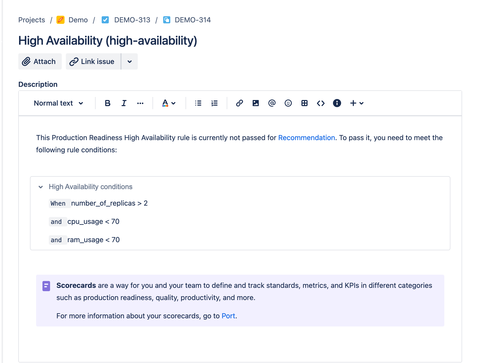

# Initiate Scorecards completion

Your developer portal contains valuable data about your entities, including their compliance with your standards (using scorecards or initiatives). For example, you can easily determine the production readiness (scorecard) of a microservice (an entity).

The [Port slack sender](https://github.com/marketplace/actions/port-message-sender) will allow you to automatically create Jira issues , send reports and reminders with regard to initiatives or scorecards, letting managers and developers know what standards need to be met that are relevant to them.

## Slack Scorecard Report Example

## Slack Scorecard Reminder Example

Head to the Port sender Slack section [action page](https://github.com/marketplace/actions/port-message-sender#send-scorecard-reminder) to learn more about the integration and how to use it.

## Syncing Jira issues

For every scorecard level that is not completed, creating a Jira task will be created and Subtasks for the level rules.

Head to the Port sender Jira section [action page](https://github.com/marketplace/actions/port-message-sender#manage-scorecards-with-jira-issues) to learn more about the integration and how to use it.

### Created task example

### Created subtasks example

