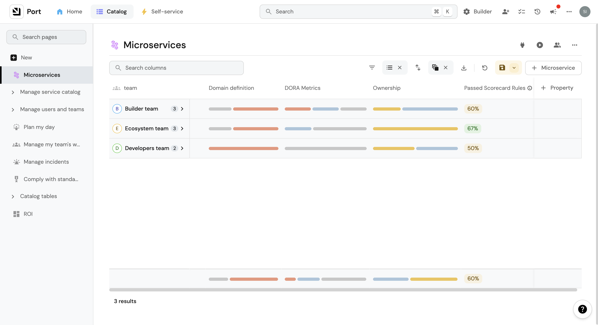

import CombinatorIntro from "/docs/search-and-query/\_combinator_intro.md"
import PortTooltip from "/src/components/tooltip/tooltip.jsx"

import Tabs from "@theme/Tabs"
import TabItem from "@theme/TabItem"

# Promote scorecards

## What is a Scorecard?

**Scorecards** enable us to define and track metrics/standards for our Port entities, based on their properties.
Each scorecard consists of a set of rules, where each rule defines one or more conditions that need to be met.

Each rule has a `level` property whose value can be defined per to the way you define standards in your organization,
for example:

- Service maturity can be defined as `Basic`, `Bronze`, `Silver`, `Gold`.
- Security standards can be defined as `Low`, `Medium`, `High`, `Critical`.
- Production readiness can be defined as traffic light colors `Red`, `Orange`, `Yellow`, `Green`.
- Engineering quality can be defined as `Poor`, `Fair`, `Good`, `Excellent`.
- Service response time can be defined as `A`, `B`, `C`, `D`, `F`.

## 💡 Scorecard use cases

Scorecards can be used to evaluate the maturity, production readiness and engineering quality of any entity in your software catalog, for example:

- Does a service have an on-call defined?
- Does a README.md file exist in the repository?
- Is Grafana defined for the K8s cluster?
- Is the relation of a certain entity empty?

In this [live demo](https://demo.getport.io/serviceEntity?identifier=authentication&activeTab=1) example, you can see the scorecards defined on a service and their evaluation. 🎬

## Scorecard structure table

A single scorecard defines a category to group different checks, validations and evaluations. Here is the structure of a single scorecard:

| Field                        | Type     | Description                                                                                                                                         |
|------------------------------|----------|-----------------------------------------------------------------------------------------------------------------------------------------------------|
| `title`                      | `String` | Scorecard name that will be shown in the UI                                                                                                         |
| `identifier`                 | `String` | The unique identifier of the `Scorecard`. The identifier is used for API calls, programmatic access and distinguishing between different scorecards |
| [`filter`](#filter-elements) | `Object` | Optional set of [conditions](#conditions) to filter entities that will be evaluated by the scorecard                                                |
| [`levels`](#levels)          | `Array`  | The levels that we define for the scorecard, for example `Basic`, `Bronze`, `Silver`, `Gold`                                                        |
| [`rules`](#rule-elements)    | `Object` | The rules that we create for each scorecard to determine its level                                                                                  |

A scorecard contains and groups multiple rules that are relevant to its specific category, for example a scorecard for _service maturity_ can contain 3 rules, while the _production readiness_ scorecard can contain 2 completely different rules.

## Levels

Levels are the different stages that an entity can be in, according to the rules that it passes.  
By default, the levels are: `Basic`, `Bronze`, `Silver`, `Gold`.

The levels can be customized according to your organization's standards and with the colors that you prefer.


<br/><br/>

Here is an example of a few level types that can be defined:

:::tip Level Hierarchy 
The levels are defined in the order of importance, where the first level is the most basic level and the last level is the most advanced.  
The basic level is the default level for all entities.  

If the entity didn't pass any rule, it will be at the `Basic` level, and thus can't have a rule associated with it.
:::


<Tabs queryString="Levels" defaultValue="Default">

<TabItem value="Default">
```json showLineNumbers
{
  "identifier": "Ownership",
  "title": "Ownership",
  # highlight-start
  "levels": [
    {
      "color": "paleBlue",
      "title": "Basic"
    },
    {
      "color": "bronze",
      "title": "Bronze"
    },
    {
      "color": "silver",
      "title": "Silver"
    },
    {
      "color": "gold",
      "title": "Gold"
    }
  ],
	# highlight-end
  "rules": [
    {
      "identifier": "has-resp-team",
      "title": "Has responsible team",
      "description": "The service has a designated responsible team assigned, ensuring clear ownership and accountability for the service's development, maintenance, and support, promoting effective collaboration, timely issue resolution, and efficient decision-making.",
      "level": "Bronze",
      "query": {
        "combinator": "and",
        "conditions": [
          {
            "operator": "isNotEmpty",
            "property": "$team"
          }
        ]
      }
    }
  ]
}
```
</TabItem>


<TabItem value="Custom">
```json
{
  "identifier": "monitoringMaturity",
  "title": "Monitoring Maturity",
  # highlight-start
  "levels": [
    {
      "color": "paleBlue",
      "title": "low"
    },
    {
      "color": "bronze",
      "title": "medium"
    },
    {
      "color": "gold",
      "title": "high"
    }
  ],
	# highlight-end
  "rules": []
}
```

</TabItem>

<TabItem value="Traffic Light">
```json
{
  "identifier": "ProductionReadiness",
  "title": "Production Readiness",
	# highlight-start
  "levels": [
    {
      "color": "red",
      "title": "Red"
    },
    {
      "color": "orange",
      "title": "Orange"
    },
    {
      "color": "yellow",
      "title": "Yellow"
    },
    {
      "color": "green",
      "title": "Green"
    }
  ],
	# highlight-end
  "rules": []
}
```

</TabItem>

</Tabs>

## Rule elements

Rules enable you to generate checks inside a scorecard only for entities and properties.

A scorecard rule is a single evaluation consisting of multiple checks, each rule has a level which directly translates to how important it is for the check to pass (the more basic the check, the lower its level):

| Field         | Type     | Description                                                                                                                                                   |
|---------------|----------|---------------------------------------------------------------------------------------------------------------------------------------------------------------|
| `title`       | `String` | `Rule` name that will be shown in the UI                                                                                                                      |
| `description` | `String` | Description that will be shown in the UI when the rule is expanded. Value that contains markdown is also supported and will be displayed in a markdown format |
| `identifier`  | `String` | The unique identifier of the `Rule`                                                                                                                           |
| `level`       | `String` | One of the levels defined in the scorecard [levels key](#levels)                                                                                              |
| `query`       | `Object` | The query is built from a [`combinator`](#combinator) (or / and) and an array of [`conditions`](#conditions)                                                  |

### Combinator

<CombinatorIntro />

<Tabs groupId="combinators" defaultValue="and" values={[
{label: "And", value: "and"},
{label: "Or", value: "or"}
]}>

<TabItem value="and">

```json showLineNumbers
{
  // highlight-next-line
  "combinator": "and",
  "conditions": [
    {
      "operator": "isNotEmpty",
      "property": "on_call"
    },
    {
      "operator": "<",
      "property": "open_incidents",
      "value": 5
    }
  ]
}
```

</TabItem>

<TabItem value="or">

```json showLineNumbers
{
  // highlight-next-line
  "combinator": "or",
  "conditions": [
    {
      "operator": "isNotEmpty",
      "property": "on_call"
    },
    {
      "operator": "<",
      "property": "open_incidents",
      "value": 5
    }
  ]
}
```

</TabItem>

</Tabs>

### Conditions

Conditions are small boolean checks that help when determining the final status of a `query` according to the specified [`combinator`](#combinator):

| Field      | Description                                                                                                                                                                                                                                                                                                                                                                                                                                                                                                                                                                                                              |
|------------|--------------------------------------------------------------------------------------------------------------------------------------------------------------------------------------------------------------------------------------------------------------------------------------------------------------------------------------------------------------------------------------------------------------------------------------------------------------------------------------------------------------------------------------------------------------------------------------------------------------------------|
| `operator` | Search operator to use when evaluating this rule, for example `=`, `!=`, `contains`, `doesNotContains`, `isEmpty`, `isNotEmpty` below                                                                                                                                                                                                                                                                                                                                                                                                                                                                                    |
| `property` | Property to filter by according to its value. It can be a [meta-property](/build-your-software-catalog/customize-integrations/configure-data-model/setup-blueprint/properties/meta-properties.md) such as `$identifier`, or any other standard entity property such as `slack_channel` including [Mirror Properties](/build-your-software-catalog/customize-integrations/configure-data-model/setup-blueprint/properties/mirror-property) and [Calculation Properties](/build-your-software-catalog/customize-integrations/configure-data-model/setup-blueprint/properties/calculation-property/calculation-property.md) |
| `value`    | Value to compare to (not required in isEmpty and isNotEmpty operators)                                                                                                                                                                                                                                                                                                                                                                                                                                                                                                                                                   |

#### Available operators

| Operator            | Supported Types                                  | Description                                                           |
|---------------------|--------------------------------------------------|-----------------------------------------------------------------------|
| `=`                 | `String`, `Number`, `Boolean`                    | checks if the rule value is equal to the entity value                 |
| `!=`                | `String`, `Number`, `Boolean`                    | checks if the rule value is not equal to the entity value             |
| `<=`                | `String`, `Number`                               | checks if the rule value is less than or equal to the entity value    |
| `>=`                | `String`, `Number`                               | checks if the rule value is greater than or equal to the entity value |
| `<`                 | `String`, `Number`                               | checks if the rule value is less than the entity value                |
| `>`                 | `String`, `Number`                               | checks if the rule value is greater than the entity value             |
| `contains`          | `String`, `Number`                               | checks if the rule value is contained within the entity value         |
| `containsAny`       | `Array`                                          | checks if any of the specified strings exist in the target array      |
| `doesNotContains`   | `String`, `Number`                               | checks if the rule value is not contained within the entity value     |
| `endsWith`          | `String`, `Number`                               | checks if the rule value ends with the entity value                   |
| `doesNotEndsWith`   | `String`, `Number`                               | checks if the rule value does not end with the entity value           |
| `beginsWith`        | `String`, `Number`                               | checks if the rule value begins with the entity value                 |
| `doesNotBeginsWith` | `String`, `Number`                               | checks if the rule value does not begin with the entity value         |
| `isEmpty`           | `String`, `Number`, `Boolean`, `Array`, `Object` | checks if the rule value is an empty string, array, or object         |
| `isNotEmpty`        | `String`, `Number`, `Boolean`, `Array`, `Object` | checks if the rule value is not an empty string, array, or object     |

## Scorecard total level calculation

A Scorecard is built from several rules, and each one of them has a `level` property.

Each scorecard has a set of levels, for example

```json
{
  "levels": [
    {
      "color": "paleBlue",
      "title": "Basic"
    },
    {
      "color": "bronze",
      "title": "Bronze"
    },
    {
      "color": "silver",
      "title": "Silver"
    },
    {
      "color": "gold",
      "title": "Gold"
    }
  ]
}
```

An entity **always** starts at the **`Basic`** level of the scorecard, and it can progress to higher levels by passing the rules of each level.

Once an entity passes all the rules for a certain level, its level changes accordingly, for example:

1. An entity starts at level `Basic`;
2. It has two rules with level `Bronze`;
3. Once the entity passes those two rules, its level would be `Bronze`;
4. It has four rules with level `Silver`;
5. Once the entity passes those four rules (and the rules from `Bronze` level), its level would be `Silver`;
6. etc.

:::note multiple rules scenario
In the example listed above, let's assume the entity passes just one of the two `Bronze` rules, but it passes all of
the `Silver` rules. The `level` of the scorecard will still be `Basic`, because not all `Bronze` rules have been
satisfied.
:::

## Filter elements

Filters allow you to apply scorecard checks only for entities that meet certain criteria.

Filters follow the same querying structure as [rules](#rule-elements).

A scorecard filter is used to make sure only relevant entities are evaluated, only entities that the filter evaluates to `true` on will have the specified rule checked:

| Field                       | Description                                               |
|-----------------------------|-----------------------------------------------------------|
| [`combinator`](#combinator) | Defines the logical operation to apply to the query rules |
| [`conditions`](#conditions) | An array of boolean conditions to filter entities with    |

## Scorecard UI indications

After configuring scorecards for the blueprint, each entity created from it will have a `Scorecards` tab in
its [entity page](/customize-pages-dashboards-and-plugins/page/entity-page), detailing the different checks and their results:


Additionally, the [catalog page](/customize-pages-dashboards-and-plugins/page/catalog-page) of each blueprint will automatically have a column for each scorecard rule.  
For example, this `service` blueprint has 4 rules configured, and we can see a column for each of them in the catalog:


### Customizing views

You can use table operations (sort, edit, group-by, etc.) to create various helpful views of your scorecards.  
For example, here are the scores of all `Services` in an organization grouped by team:



Note that every column (scorecard metric) in the table has an aggregation in the bottom, hover over it to see the compliance of this metric across all entities in the table.

### Rule result summaries

Scorecard rules are automatically added as columns in the relevant catalog page, and each such column is summarized on the bottom.  
For example, these services have some rules defined in their scorecards, and we can see that:

- 100% of `Team Batman's` services have an on-call defined, but only 67% of them have a PR cycle time shorter than 1500
	minutes.
- The bottom of the table contains an aggregation of the results of each rule for all services (across all teams). 11
	out of 18 services in total have a build success rate that is higher than 70%.


## Next steps

[Explore How to Create, Edit, and Delete Scorecards with basic examples](/promote-scorecards/usage)

[Dive into advanced operations on Scorecards with our API ➡️ ](/api-reference/port-api)

## Scorecards as Blueprints

:::info Closed beta feature
This capability is currently in closed beta, and is not yet generally available.  
If you would like to join the beta, please reach out to us.
:::

Port allows you to manage scorecards as <PortTooltip id="blueprint">blueprints</PortTooltip>. This feature enables you to create and manage scorecards that evaluate entities in your data model based on customizable rules and levels.

### Why manage scorecards as blueprints?

With this powerful feature you can accomplish the following:

1. **RBAC Management**
   - Control who can create and modify scorecards and rules.
   - Define which teams can view specific scorecard results.
   - Manage permissions for rule creation and modification at a granular level.

2. **Automations and Actions**
   - Create workflows that trigger based on rule results.
   - Set up automated notifications when entities change compliance levels.
   - Build self-service actions to remediate failed rules.
   - Integrate with external systems to sync scorecard data.

3. **Reports and Dashboards**
   - Build custom dashboards to visualize compliance across your organization.
   - Track progress of entities through different levels.
   - Generate reports on rule effectiveness and entity compliance.
   - Monitor trends in rule results over time.

### Overview

After enabling `scorecards as blueprints`, three new blueprints will be created in your [data model](https://app.getport.io/settings/data-model):
- `Scorecard` - Represents a collection of rules and levels for evaluating entities.
- `Rule` - Defines specific criteria for evaluation.
- `Rule Result` - Stores the evaluation results for each entity.

### Blueprint Structure

<Tabs groupId="scorecard-blueprint-structure" queryString values={[
{label: "Scorecard", value: "scorecard"},
{label: "Rule", value: "rule"},
{label: "Rule Result", value: "rule-result"},
]}>

<TabItem value="scorecard">

The `Scorecard` blueprint contains the following properties:
| Name | Type | Description |
|------|------|-------------|
| Blueprint | string (format: blueprints) | The target blueprint whose entities will be evaluated |
| Levels | array of objects | An array of levels with titles and colors (e.g., Bronze, Silver, Gold) |
| Filter | object | Optional query to filter which entities should be evaluated |
| Rules Tested | number ([aggregation](/build-your-software-catalog/customize-integrations/configure-data-model/setup-blueprint/properties/aggregation-property)) | Number of rule evaluations performed |
| Rules Passed | number ([aggregation](/build-your-software-catalog/customize-integrations/configure-data-model/setup-blueprint/properties/aggregation-property)) | Number of successful rule evaluations |
| % of Rules Passed | number ([calculation](/build-your-software-catalog/customize-integrations/configure-data-model/setup-blueprint/properties/calculation-property)) | Calculated percentage of passed rules |

Relations:
| Name | Target Blueprint | Required | Many | Description |
|------|-----------------|----------|-------|-------------|
| - | - | - | - | No default relations |

</TabItem>

<TabItem value="rule">

The `Rule` blueprint contains the following properties:
| Name | Type | Description |
|------|------|-------------|
| Level | string (enum) | The required level for this rule (must be one of the scorecard's defined levels) |
| Query | object | The evaluation criteria for entities |
| Rule Description | string | Optional explanation of the rule's logic |
| Entities Tested | number ([aggregation](/build-your-software-catalog/customize-integrations/configure-data-model/setup-blueprint/properties/aggregation-property)) | Number of entities evaluated by this rule |
| Entities Passed | number ([aggregation](/build-your-software-catalog/customize-integrations/configure-data-model/setup-blueprint/properties/aggregation-property)) | Number of entities that passed this rule |
| % of Entities Passed | number ([calculation](/build-your-software-catalog/customize-integrations/configure-data-model/setup-blueprint/properties/calculation-property)) | Calculated percentage of passed entities |

Relations:
| Name | Target Blueprint | Required | Many | Description |
|------|-----------------|----------|-------|-------------|
| scorecard | Scorecard | true | false | The scorecard this rule belongs to |

</TabItem>

<TabItem value="rule-result">

The `Rule result` blueprint contains the following properties:
| Name | Type | Description |
|------|------|-------------|
| Result | string (enum) | Whether the entity passed the rule ("Passed" or "Not passed") |
| Entity | string | The identifier of the evaluated entity |
| Result Last Change | string (date-time) | Timestamp of the last result change |
| Level | string (mirror) | Mirror property from the related rule |
| Scorecard | string (mirror) | Mirror property showing the parent scorecard title |
| Blueprint | string (mirror) | Mirror property showing the target blueprint |
| Entity Link | string (url) | Calculated URL to the evaluated entity |

Relations:
| Name | Target Blueprint | Required | Many | Description |
|------|-----------------|----------|-------|-------------|
| rule | Rule | true | false | The rule that generated this result |
| [Blueprint Identifier] | [Dynamic] | false | false | Automatically created relation to the target blueprint when a new scorecard is created |

:::info Dynamic Relations
When a new scorecard is created, Port automatically creates a relation in the Rule Result blueprint to the scorecard's target blueprint. For example, if you create a scorecard for the "service" blueprint, a new relation named "service" will be added to the Rule Result blueprint.
:::

</TabItem>
</Tabs>

### Important Notes

1. The scorecard blueprints are protected and their core structure cannot be modified:
   - Default properties cannot be changed or deleted.
   - Required relations cannot be modified.
   - The blueprints themselves cannot be deleted.

2. You can extend the blueprints with:
   - New properties.
   - New non-required relations.
   - Additional configurations that don't affect the core functionality.

3. Rule Results are automatically generated and managed by Port:
   - They cannot be created, deleted, or modified directly.
   - You can update the custom properties you created for the rule results.
   - Rule results are not searchable in the global search.
   - They are updated automatically when rules are evaluated.

### Validation Rules

The system enforces several validation rules to maintain data integrity:

1. Rule levels must match one of the levels defined in their parent scorecard.
2. Scorecard blueprint built-in relations cannot be renamed or modified.
3. Rule results maintain immutable core properties while allowing updates to custom properties.