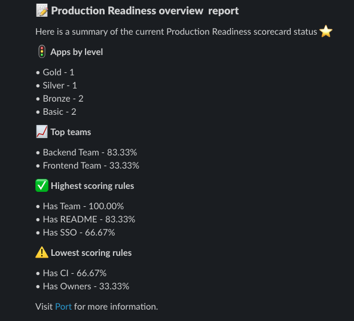

# Slack Notifications

The Slack Notifications integration allows you to send notifications to your Slack workspace.

The [Port slack sender](https://github.com/marketplace/actions/port-message-sender) helps you to keep your teams up to date with the initiatives you are promoting in your organization.

Head to the Port slack sender [action page](https://github.com/marketplace/actions/port-message-sender) to learn more about the integration and how to use it.
