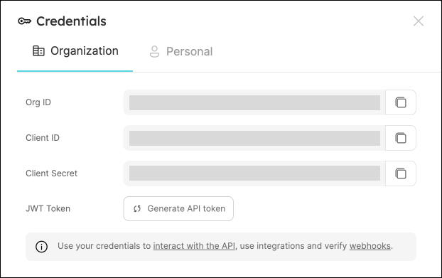
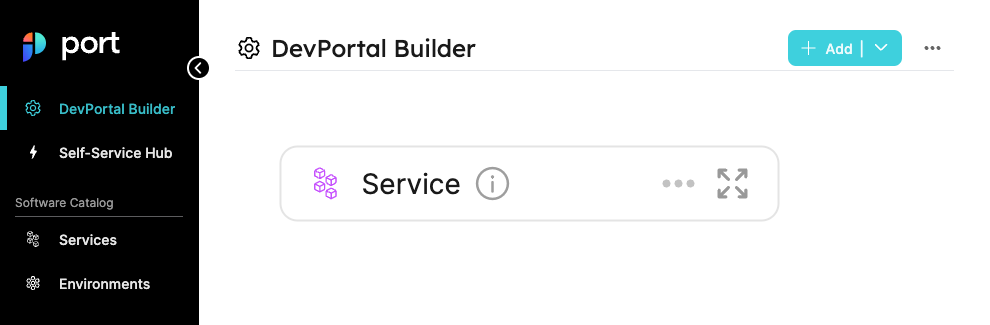
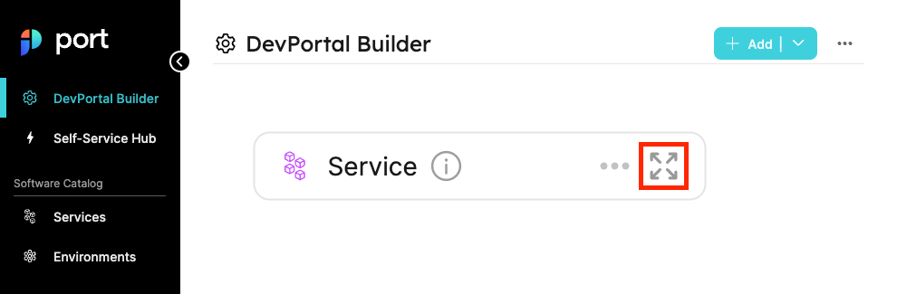
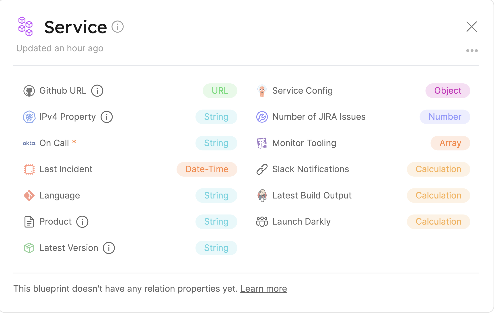
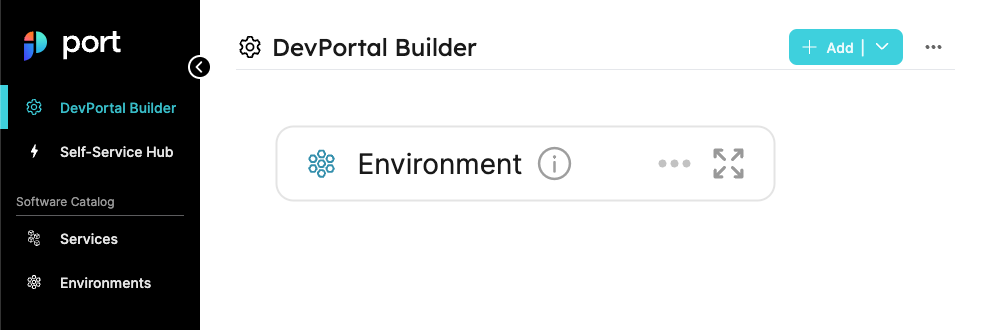
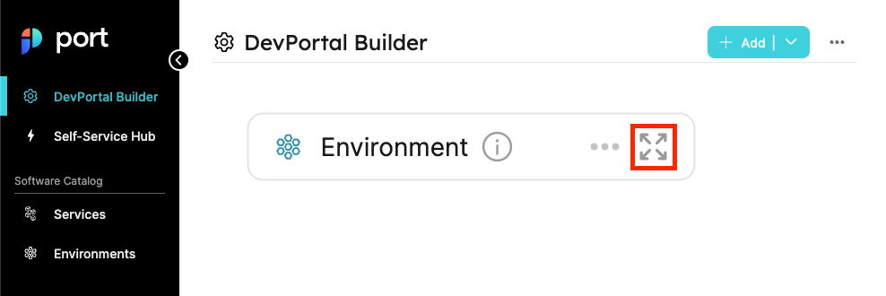
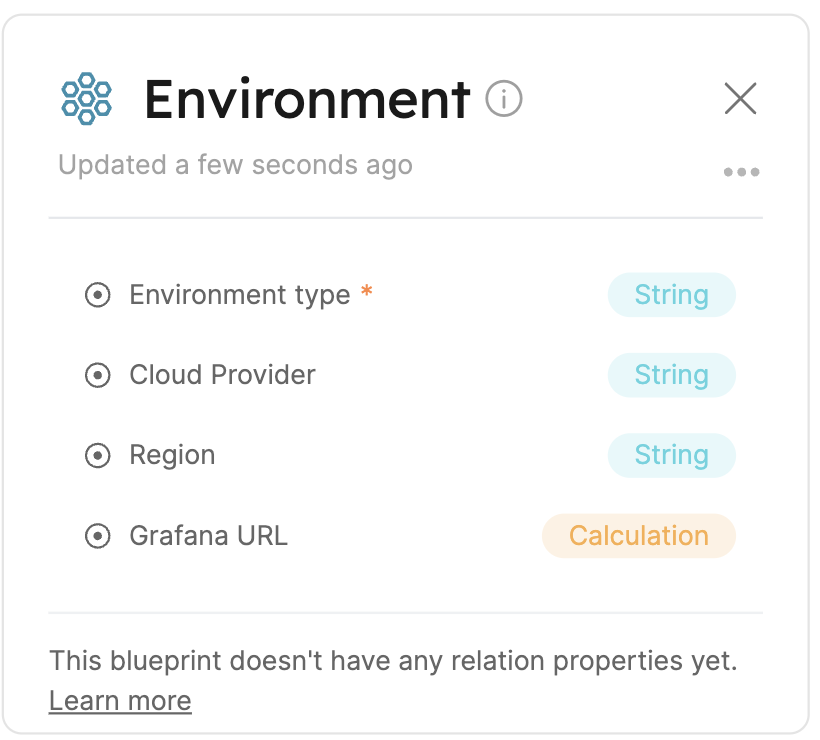
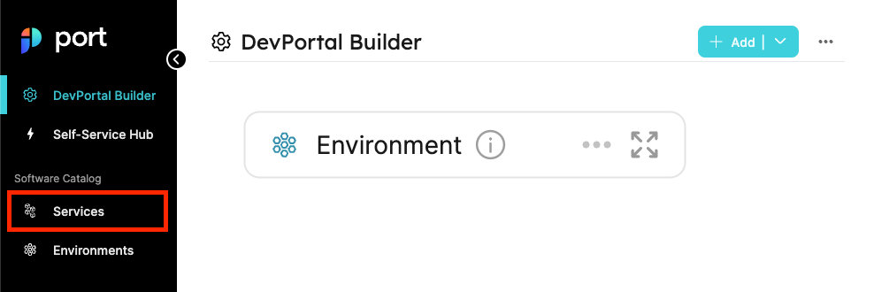
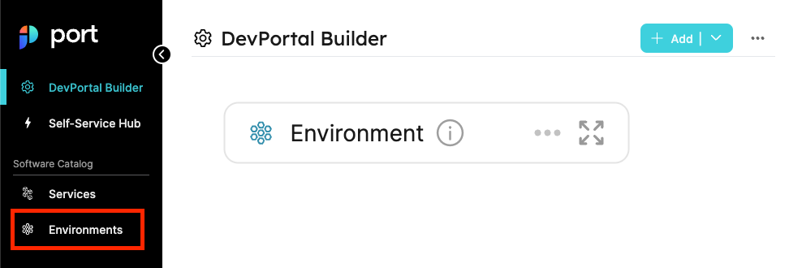

# Quickstart

## What is Port?

Port is a Developer Platform made to make life easier for developers and DevOps in an organization, by creating a single platform that acts as a single source-of-truth for all of the infrastructure assets and operations existing in the organization's tech stack.

Port then allows engineers to perform actions on these assets in a self-service fashion. From provisioning a dev environment, understanding who is the owner of a microservice, or any unique use case DevOps want to self-serve and automate.

### Port helps you to

- Create a comprehensive **Software Catalog** by mapping all your software and infrastructure components in one place: microservices, monoliths, deployments, repos, databases, and more.
- Let your developers provision, terminate and perform day 2 operations on any asset exposed (microservice or not) in your catalog, within the policies and guardrails you’ve set, ensuring unified standards and governance over the processes inside your organization.


Port's three core building blocks are _Blueprints_, _Entities_ and _Relations_. This tutorial will walk you through your first steps on the platform and get you started on your Developer Portal journey!🚢

## The goal of this tutorial

The goal of this tutorial is:

- Teach you about Port's core components;
- Familiarize you with Port's web UI;
- View functional code snippets to interact with Port's API;
- Experience the power of Port as an internal developer platform.

This guide will give you a foundation to start building your software catalog in Port and view a complete image of your software infrastructure.

Your developers will be able to see all the services in a given environment and their status:


In addition, your developers will be able to see all the environments that a specific microservice is deployed at, and which version is deployed where:


Let's get started! 🚢

## Define a Blueprint

Blueprints are used to model data in Port. A Blueprint allows us to define what properties and fields an _Entity_ will contain.

Architectures and deployments vary greatly, and so do preferences and standards for data representation and asset structure. Therefore, in Port, You have full control of the way data is presented using any data format you desire, so that the Software Catalog truly represents all you need for the developer portal.

But for now, let's start with a simple example:

Your organization uses a microservice architecture; a single **microservice** can be deployed to multiple **environments** (production, staging, QA, etc.).

To create your Software Catalog, you need to to ingest and track your microservices, track your existing environments, and map out which microservice is deployed at which environment.

In this tutorial you are going to create 3 Blueprints:

- Service;
- Environment;
- Running service.

Note the **Running service** Blueprint - it is meant to represent a running deployment of your **service** in one of your **environments**.

:::tip
In this tutorial, we will demonstrate how to perform every step using Port's web UI and Port's REST API.

This tutorial includes various examples of ways to interact with Port's API. For more, you are welcome to visit the [API section](./software-catalog/blueprint/tutorial.md#from-the-api) in [Blueprint basics](./software-catalog/blueprint/tutorial.md).

Port also has a [GitHub app](./exporters/github-exporter) and a [Terraform provider](./api-providers/terraform.md) you can use to ingest data and interact with Port's components.

For readability, snippets to copy and paste and examples will be inside collapsed boxes:

<details>
<summary>Example JSON block</summary>

```json showLineNumbers
{
  "foo": "bar"
}
```

</details>

<details>
<summary>Example code block</summary>

```python showLineNumbers
print("hello world!")
```

</details>

:::

### Service Blueprint

Our service Blueprint is going to include the following properties (among others):

- **Github URL** - link to the GitHub repository of the microservice;
- **On Call** - current on-call developer;
- **Last Incident** - last time an incident occurred in the microservice;
- **Language** - main programming language used for the microservice;
- **Product** - business unit category of the microservice;
- **Latest Version** - latest version of the microservice;
- **Number of JIRA issues** - number of currently open JIRA issues;
- **Slack notifications** - URL to the Slack Channel of the team responsible for the microservice.

:::tip
Don't worry if you want to add/remove properties, you can always go back and re-edit them later.
:::

In addition, the `on-call` field is marked as `required`, so that we always know who is the current on-call for the service.

#### From the UI

Let's head to [Port](https://app.getport.io/blueprints) and look at the Blueprints page, at the top right corner let's click on **Add Blueprint** and configure our first Blueprint - **Service** as shown in the image below:


After clicking the button, you will see a creation form as shown below:


:::note
When you click on `Add Blueprint`, you will see a template for a `microservice` Blueprint which is identical to the one you will create. So you can just click `save` and skip to [Environment Blueprint](#environment-blueprint).
:::

In order to create the service Blueprint, use the following JSON body:

<details>
<summary>Service Blueprint JSON</summary>

```json showLineNumbers
{
  "identifier": "microservice",
  "description": "This blueprint represents service in our software catalog",
  "title": "Service",
  "icon": "Microservice",
  "schema": {
    "properties": {
      "on-call": {
        "type": "string",
        "icon": "Okta",
        "title": "On Call",
        "format": "email",
        "default": "develoepr@getport.io"
      },
      "language": {
        "type": "string",
        "icon": "Git",
        "title": "Language",
        "default": "Node",
        "enum": ["GO", "Python", "Node"],
        "enumColors": {
          "GO": "red",
          "Python": "green",
          "Node": "blue"
        }
      },
      "number-of-open-jira-issues": {
        "type": "number",
        "icon": "DevopsTool",
        "title": "Number of JIRA Issues",
        "default": 42
      },
      "product": {
        "title": "Product",
        "type": "string",
        "icon": "Docs",
        "default": "Analytics",
        "enum": ["SaaS", "Control Panel", "Analytics"],
        "description": "Choose product unit related to the service"
      },
      "url": {
        "type": "string",
        "title": "Github URL",
        "icon": "Github",
        "format": "url",
        "default": "https://git.com",
        "description": "the link to the repo in our github"
      },
      "config": {
        "title": "Service Config",
        "type": "object",
        "icon": "Argo",
        "default": {
          "foo": "bar"
        }
      },
      "monitor-links": {
        "title": "Monitor Tooling",
        "type": "array",
        "icon": "Datadog",
        "items": {
          "type": "string",
          "format": "url"
        },
        "default": [
          "https://grafana.com",
          "https://prometheus.com",
          "https://datadog.com"
        ]
      },
      "last-incident": {
        "icon": "CPU",
        "type": "string",
        "title": "Last Incident",
        "format": "date-time",
        "default": "2022-04-18T11:44:15.345Z"
      },
      "version": {
        "type": "string",
        "icon": "Package",
        "title": "Latest Version",
        "pattern": "[a-zA-Z0-9.]",
        "description": "A property that supports values specified by a regex pattern",
        "default": "Port1337"
      },
      "ip": {
        "title": "IPv4 Property",
        "icon": "Cluster",
        "type": "string",
        "format": "ipv4",
        "description": "An IPv4 property",
        "default": "127.0.0.1"
      }
    },
    "required": ["on-call"]
  },
  "mirrorProperties": {},
  "calculationProperties": {
    "slack-notifications": {
      "title": "Slack Notifications",
      "icon": "Link",
      "calculation": "'https://slack.com/' + .identifier",
      "type": "string",
      "format": "url"
    },
    "latest-build-output": {
      "title": "Latest Build Output",
      "icon": "Jenkins",
      "calculation": ".properties.url + '/' + .properties.version",
      "type": "string",
      "format": "url"
    },
    "launch-darkly": {
      "title": "Launch Darkly",
      "icon": "Customer",
      "calculation": "'https://launchdarkly.com/' + .title",
      "type": "string",
      "format": "url"
    }
  },
  "relations": {}
}
```

</details>

Click on the `save` button, and [you will see](#the-results) your new Blueprint in the Blueprints graph.

#### From the API

To interact with Port's API, we will use python, the only package requirement is the [requests](https://pypi.org/project/requests/) library which you can install by running:

```bash showLineNumbers
python -m pip install requests
```

:::note
For the next part, you will need your Port `CLIENT_ID` and `CLIENT_SECRET`.

To find your Port API credentials go to [Port](https://app.getport.io), click on `Crednetials` at the bottom left corner and you will be able to view and copy your `CLIENT_ID` and `CLIENT_SECRET`:

<center>



</center>

:::

In order to perform any action with Port's API, you first need an **access token**:

<details>
<summary>Get an API access token</summary>

```python showLineNumbers
# Dependencies to install:
# $ python -m pip install requests

import requests

CLIENT_ID = 'YOUR_CLIENT_ID'
CLIENT_SECRET = 'YOUR_CLIENT_SECRET'

API_URL = 'https://api.getport.io/v1'

credentials = {'clientId': CLIENT_ID, 'clientSecret': CLIENT_SECRET}

token_response = requests.post(f'{API_URL}/auth/access_token', json=credentials)

access_token = token_response.json()['accessToken']

# You can now use the value in access_token when making further requests

```

:::tip
For examples in other languages you can visit the [API section](./software-catalog/blueprint/tutorial.md#from-the-api) in [Blueprint basics](./software-catalog/blueprint/tutorial.md).

:::

</details>

Now that you have an access token, you can use it for every interaction you make with Port's API. You will also use it in the section below to create the `Service` Blueprint:

<details>
<summary>Create the service Blueprint</summary>

Note this example assumes the token is saved in the `access_token` variable.

```python showLineNumbers
# Dependencies to install:
# $ python -m pip install requests
import json
import requests

# the access_token variable should already have the token from the previous example

API_URL = 'https://api.getport.io/v1'

headers = {
    'Authorization': f'Bearer {access_token}'
}

blueprint = {
    "identifier": "microservice",
    "description": "This blueprint represents service in our software catalog",
    "title": "Service",
    "icon": "Microservice",
    "schema": {
        "properties": {
            "on-call": {
                "type": "string",
                "icon": "Okta",
                "title": "On Call",
                "format": "email",
                "default": "develoepr@getport.io"
            },
            "language": {
                "type": "string",
                "icon": "Git",
                "title": "Language",
                "default": "Node",
                "enum": ["GO", "Python", "Node"],
                "enumColors": {
                    "GO": "red",
                    "Python": "green",
                    "Node": "blue"
                }
            },
            "number-of-open-jira-issues": {
                "type": "number",
                "icon": "DevopsTool",
                "title": "Number of JIRA Issues",
                "default": 42
            },
            "product": {
                "title": "Product",
                "type": "string",
                "icon": "Docs",
                "default": "Analytics",
                "enum": ["SaaS", "Control Panel", "Analytics"],
                "description": "Choose product unit related to the service"
            },
            "url": {
                "type": "string",
                "title": "Github URL",
                "icon": "Github",
                "format": "url",
                "default": "https://git.com",
                "description": "the link to the repo in our github"
            },
            "config": {
                "title": "Service Config",
                "type": "object",
                "icon": "Argo",
                "default": {
                    "foo": "bar"
                }
            },
            "monitor-links": {
                "title": "Monitor Tooling",
                "type": "array",
                "icon": "Datadog",
                "items": {
                    "type": "string",
                    "format": "url"
                },
                "default": ["https://grafana.com", "https://prometheus.com", "https://datadog.com"]
            },
            "last-incident": {
                "icon": "CPU",
                "type": "string",
                "title": "Last Incident",
                "format": "date-time",
                "default": "2022-04-18T11:44:15.345Z"
            },
            "version": {
                "type": "string",
                "icon": "Package",
                "title": "Latest Version",
                "pattern": "[a-zA-Z0-9.]",
                "description": "A property that supports values specified by a regex pattern",
                "default": "Port1337"
            },
            "ip": {
                "title": "IPv4 Property",
                "icon": "Cluster",
                "type": "string",
                "format": "ipv4",
                "description": "An IPv4 property",
                "default": "127.0.0.1"
            }
        },
        "required": ["on-call"]
    },
    "mirrorProperties": {},
    "calculationProperties": {
      "slack-notifications": {
        "title": "Slack Notifications",
        "icon": "Link",
        "calculation": "'https://slack.com/' + .identifier",
        "type": "string",
        "format": "url"
      },
      "latest-build-output": {
        "title": "Latest Build Output",
        "icon": "Jenkins",
        "calculation": ".properties.url + '/' + .properties.version",
        "type": "string",
        "format": "url"
      },
      "launch-darkly": {
        "title": "Launch Darkly",
        "icon": "Customer",
        "calculation": "'https://launchdarkly.com/' + .title",
        "type": "string",
        "format": "url"
      }
  },
    "relations": {}
}

response = requests.post(f'{API_URL}/blueprints', json=blueprint, headers=headers)
# response.json() contains the content of the resulting blueprint

print(json.dumps(response.json(), indent=2))

```

</details>

#### The results



Click on the `expand` button as shown in the image below:



You will see an expanded view of the Blueprint you just created, with all of its properties listed alongside the types you provided:



Congratulations! you have just created your first Blueprint! 🎉

### Environment Blueprint

Our environment Blueprint is going to include the following properties:

- **Environment type** - type of the environment (production, staging, QA, etc.);
- **Cloud provider** - cloud provider where the cluster is deployed;
- **Region** - cloud region where the cluster is deployed.

In addition, the Blueprint is going to include the following calculation property:

- **Grafana URL** - link to the Grafana dashboard of the environment.

:::tip
For more information about calculation properties click [here](./software-catalog/blueprint/calculation-properties.md).
:::

In addition, the `environment type` field will be marked as `required`, that way we can make sure that our environments are tagged correctly.

To create the environment Blueprint, use the following JSON body:

<details>
<summary>Environment Blueprint JSON</summary>

```json showLineNumbers
{
  "identifier": "environment",
  "description": "This blueprint represents an environment in our software catalog",
  "title": "Environment",
  "icon": "Environment",
  "schema": {
    "properties": {
      "type": {
        "type": "string",
        "title": "Environment type",
        "enum": ["Integration", "Production", "Staging", "Security", "QA"]
      },
      "cloud-provider": {
        "type": "string",
        "title": "Cloud Provider",
        "enum": ["AWS", "GCP", "Azure", "Oracle"],
        "enumColors": {
          "AWS": "orange",
          "GCP": "green",
          "Azure": "blue",
          "Oracle": "red"
        }
      },
      "region": {
        "type": "string",
        "title": "Region",
        "enum": [
          "eu-west-1",
          "eu-west-2",
          "us-west-1",
          "us-east-1",
          "us-east-2"
        ]
      }
    },
    "required": ["type"]
  },
  "mirrorProperties": {},
  "calculationProperties": {
    "grafanaUrl": {
      "title": "Grafana URL",
      "calculation": "'https://grafana.com/' + .identifier",
      "type": "string"
    }
  },
  "relations": {}
}
```

</details>

#### From the UI

To create the environment Blueprint from the UI, repeat the steps you took in [creating a service Blueprint from the UI](#from-the-ui) using the environment Blueprint JSON.

#### From the API

To create the environment Blueprint from the API, use the following code snippet (remember that an access token is required):

<details>
<summary>Create the environment Blueprint</summary>

Note this example assumes the token is saved in the `access_token` variable.

```python showLineNumbers
# Dependencies to install:
# $ python -m pip install requests
import json
import requests

# the access_token variable should already have the token from the previous example

API_URL = 'https://api.getport.io/v1'

headers = {
    'Authorization': f'Bearer {access_token}'
}

blueprint = {
    "identifier": "environment",
    "description": "This blueprint represents an environment in our software catalog",
    "title": "Environment",
    "icon": "Environment",
    "schema": {
        "properties": {
            "type": {
                "type": "string",
                "title": "Environment type",
                "enum": [
                    "Integration",
                    "Production",
                    "Staging",
                    "Security",
                    "QA"
                ]
            },
            "cloud-provider": {
                "type": "string",
                "title": "Cloud Provider",
                "enum": [
                    "AWS",
                    "GCP",
                    "Azure",
                    "Oracle"
                ],
                "enumColors": {
                    "AWS": "orange",
                    "GCP": "green",
                    "Azure": "blue",
                    "Oracle": "red"
                }
            },
            "region": {
                "type": "string",
                "title": "Region",
                "enum": [
                    "eu-west-1",
                    "eu-west-2",
                    "us-west-1",
                    "us-east-1",
                    "us-east-2"
                ]
            }
        },
        "required": [
            "type"
        ]
    },
    "mirrorProperties": {},
    "calculationProperties": {
      "grafanaUrl": {
            "title": "Grafana URL",
            "calculation": "'https://grafana.com/' + .identifier",
            "type": "string"
        }
    },
    "relations": {}
}

response = requests.post(f'{API_URL}/blueprints', json=blueprint, headers=headers)
# response.json() contains the content of the resulting blueprint

print(json.dumps(response.json(), indent=2))
```

</details>

#### The results



Click on the `expand` button as shown in the image below:



You will see an expanded view of the Blueprint you just created, with all of its properties listed alongside the types you provided:



In the next part, we will start to create Entities that match the new Blueprints we created, assembling the Software Catalog!

## Create your first Entities

Now that we have Blueprints for `environment` and `service`, we can add some _Entities_.

An **Entity** is an object that matches a type of a certain Blueprint. In our case, every Entity we create under the service Blueprint, is a microservice in our organization. And every environment we create under the environment Blueprint, is a different environment in which our code is running.

Let's take it slowly, and start by creating some initial Entities.

### Service and Environment Entity

#### From the UI

Click on the services page on the left sidebar:



On the services page, click on the `+ Service` button to create a new Entity:


After clicking the button a new service form will appear. Let's fill it up with the following details:

<details>
<summary>Notification service Entity JSON</summary>

```json showLineNumbers
{
  "properties": {
    "on-call": "mor@getport.io",
    "language": "Python",
    "number-of-open-jira-issues": 21,
    "product": "Analytics",
    "url": "https://github.com/port/notification-service",
    "config": {
      "enable_analytics": true
    },
    "monitor-links": ["https://grafana.com", "https://datadog.com"],
    "last-incident": "2022-04-18T11:44:15.345Z",
    "version": "1.0.0",
    "ip": "8.8.8.8"
  },
  "relations": {},
  "title": "Notification Service",
  "identifier": "notification-service"
}
```

:::tip
You can either switch the creation form to Json Mode using the toggle, or you can just manually type the values into the fields.
:::

</details>

After filling all of the above, your creation page should look like this:


You can go ahead and press the `Create` button at the bottom right corner (as shown in the image above).

Now to create an environment Entity, repeat the same steps, but this time go to the environments page:



And use the following data for the environment Entity:

<details>
<summary>Production environment Entity JSON</summary>

```json showLineNumbers
{
  "properties": {
    "type": "Production",
    "cloud-provider": "AWS",
    "region": "eu-west-1"
  },
  "relations": {},
  "title": "Production",
  "identifier": "production"
}
```

</details>

Now you can [witness your new service and environment](#the-results-2) Entities appear in the services page and environments page respectively.

#### From the API

To create both the service Entity and the environment Entity from the API, use the following code snippet (remember that an access token is required):

<details>
<summary>Create the service Entity and the environment Entity</summary>

Note this example assumes the token is saved in the `access_token` variable.

```python showLineNumbers
# Dependencies to install:
# $ python -m pip install requests
import json
import requests

# the access_token variable should already have the token from the previous example

API_URL = 'https://api.getport.io/v1'

headers = {
    'Authorization': f'Bearer {access_token}'
}

service_blueprint_identifier = 'microservice'

env_blueprint_identifier = 'environment'

service_entity = {
    "properties": {
        "on-call": "mor@getport.io",
        "language": "Python",
        "number-of-open-jira-issues": 21,
        "product": "Analytics",
        "url": "https://github.com/port/notification-service",
        "config": {
            "enable_analytics": True
        },
        "monitor-links": [
            "https://grafana.com",
            "https://datadog.com"
        ],
        "last-incident": "2022-04-18T11:44:15.345Z",
        "version": "1.0.0",
        "ip": "8.8.8.8"
    },
    "relations": {},
    "title": "Notification Service",
    "identifier": "notification-service"
}

env_entity = {
    "properties": {
        "type": "Production",
        "cloud-provider": "AWS",
        "region": "eu-west-1"
    },
    "relations": {},
    "title": "Production",
    "identifier": "production"
}

service_response = requests.post(f'{API_URL}/blueprints/{service_blueprint_identifier}/entities', json=service_entity, headers=headers)

print(json.dumps(service_response.json(), indent=2))

env_response = requests.post(f'{API_URL}/blueprints/{env_blueprint_identifier}/entities', json=env_entity, headers=headers)

print(json.dumps(env_response.json(), indent=2))

```

</details>

#### The results

The respective pages for each of our Blueprints will now show the Entities we created:


Amazing! You have just created 2 awesome entities 🎉

To conclude your first steps with Port, we use Blueprints to define our data model, and Entities to store data objects that match the type of our Blueprints.

In the next part, we will look at our last building block - _Relations_. Let's get to it!

## Create a Relation

A **Relation** is a connection between two Blueprints and the Entities that are based on them. Using Relations you can create a connection graph between multiple Entities, the connection graph helps you understand the structure of your infrastructure and gain easier access to the data of related Entities.

Currently our Software Catalog has services and environments, but in practice a single service is deployed to multiple environments at the same time. In order to keep track of all the different services and their active deployments, we're now going to create another Blueprint `Running Service`. Our running service Blueprint will contain the following fields:

- **Health status** - health status of the running service;
- **Deployed branch** - branch where the code of the running service is taken from;
- **Locked** - is the running service currently locked (meaning no new deployments are allowed);
- **Version** - current version of the running service.

In addition, the running service Blueprint will include two **Relations**:

- Relation to a service - to denote the microservice the running service belongs to;
- Relation to an environment - to denote the environment the running service is deployed at.

To create the running service Blueprint, use the following JSON body:

<details>
<summary>Running service Blueprint JSON</summary>

```json showLineNumbers
{
  "identifier": "runningService",
  "description": "This blueprint represents a running version of a service in an environment",
  "title": "Running Service",
  "icon": "DeployedAt",
  "schema": {
    "properties": {
      "health-status": {
        "type": "string",
        "title": "Health Status",
        "enum": ["Healthy", "Degraded", "Crashed"],
        "enumColors": {
          "Healthy": "green",
          "Degraded": "orange",
          "Crashed": "red"
        }
      },
      "locked": {
        "type": "boolean",
        "title": "Locked",
        "icon": "Lock",
        "default": false
      },
      "deployedBranch": {
        "type": "string",
        "title": "Deployed Branch"
      },
      "version": {
        "type": "string",
        "icon": "Package",
        "title": "Version",
        "pattern": "[a-zA-Z0-9.]",
        "default": "Port1337"
      }
    },
    "required": []
  },
  "mirrorProperties": {},
  "calculationProperties": {
    "sentryUrl": {
      "title": "Sentry URL",
      "type": "string",
      "format": "url",
      "icon": "Link",
      "calculation": "'https://sentry.io/' + .identifier"
    },
    "newRelicUrl": {
      "title": "NewRelic URL",
      "type": "string",
      "format": "url",
      "icon": "Link",
      "calculation": "'https://newrelic.com/' + .identifier"
    }
  },
  "relations": {
    "microservice": {
      "target": "microservice",
      "description": "The service this running deployment belongs to",
      "many": false,
      "required": true,
      "title": "Service"
    },
    "environment": {
      "target": "environment",
      "description": "The environment this running deployment is deployed at",
      "many": false,
      "required": true,
      "title": "Environment"
    }
  }
}
```

</details>

:::tip
In the Blueprint JSON of the running service Blueprint you will notice one new addition: the `relations` object is now filled with two keys - `service` and `environment` these two keys represent the target Blueprints for our Relations.

The JSON matching the two Relations is also provided here:

<details>
<summary>Service Relation JSON</summary>

```json showLineNumbers
{
  "microservice": {
    "title": "Service",
    "description": "The service this running deployment belongs to",
    "target": "microservice",
    "required": true,
    "many": false
  }
}
```

</details>

<details>
<summary>Environment Relation JSON</summary>

```json showLineNumbers
{
  "environment": {
    "title": "Environment",
    "description": "The environment this running deployment is deployed at",
    "target": "environment",
    "required": true,
    "many": false
  }
}
```

</details>

:::

Let's go ahead and create a **Running Service Blueprint**:

### From the UI

- Go back to the Blueprints page;
- Click on the Add Blueprint button;
- Paste the running service Blueprint JSON body and click `Save`

:::tip
**Remember**, if you are having trouble at any point, you performed the exact same steps with the **Service** Blueprint in the [Define a Blueprint section](#define-a-blueprint), so feel free to go back for reference.
:::

### From the API

To create the running service Blueprint from the API, use the following code snippet (remember that an access token is required):

<details>
<summary>Create the running service Blueprint</summary>

Note this example assumes the token is saved in the `access_token` variable.

```python showLineNumbers
# Dependencies to install:
# $ python -m pip install requests
import json
import requests

# the access_token variable should already have the token from the previous example

API_URL = 'https://api.getport.io/v1'

headers = {
    'Authorization': f'Bearer {access_token}'
}

blueprint = {
    "identifier": "runningService",
    "description": "This blueprint represents a running version of a service in an environment",
    "title": "Running Service",
    "icon": "DeployedAt",
    "schema": {
        "properties": {
            "health-status": {
                "type": "string",
                "title": "Health Status",
                "enum": [
                    "Healthy",
                    "Degraded",
                    "Crashed"
                ],
                "enumColors": {
                    "Healthy": "green",
                    "Degraded": "orange",
                    "Crashed": "red"
                }
            },
            "locked": {
                "type": "boolean",
                "title": "Locked",
                "icon": "Lock",
                "default": False
            },
            "deployedBranch": {
                "type": "string",
                "title": "Deployed Branch"
            },
            "version": {
                "type": "string",
                "icon": "Package",
                "title": "Version",
                "pattern": "[a-zA-Z0-9.]",
                "default": "Port1337"
            }
        },
        "required": []
    },
    "mirrorProperties": {},
    "calculationProperties": {
      "sentryUrl": {
        "title": "Sentry URL",
        "type": "string",
        "format": "url",
        "icon": "Link",
        "calculation": "'https://sentry.io/' + .identifier"
    },
    "newRelicUrl": {
        "title": "NewRelic URL",
        "type": "string",
        "format": "url",
        "icon": "Link",
        "calculation": "'https://newrelic.com/' + .identifier"
    }
    },
    "relations": {
        "microservice": {
            "target": "microservice",
            "description": "The service this running deployment belongs to",
            "many": False,
            "required": True,
            "title": "Service"
        },
        "environment": {
            "target": "environment",
            "description": "The environment this running deployment is deployed at",
            "many": False,
            "required": True,
            "title": "Environment"
        }
    }
}

response = requests.post(f'{API_URL}/blueprints', json=blueprint, headers=headers)
# response.json() contains the content of the resulting blueprint

print(json.dumps(response.json(), indent=2))

```

</details>

### The results

After you're done, your Blueprints page will look like this:


:::note
Look at the connection graph you have just created. You modeled the relationship between your Blueprints in a way that shows which Blueprint depends on the other.
:::

Now we'll create a running service Entity.

## Running Service Entity

Our goal is to track running versions of microservices and their respective environments.

You already have 2 Entities you created - those are the `Production` environment and the `Notification Service` service.

You are now going to create a running service Entity and map the environment and the service to it using the Relation you created.

In order to create the running service Entity, use the following JSON body:

<details>
<summary>Notification service prod Running Service Entity JSON</summary>

```json showLineNumbers
{
  "properties": {
    "locked": true,
    "health-status": "Healthy",
    "deployedBranch": "main",
    "version": "1.0.0"
  },
  "relations": {
    "microservice": "notification-service",
    "environment": "production"
  },
  "title": "Notification Service Prod",
  "identifier": "notification-service-prod"
}
```

</details>

### From the UI

To create the Entity from the UI, repeat the steps you took in [creating service and environment Entities from the UI](#from-the-ui-2) using the `notification-service-prod` Entity JSON.

### From the API

To create the `notification-service-prod` Entity from the API, use the following code snippet (remember that an access token is required):

<details>
<summary>Create the running service Entity</summary>

Note this example assumes the token is saved in the `access_token` variable.

```python showLineNumbers
# Dependencies to install:
# $ python -m pip install requests
import json
import requests

# the access_token variable should already have the token from the previous example

API_URL = 'https://api.getport.io/v1'

headers = {
    'Authorization': f'Bearer {access_token}'
}

running_service_blueprint_identifier = 'runningService'

running_service_entity = {
    "properties": {
        "locked": True,
        "health-status": "Healthy",
        "deployedBranch": "main",
        "version": "1.0.0"
    },
    "relations": {
        "microservice": "notification-service",
        "environment": "production"
    },
    "title": "Notification Service Prod",
    "identifier": "notification-service-prod"
}

running_service_response = requests.post(f'{API_URL}/blueprints/{running_service_blueprint_identifier}/entities',
                                         json=running_service_entity, headers=headers)

print(json.dumps(running_service_response.json(), indent=2))

```

</details>

### The results

Now you will see your new running service Entity, and if you look at the Service column and the Environment column, you will see the service and environment you created previously:


Click on the `Notification Service Prod` link in the `title` column and you will see what we call the **specific Entity page**. This page allows you to see the complete details and dependency graph of a specific Entity.


:::info
In our case, the specific Entity page for a running service will also show us a tab with the **microservice** the running service belongs to, and another tab with the **environment** of the running service because that is the Relation we mapped.
:::

Feel free to continue exploring the specific Entity page and the environments, services and running service pages. Notice the `filter`, `hide`, `sort` and `group by` controls you can find at the top right of Port's table widgets.

You can also use Port's API to make GET requests for Blueprints and Entities, here is a code example to get the running service Entity we created in this tutorial:

<details>
<summary>Get the running service Entity</summary>

Note this example assumes the token is saved in the `access_token` variable.

```python showLineNumbers
# Dependencies to install:
# $ python -m pip install requests
import json
import requests

# the access_token variable should already have the token from the previous example

API_URL = 'https://api.getport.io/v1'

headers = {
    'Authorization': f'Bearer {access_token}'
}

running_service_blueprint_identifier = 'runningService'

running_service_entity_identifier = 'notification-service-prod'

running_service_response = requests.get(
    f'{API_URL}/blueprints/{running_service_blueprint_identifier}/entities/{running_service_entity_identifier}', headers=headers)

print(json.dumps(running_service_response.json(), indent=2))

```

</details>

In addition, you can also use Port's API to [search](./software-catalog/search-in-port.md) for Blueprints and Entities.

## What now?

Congratulations! you just modeled your first environment in Port! 🎉🚢

This quickstart was used to teach you the basic building blocks Port provides. Now, you have all the tools you need to start cataloging and tracking your environment!

You can begin creating Blueprints that describe your `services`, `applications`, `clusters` and `infrastructure resources`.

:::tip Reuse or Restart?
Remember that the blueprints, entities and relations you created here were used as a basic example, but Port always allows you to go back and edit them until they match the infrastructure you want to catalog.

And, if you want to do something completely different, you can simply delete what you created here, and start mapping out Entities exactly the way you want them to be.
:::

### Recommended next steps

:::tip
These suggestions show the basic steps in creating your very own Developer Portal, if you want to learn more about Port before starting your Developer Portal journey, look at [Diving deeper](#diving-deeper) or [Using the API](#using-the-api) below.
:::

1. Create [Blueprints](./software-catalog/blueprint/blueprint.md) for your software and infrastructure components;
2. Map out the [Relations](./software-catalog/relation/relation.md) between your Blueprints;
3. Ingest data to your catalog by creating [Entities](./software-catalog/entity/entity.md) based on your Blueprints via Port's UI or using our API;
4. Define [Self-Service Actions](./self-service-actions/self-service-actions.md) that can be used by you and your developers;
5. Use one of our [Complete use cases](./complete-use-cases/complete-use-cases.md) to fully set up your software catalog.

### Diving deeper

If you want to learn more about Port's capabilities in a specific area, you can check out any of these resources:

- [Blueprints deep dive](./software-catalog/blueprint/blueprint.md);
- [Relations deep dive](./software-catalog/relation/relation.md);
- [Entities deep dive](./software-catalog/entity/entity.md);
- [Self-Service Actions deep dive](./self-service-actions/self-service-actions.md).

### Using the API

If you want to continue utilizing Port's REST API Interface, take a look at these resources:

- [Blueprint Tutorial](./software-catalog/blueprint/tutorial.md);
- [Relation Tutorial](./software-catalog/relation/tutorial.md);
- [Entity Tutorial](./software-catalog/entity/tutorial.md);
- [Port API Reference](./api-providers/rest.md).
