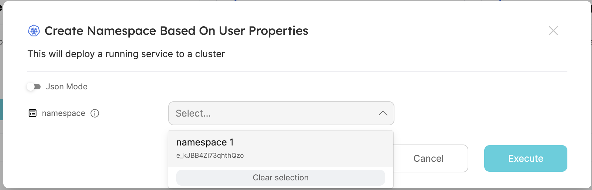
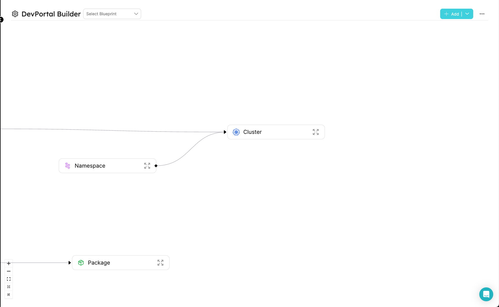
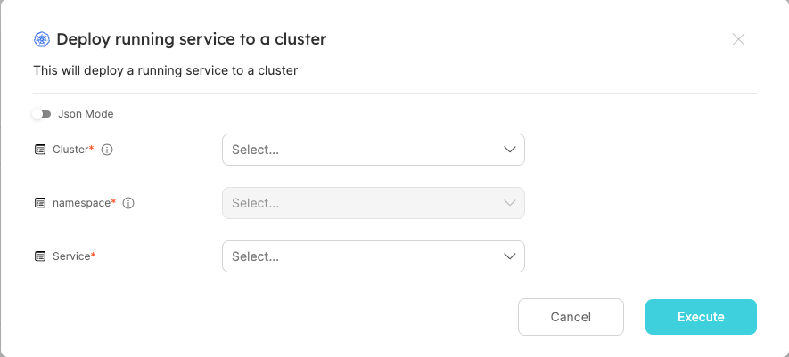

import Tabs from '@theme/Tabs';
import TabItem from '@theme/TabItem';

# Advanced Form Configurations

In Port, You can create actions with dependencies between inputs, based on the values of other inputs, the entity, or the logged-in user properties. This allows you to create a more dynamic and interactive experience for your users and also to create more complex actions.

### Common Use Cases

- Create a filter to limit the entities that the user can choose in a dropdown.
- Create a dependency between inputs to allow the user to select a value based on the value of another input.
- Create inputs based on the logged-in user properties(such as teams, email, role etc`) or the entity that the action is being executed on (for day-2 or delete actions only).

#### building such actions can be done by leveraging 3 keys in the action's schema:

<Tabs
defaultValue="DependsOn"
values={[
{ label: 'dependsOn', value: 'DependsOn', },
{ label: 'dataset', value: 'Dataset', },
{ label: 'jqQuery', value: 'jqQuery', },
]}>

<TabItem value="DependsOn">
the dependsOn property is used to create a dependency between inputs. The input will only be enabled if the inputs that it depends on have a value. The input will also have a default value based on the value of the inputs that it depends on.

```json
{
  "language": {
    "type": "string",
    "enum": ["javascript", "python"]
  },
  "SDK": {
    "type": "string",
    "dependsOn": ["language"]
  }
}
```

</TabItem>
<TabItem value="Dataset">
the dataset property is used to create a filter that will limit the options that the user can choose from. The filter can be a value(string, number, etc') or a "jqQuery" object

```json
{
  "namespace": {
    "type": "string",
    "format": "entity",
    "blueprint": "namespace",
    "dataset": {
      "combinator": "and",
      "rules": [
        {
          "property": "$team",
          "operator": "containsAny",
          "value": "value here. this can also be a 'jqQuery' object"
        }
      ]
    }
  }
}
```

</TabItem>
<TabItem value="jqQuery">
the jqQuery property is used to create a query that can be used to extract data from the entity, the user, or the current form. The query can also be used to perform data manipulations.

```json
{
  "language": {
    "type": "string",
    "enum": ["javascript", "python"],
  }
},
{
  "SDK": {
    "type": "string",
    "enum": {
      "jqQuery": "if .form.language == \"javascript\" then [\"Node 16\", \"Node 18\"] else [\"Python 3.8\"] end"
    },
  }
}
```

</TabItem>
</Tabs>

### basic usage

#### using data from the current form values in a different input

this json creates a dependency between the "language" input and the "SDK" input. The "SDK" input will only show the options that are available for the selected language.

```json
{
  "language": {
    "type": "string",
    "enum": ["javascript", "python"],
  }
}
{
  "SDK": {
    "type": "string",
    "enum": {
      "jqQuery": "if .form.language == \"javascript\" then [\"Node 16\", \"Node 18\"] else [\"Python 3.8\"] end"
    },
    "dependsOn": ["language"]
  }
}
```


#### creating an input based on the logged-in user properties

this json creates a filter that will only show the namespaces that the user is a member of (notice the value key in the rules object)

```json
{
  "namespace": {
    "type": "string",
    "format": "entity",
    "blueprint": "namespace",
    "dataset": {
      "combinator": "and",
      "rules": [
        {
          "property": "$team",
          "operator": "containsAny",
          "value": {
            "jqQuery": "[.user.teams[].name]"
          }
        }
      ]
    }
  }
}
```



:point_up: these are only the namespaces that associated with the logged-in user's teams. :point_up:

#### Using data from the entity that the action is being executed on (for day-2 or delete actions only)

this creates a filter that will only show the namespaces that the entity is tagged with.

```json
{
  "namespace": {
    "type": "string",
    "format": "entity",
    "blueprint": "namespace",
    "dataset": {
      "combinator": "and",
      "rules": [
        {
          "property": "tags",
          "operator": "containsAny",
          "value": {
            "jqQuery": "[.entity.tags[].name]"
          }
        }
      ]
    }
  }
}
```


:point_up: this is a dropdown with the tags of the selected entity(namespace1). :point_up:

#### Setting a default value with the jqQuery

this creates a filter that will only show the namespaces that the entity is tagged with.

```json
{
  "some_input": {
    "type": "array",
    "default" {
      "jqQuery": ".entity.properties.tags"
    }
  }
}
```


:point_up: the tags of the namespace are already inserted to the form. :point_up:

## The "JqQuery" object

The "JqQuery" object is used to define a query that will be executed when the action's UI is loaded or when executing the action against the data being sent to Port(thus, triggering a run). The query is executed using the [jq](https://stedolan.github.io/jq/) library. The query can be used to extract data from the entity, the user, or the form inputs. The query can also be used to manipulate json.

### All the properties you can access using the "JqQuery" object

<Tabs
defaultValue="form"
values={[
{label: 'form', value: 'form'},
{label: 'entity', value: 'entity'},
{label: 'user', value: 'user'},
]}>
<TabItem value="form">

Usage:

```json
{
  "jqQuery": ".form.input1"
}
```

The available form object(each input as a property in the action's `userInputs` object)):

```json
{
  "input1": "...",
  "input2": "...",
  "input3": "..."
}
```

  </TabItem>
  <TabItem value="entity">
  
  Usage:

```json
{
  "jqQuery": ".entity.properties.property1"
}
```

The available entity object:

```json
{
  "identifier": "...",
  "title": "...",
  "blueprint": "...",
  "team": ["..."],
  "properties": {
    "property1": "...",
    "property2": "...",
    "property3": "..."
  },
  "relations": {
    "relation1": "...",
    "relation2": "...",
    "relationMany": ["...", "..."]
  },
  "createdAt": "...",
  "createdBy": "...",
  "updatedAt": "...",
  "updatedBy": "...",
  "scorecards": {
    "ResourceQuota": {
      "rules": [
        {
          "identifier": "...",
          "status": "...",
          "level": "..."
        },
        {
          "identifier": "...",
          "status": "...",
          "level": "..."
        }
      ],
      "level": "..."
    },
    "Ownership": {
      "rules": [
        {
          "identifier": "...",
          "status": "...",
          "level": "..."
        },
        {
          "identifier": "...",
          "status": "...",
          "level": "..."
        }
      ],
      "level": "..."
    }
  }
}
```

  </TabItem>
  <TabItem value="user">
  Usage:

```json
{
  "jqQuery": ".user.email"
}
```

The available logged-in user object:

```json
{
  "picture": "...",
  "userId": "...",
  "email": "...",
  "name": "...",
  "mainRole": "...",
  "roles": [
    {
      "name": "..."
    }
  ],
  "teams": [
    {
      "name": "...",
      "provider": "..."
    },
    {
      "name": "...",
      "provider": "..."
    }
  ]
}
```

  </TabItem>
</Tabs>

## Example: create an action to deploy a running service to a cluster

In this example, we will create an action that lets the user select a cluster and a namespace in that cluster. The user will also be able to select a service that is already running in the cluster. The action will then deploy the selected service to the selected namespace in the cluster. The user will only be able to select a service that is linked to his team.

#### the existing model in Port:



#### the action's configuration:

```json
{
  "identifier": "createRunningService",
  "title": "Deploy running service to a cluster",
  "icon": "Cluster",
  "userInputs": {
    "properties": {
      "Cluster": {
        "type": "string",
        "format": "entity",
        "blueprint": "Cluster",
        "title": "Cluster",
        "description": "The cluster to create the namespace in"
      },
      "namespace": {
        "type": "string",
        "format": "entity",
        "blueprint": "namespace",
        "dependsOn": ["Cluster"],
        "dataset": {
          "combinator": "and",
          "rules": [
            {
              "blueprint": "Cluster",
              "operator": "relatedTo",
              "value": {
                "jqQuery": ".form.Cluster.identifier"
              }
            }
          ]
        },
        "title": "namespace",
        "description": "The namespace to create the cluster in"
      },
      "service": {
        "type": "string",
        "format": "entity",
        "blueprint": "Service",
        "dataset": {
          "combinator": "and",
          "rules": [
            {
              "blueprint": "$team",
              "operator": "containsAny",
              "value": {
                "jqQuery": "[.user.teams[].name]"
              }
            }
          ]
        },
        "title": "Service"
      }
    },
    "required": ["Cluster", "namespace", "service"]
  },
  "invocationMethod": {
    "type": "WEBHOOK",
    "url": "https://example.com"
  },
  "trigger": "CREATE",
  "description": "This will deploy a running service to a cluster"
}
```

#### The action in the developer portal:



## Properties that are supported with jqQuery expressions

| Property | Description                                       |
| -------- | ------------------------------------------------- |
| enum     | The list of options that the user can select from |
| value    | the value of the dataset search query             |
| default  | the default value of inputs                       |
