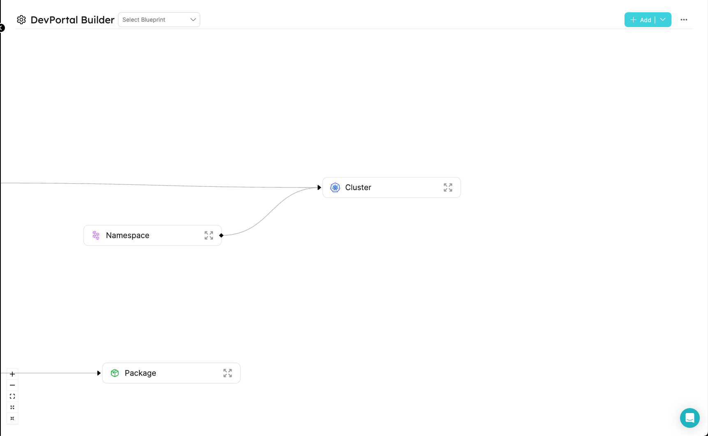

# Filter and Dependencies

In Port, You can create actions with dependencies between inputs, based on the values of other inputs, the entity, or the user. This allows you to create a more dynamic and interactive experience for your users and also to create more complex actions.

For inputs that lets the user select an entity, you can define a filter to limit the entities that are available to the user. For example, you can create an action that lets the user select a Kubernetes cluster and then select a namespace in that cluster. You can use a filter to limit the namespaces that are available to the user to only those that are in the selected cluster.

## Common Use Cases

- Create a filter to limit the entities that the user can choose, for example to limit the namespaces that the user can choose to only those in the selected cluster.
- Create a dependency between inputs to allow the user to select a value based on the value of another input, for example to allow the user to select a SDK version based on the selected language.
- Create filter based on the user's properties, such as the user's teams. For example to allow the user to select a namespace based on the teams that the user is a member of.
- Create a filter based on the entity's properties, such as the entity's tags. For example to allow the user to select a namespace based on the tags that are assigned to the namespace.(for DAY-2 and DELETE actions only)

### Reusing data from the form in a different input

Let's say that we have an action that lets the user select a language and then select a SDK version based on the selected language. The SDK versions are different for each language. We can use a "JqQuery" object to define a query that will extract the selected language from the form and then use it to filter the SDK versions that are available to the user. We can also define a default value for the language version input, so that the user will see a value in the input based on the entity in the context.

```json
{
  "language": {
    "type": "string",
    "enum": ["javascript", "python"],
    "default": {
      "jqQuery": ".entity.properties.language"
    }
  }
}
```

```json
{
  "SDK": {
    "type": "string",
    "enum": {
      "jqQuery": "if .form.language == \"javascript\" then [\"Node 16\", \"Node 18\"] else [\"Python 3.8\"] end"
    },
    "dependsOn": ["language"]
  }
}
```

### Reusing data from the logged in user

lets say that we have an action that lets the user select a namespace based on the teams that the user is a member of. We can use a "JqQuery" object to define a query that will extract the user's teams from the user object and then use it to filter the namespaces that are available to the user.

```json
{
  "namespace": {
    "type": "string",
    "format": "entity",
    "blueprint": "namespace",
    "dataset": {
      "combinator": "and",
      "rules": [
        {
          "property": "$team",
          "operator": "containsAny",
          "value": {
            "jqQuery": "[.user.teams[].name]"
          }
        }
      ]
    },
    "title": "namespace",
    "description": "The namespace to create the cluster in"
  }
}
```

### Reusing data from the entity that is being acted upon

lets say that we have an action that lets the user select a namespace based on the tags that are assigned to the namespace. We can use a "JqQuery" object to define a query that will extract the tags from the entity object and then use it to filter the namespaces that are available to the user.

```json
{
  "namespace": {
    "type": "string",
    "format": "entity",
    "blueprint": "namespace",
    "dataset": {
      "combinator": "and",
      "rules": [
        {
          "property": "tags",
          "operator": "containsAny",
          "value": {
            "jqQuery": "[.entity.tags[].name]"
          }
        }
      ]
    },
    "title": "namespace",
    "description": "The namespace to create the cluster in"
  }
}
```

## The "JqQuery" object

The "JqQuery" object is used to define a query that will be executed when the action's UI is loaded or when executing the action against the data being sent to Port. The query is executed using the [jq](https://stedolan.github.io/jq/) library. The query can be used to extract data from the entity, the user, or the form. The query can also be used to combine data from multiple sources.

### All the properties you can access using the "JqQuery" object

#### The "form" object

```json
{
    "input1": "...",
    "input2": "..."
    "input3": "...",
}
```

selecting the value of "input1" from the form

```json
{
  "jqQuery": ".form.input1"
}
```

#### The "entity" object

```json
{
  "identifier": "...",
  "title": "...",
  "blueprint": "...",
  "team": ["..."],
  "properties": {
    "property1": "...",
    "property2": "...",
    "property3": "..."
  },
  "relations": {
    "relation1": "...",
    "relation2": "...",
    "relationMany": ["...", "..."]
  },
  "createdAt": "...",
  "createdBy": "...",
  "updatedAt": "...",
  "updatedBy": "...",
  "scorecards": {
    "ResourceQuota": {
      "rules": [
        {
          "identifier": "...",
          "status": "...",
          "level": "..."
        },
        {
          "identifier": "...",
          "status": "...",
          "level": "..."
        }
      ],
      "level": "..."
    },
    "Ownership": {
      "rules": [
        {
          "identifier": "...",
          "status": "...",
          "level": "..."
        },
        {
          "identifier": "...",
          "status": "...",
          "level": "..."
        }
      ],
      "level": "..."
    }
  }
}
```

selecting the value of "property1" from the entity

```json
{
  "jqQuery": ".entity.properties.property1"
}
```

selecting the identifier from the entity

```json
{
  "jqQuery": ".entity.identifier"
}
```

#### The "user" object

```json
{
  "picture": "...",
  "userId": "...",
  "email": "...",
  "name": "...",
  "mainRole": "...",
  "roles": [
    {
      "name": "..."
    }
  ],
  "teams": [
    {
      "name": "...",
      "provider": "..."
    },
    {
      "name": "...",
      "provider": "..."
    }
  ]
}
```

selecting the names of the teams from the user

```json
{
  "jqQuery": "[.user.teams[].name]"
}
```

selecting the email of the user

```json
{
  "jqQuery": ".user.email"
}
```

## The "dependsOn" key

the "dependsOn" key is used to define a dependency between inputs. When an input has a dependency, the input will only be available to the user when the dependency is met. For example, if you have an input that lets the user select a language and another input that lets the user select a SDK version based on the selected language, you can use the "dependsOn" key to define a dependency between the two inputs. The SDK version input will only be available to the user when the language input is selected.

```json
{
  "language": {
    ...
  },
  "SDK": {
    "dependsOn": ["language"]
    ...
  }
}
```

## the "dataset" key

The "dataset" key consists of rules that are combined using a combinator. The combinator can be "and" or "or". The rules can be used to filter entities based on the user's teams, roles, or any other property that is available on the entity. The rules can also be used to combine data from multiple sources. You can read more about the rules in the [Search & Query](/search-and-query/) section.

## Example: Create an action to deploy a running service to a cluster

In this example, we will create an action that lets the user select a cluster and a namespace in that cluster. The user will also be able to select a service that is already running in the cluster. The action will then deploy the selected service to the selected namespace in the cluster. The user will only be able to select a service that is linked to his team.

#### the existing model in Port:



#### the action's configuration:

```json
{
  "identifier": "createRunningService",
  "title": "Deploy running service to a cluster",
  "icon": "Cluster",
  "userInputs": {
    "properties": {
      "Cluster": {
        "type": "string",
        "format": "entity",
        "blueprint": "Cluster",
        "title": "Cluster",
        "description": "The cluster to create the namespace in"
      },
      "namespace": {
        "type": "string",
        "format": "entity",
        "blueprint": "namespace",
        "dependsOn": ["Cluster"],
        "dataset": {
          "combinator": "and",
          "rules": [
            {
              "blueprint": "Cluster",
              "operator": "relatedTo",
              "value": {
                "jqQuery": ".form.Cluster.identifier"
              }
            }
          ]
        },
        "title": "namespace",
        "description": "The namespace to create the cluster in"
      },
      "service": {
        "type": "string",
        "format": "entity",
        "blueprint": "Service",
        "dataset": {
          "combinator": "and",
          "rules": [
            {
              "blueprint": "$team",
              "operator": "containsAny",
              "value": {
                "jqQuery": "[.user.teams[].name]"
              }
            }
          ]
        },
        "title": "Service"
      }
    },
    "required": ["Cluster", "namespace", "service"]
  },
  "invocationMethod": {
    "type": "WEBHOOK",
    "url": "https://example.com"
  },
  "trigger": "CREATE",
  "description": "This will deploy a running service to a cluster"
}
```

#### The action in the developer portal:


## Properties that are supported with jqQuery expressions

| Property | Description                                       |
| -------- | ------------------------------------------------- |
| enum     | The list of options that the user can select from |
| value    | the value of the dataset search query             |
| default  | the default value of inputs                       |
