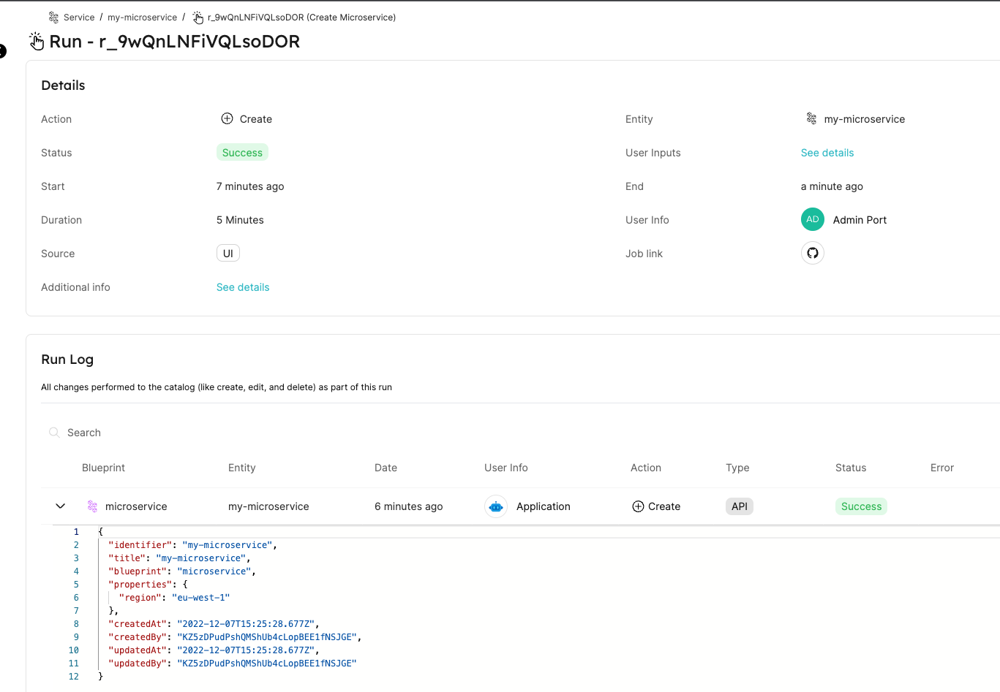

# Action Runs Tutorial

Invoking a Port Self-Service Action creates an `actionRun` object inside Port.

:::tip
To learn more about configuring Self-Service Actions, refer to the [Depp Dive](./self-service-actions-deep-dive.md). After configuring a Self-Service Action, invoking it will generate an `actionRun` which you can learn more about in this tutorial.
:::

You can find all existing action runs in one of the following methods:

1. Select the Runs tab on the Audit Log page;
2. Select the Runs tab of a specific Entity on its [specific entity page](../../customize-pages-dashboards-and-plugins/page/entity-page.md);
3. When you invoke a Self-Service Action from the UI, a toast will appear on the page, with the link to the action run that corresponds to the run of the Self-Service Action.

This tutorial will teach you how to use Port's API to obtain existing action runs, update them with additional metadata and information about the results of the invoked Self-Service Action, and mark them as completed or failed to keep a consistent history of invoked Self-Service Actions and their status.

## Setup

During this tutorial, you will interact with action runs that were created from a basic `create microservice` Self-Service Action that was added to a `microservice` Blueprint.

The Blueprint definition and Self-Service Action we will use in this tutorial are detailed below:

:::note
The Blueprint and Self-Service Action are intentionally minimalistic since they are not the focus of this tutorial. If needed, they can easily be extended to include extra properties you require.
:::

<details>
<summary>Microservice Blueprint</summary>

```json showLineNumbers
{
  "identifier": "microservice",
  "description": "This blueprint represents service in our software catalog",
  "title": "Service",
  "icon": "Microservice",
  "schema": {
    "properties": {
      "region": {
        "type": "string",
        "title": "Region"
      }
    },
    "required": []
  },
  "mirrorProperties": {},
  "calculationProperties": {},
  "relations": {}
}
```

</details>

<details>
<summary>Create microservice Self-Service Action</summary>

```json showLineNumbers
[
  {
    "identifier": "create_microservice",
    "title": "Create Microservice",
    "userInputs": {
      "properties": {
        "name": {
          "title": "Service name",
          "type": "string"
        },
        "region": {
          "title": "Cloud Region",
          "type": "string"
        }
      }
    },
    "invocationMethod": {
      "url": "https://getport.io",
      "agent": false,
      "type": "WEBHOOK"
    },
    "trigger": "CREATE",
    "description": "Create new microservice"
  }
]
```

</details>

<details>
<summary>2nd day operation microservice Self-Service Action</summary>

```json showLineNumbers
[
  {
    "identifier": "deploy_microservice",
    "title": "Deploy Microservice",
    "userInputs": {
      "properties": {
        "environment": {
          "title": "Environment",
          "type": "string"
        }
      }
    },
    "invocationMethod": {
      "url": "https://getport.io",
      "agent": false,
      "type": "WEBHOOK"
    },
    "trigger": "DAY-2",
    "description": "Deploy the microservice in a specified environment"
  }
]
```

</details>

## Action run structure

### `CREATE` action trigger

Let's invoke a `CREATE` Self-Service Action with the following parameters:

```json showLineNumbers
{
  "name": "my-microservice",
  "region": "eu-west-1"
}
```

By invoking the Self-Service Action, the following action invocation body is sent:

```json showLineNumbers
{
  "payload": {
    "action": "create_microservice",
    "resourceType": "run",
    "status": "TRIGGERED",
    "trigger": {
      "by": {
        "orgId": "org_7SDeR821bunhS8es",
        "userId": "auth0|638879fa62c686d381b36ecb",
        "user": {
          "email": "test@test.com",
          "firstName": "test",
          "lastName": "test",
          "id": "auth0|638879fa62c686d381b36ecb"
        }
      },
      "origin": "UI",
      "at": "2022-12-07T12:53:52.916Z"
    },
    "context": {
      "entity": null,
      "blueprint": "microservice",
      // highlight-next-line
      "runId": "r_QOz6WoOB1Q2lmhZZ"
    },
    "payload": {
      "entity": null,
      "action": {
        "id": "action_ed2B0O9CbEYkuqvN",
        "identifier": "create_microservice",
        "title": "Create Microservice",
        "userInputs": {
          "properties": {
            "name": { "title": "Service name", "type": "string" },
            "region": { "title": "Cloud Region", "type": "string" }
          }
        },
        "invocationMethod": {
          "url": "https://getport.io",
          "agent": false,
          "type": "WEBHOOK"
        },
        "trigger": "CREATE",
        "description": "Create new microservice",
        "blueprint": "microservice",
        "createdAt": "2022-12-07T09:48:28.659Z",
        "createdBy": "auth0|638879fa62c686d381b36ecb",
        "updatedAt": "2022-12-07T09:48:28.659Z",
        "updatedBy": "auth0|638879fa62c686d381b36ecb"
      },
      "properties": { "name": "my-microservice", "region": "eu-west-1" }
    }
  }
}
```

Note that the `runId` of the invoked Self-Service Action is: `r_QOz6WoOB1Q2lmhZZ`.

By making a request to `https://api.getport.io/v1/actions/runs/{run_id}` where `run_id=r_QOz6WoOB1Q2lmhZZ`, you get the following response:

```json showLineNumbers
{
  "ok": true,
  "run": {
    "id": "r_QOz6WoOB1Q2lmhZZ",
    "status": "IN_PROGRESS",
    "blueprint": {
      "identifier": "microservice",
      "title": "Service"
    },
    "action": "create_microservice",
    "endedAt": null,
    "source": "UI",
    "relatedEntityExists": false,
    "relatedBlueprintExists": true,
    "properties": {
      "name": "my-microservice",
      "region": "eu-west-1"
    },
    "createdAt": "2022-12-07T12:53:52.916Z",
    "updatedAt": "2022-12-07T12:53:52.916Z",
    "createdBy": "auth0|638879fa62c686d381b36ecb",
    "updatedBy": "auth0|638879fa62c686d381b36ecb"
  }
}
```

:::info
In the action run object, pay attention to the following:

- `status` - current status of the action. When a Self-Service Action is invoked, the value is automatically set to `IN_PROGRESS`, but you can alter it to `SUCCESS` or `FAILURE` according to the run's progress;
- `endedAt` - shows `null` because the action run status is `IN_PROGRESS`, but it will automatically update when the status of the action run is changed to either `SUCCESS` or `FAILURE`.

:::

### `DAY-2` action trigger

An action run of a `DAY-2` Self-Service Action is very similar to an action run of a `CREATE` Self-Service Action, the main difference being that the Entity the action was invoked for is also provided in the action run object.

For example, after performing a simple invocation of the `DAY-2` Self-Service Action with the following parameters:

```json showLineNumbers
{
  "environment": "production"
}
```

The following action invocation body is sent (existing Entity is highlighted):

```json showLineNumbers
{
  "payload": {
    "action": "deploy_microservice",
    "resourceType": "run",
    "status": "TRIGGERED",
    "trigger": {
      "by": {
        "orgId": "org_7SDeR821bunhS8es",
        "userId": "auth0|638879fa62c686d381b36ecb",
        "user": {
          "email": "test@test.com",
          "firstName": "test",
          "lastName": "test",
          "id": "auth0|638879fa62c686d381b36ecb"
        }
      },
      "origin": "UI",
      "at": "2022-12-08T10:07:09.886Z"
    },
    "context": {
      "entity": "my-microservice",
      "blueprint": "microservice",
      // highlight-next-line
      "runId": "r_z0nJYJv0wCm2ASTR"
    },
    "payload": {
      // highlight-start
      "entity": {
        "identifier": "my-microservice",
        "title": "my-microservice",
        "icon": null,
        "blueprint": "microservice",
        "properties": {
          "region": "eu-west-1"
        },

        "relations": {},
        "createdAt": "2022-12-07T15:25:28.677Z",
        "createdBy": "KZ5zDPudPshQMShUb4cLopBEE1fNSJGE",
        "updatedAt": "2022-12-07T15:30:24.660Z",
        "updatedBy": "KZ5zDPudPshQMShUb4cLopBEE1fNSJGE"
      },
      // highlight-end
      "action": {
        "id": "action_AOLZfMmE3YUeBlMt",
        "identifier": "deploy_microservice",
        "title": "Deploy Microservice",
        "userInputs": {
          "properties": {
            "environment": {
              "title": "Environment",
              "type": "string"
            }
          }
        },
        "invocationMethod": {
          "url": "https://getport.io",
          "agent": false,
          "type": "WEBHOOK"
        },
        "trigger": "DAY-2",
        "description": "Deploy the microservice in a specified environment",
        "blueprint": "microservice",
        "createdAt": "2022-12-08T10:05:54.935Z",
        "createdBy": "auth0|638879fa62c686d381b36ecb",
        "updatedAt": "2022-12-08T10:05:54.935Z",
        "updatedBy": "auth0|638879fa62c686d381b36ecb"
      },
      "properties": {
        "environment": "production"
      }
    }
  }
}
```

Note that the `runId` of the invoked Self-Service Action is: `r_z0nJYJv0wCm2ASTR`.

By making a `GET` request to `https://api.getport.io/v1/actions/runs/{run_id}` where `run_id=r_z0nJYJv0wCm2ASTR`, you receive the following response:

```json showLineNumbers
{
  "ok": true,
  "run": {
    "id": "r_z0nJYJv0wCm2ASTR",
    "status": "IN_PROGRESS",
    "blueprint": {
      "identifier": "microservice",
      "title": "Service"
    },
    "entity": {
      "identifier": "my-microservice",
      "title": "my-microservice"
    },
    "action": "deploy_microservice",
    "endedAt": null,
    "source": "UI",
    "relatedEntityExists": true,
    "relatedBlueprintExists": true,
    "properties": {
      "environment": "production"
    },
    "createdAt": "2022-12-08T10:07:09.860Z",
    "updatedAt": "2022-12-08T10:07:09.860Z",
    "createdBy": "auth0|638879fa62c686d381b36ecb",
    "updatedBy": "auth0|638879fa62c686d381b36ecb"
  }
}
```

## Updating an action run

Now let's take an action run and update it. All updates can be performed by sending a `PATCH` request to the `https://api.getport.io/v1/actions/runs/{run_id}` endpoint.

Our different update options are:

- Set the action run status via the `status` key - `SUCCESS`, `FAILURE`;
- Add links to an external log of the job runners via the `link` key - AWS Cloudwatch logs, Github Workflow job, Jenkins job, etc.;
- Add a message JSON object which contains additional metadata, runtime or debug information via the `message` key.

:::tip
You don't have to provide all of the different updates in one request, you can make a `PATCH` request to the endpoint as many times as you need until the action run has finished.

Note that every patch request will override the previous information that was available for a given key. For example, when updating the `link` key multiple times, only the value provided in the latest update will be the one displayed on the action run object.
:::

Let's update our action run with the following `PATCH` request body:

```json showLineNumbers
{
  "status": "SUCCESS",
  "link": [
    "https://github.com/actions/toolkit/actions/runs/3617893813",
    "https://github.com/actions/toolkit/actions/runs/4165617487"
  ],
  "message": {
    "run_status": "Run completed successfully!"
  }
}
```

The API returns the following response:

```json showLineNumbers
{
  "ok": true,
  "run": {
    "id": "r_QOz6WoOB1Q2lmhZZ",
    "status": "SUCCESS",
    "blueprint": {
      "identifier": "microservice",
      "title": "Service"
    },
    "action": "create_microservice",
    // highlight-next-line
    "endedAt": "2022-12-07T14:51:52.796Z",
    "source": "UI",
    // highlight-start
    "link": ["https://github.com/actions/toolkit/actions/runs/3617893813"],
    "message": {
      "run_status": "Run completed successfully!"
    },
    // highlight-end
    "relatedEntityExists": false,
    "relatedBlueprintExists": true,
    "properties": {
      "name": "my-microservice",
      "region": "eu-west-1"
    },
    "createdAt": "2022-12-07T12:53:52.916Z",
    "updatedAt": "2022-12-07T14:51:52.796Z",
    "createdBy": "auth0|638879fa62c686d381b36ecb",
    "updatedBy": "KZ5zDPudPshQMShUb4cLopBEE1fNSJGE"
  }
}
```

:::info
Note how our action run has updated:

- `status` - has been updated to `SUCCESS`;
- `endedAt` - now correctly shows the time that the action run was updated;
- `link` - now includes the links we provided, and those links will also appear in the page matching the action run in Port;
- `message` - now includes the additional info we provided and it will also appear in the page matching the action run in Port.

:::

## Tying Entities to an action run

You can also add additional context and metadata to an action run by attaching a `run_id` query parameter to every API route that creates or changes an Entity (i.e. `POST`, `PUT`, `PATCH` and `DELETE` requests to the `https://api.getport.io/v1/blueprints/{blueprint_id}/entities/{entity_id}` route). By adding the `run_id` parameter, you reflect the change made to the Entity as part of the set of steps the action run performed during its runtime.

:::tip
Tying Entities to an action run is only possible when an action run is in the `IN_PROGRESS` status.
:::

For example, let's invoke another action run and use the following python snippet to create a new microservice Entity which matches our triggered Self-Service Action, and add the `run_id` query parameter to mark that the Self-Service Action was responsible for the creation of the new microservice:

<details>
<summary>Click here to see the Python code</summary>

```python showLineNumbers
# Dependencies to install:
# $ python -m pip install requests
from pprint import pprint
import requests

CLIENT_ID = 'YOUR_CLIENT_ID'
CLIENT_SECRET = 'YOUR_CLIENT_SECRET'

API_URL = 'https://api.getport.io/v1'

RUN_ID = 'YOUR_RUN_ID'

TARGET_BLUEPRINT_ID = 'microservice'


def get_auth_token():
    credentials = {'clientId': CLIENT_ID, 'clientSecret': CLIENT_SECRET}
    token_response = requests.post(f'{API_URL}/auth/access_token', json=credentials)
    return token_response.json()['accessToken']


def get_run_id(access_token, run_id):
    headers = {
        'Authorization': f'Bearer {access_token}'
    }

    run_id_resp = requests.get(f'{API_URL}/actions/runs/{run_id}', headers=headers)
    return run_id_resp.json()['run']


def create_entity(access_token, run_id, properties):
    headers = {
        'Authorization': f'Bearer {access_token}'
    }

    query = {
        "run_id": run_id,
        "upsert": "true"
    }

    body = {
        "identifier": f"{properties['name'].replace(' ','_')}",
        "title": f"{properties['name']}",
        "properties": {
            "region": f"{properties['region']}"
        }
    }

    entity_resp = requests.post(f"{API_URL}/blueprints/{TARGET_BLUEPRINT_ID}/entities", headers=headers, params=query, json=body)
    pprint(entity_resp.json()['entity'])
    return entity_resp.json()['entity']['identifier']


def mark_action_run_as_successful(access_token, run_id, entity_id, additional_message):
    headers = {
        'Authorization': f'Bearer {access_token}'
    }

    body = {
        "status": "SUCCESS",
        "link": ["https://github.com/actions/toolkit/actions/runs/3617893813"],
        "message": {
            "run_status": additional_message,
            "new_entity": entity_id
        }
    }

    action_update_resp = requests.patch(f'{API_URL}/actions/runs/{run_id}', headers=headers, json=body)
    pprint(action_update_resp.json()['run'])


def main():
    access_token = get_auth_token()

    run = get_run_id(access_token, RUN_ID)
    props = run['properties']
    entity_id = create_entity(access_token, RUN_ID, props)
    mark_action_run_as_successful(access_token, RUN_ID, entity_id, 'New Entity created!')


if __name__ == '__main__':
    main()

```

</details>

Now when you look at the run log of the action run, you will see the information of the newly created Entity:



:::tip
In the example above we created just one Entity, but it is possible to create, update or delete multiple Entities as part of the steps taken by a single action run, and all of these changes will be reflected in the action run log.
:::
