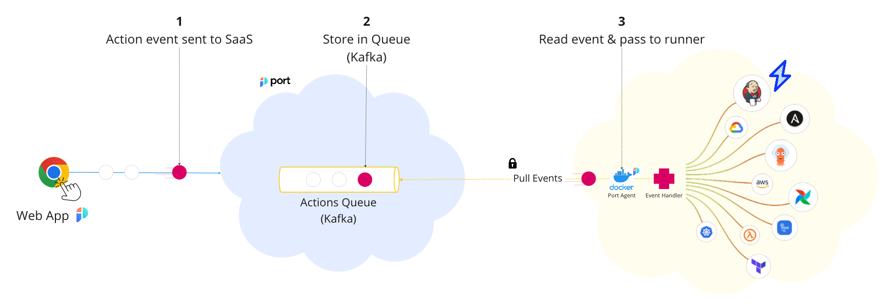

# Port execution agent

Our execution agent provides you with a secure and convenient way to listen and act on invocations of Self-Service Actions and changes in the software catalog.

By using the execution agent, you don't need to expose a public endpoint for Port to contact.

:::note
To use the execution agent, please contact us via Intercom to receive a dedicated Kafka topic.
:::

The data flow when using the Port execution agent is as follows:

- A new Self-Service Action or change in the software catalog is invoked;
- Port sends the invocation event to your dedicated Kafka topic;
- The execution agent pulls the new invocation event from your Kafka topic, and sends it to the URL you specified.

## Next steps

[Explore How to install and use the agent](./quickstart)
