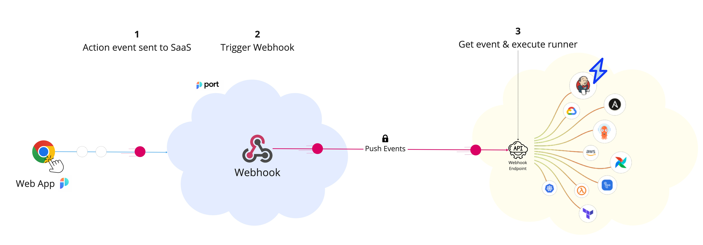

# Webhook Self-Service Actions

Port can trigger webhooks based on a customer provided `URL` Both for `Action` and `Changelog` events.

The steps shown in the image above are as follows:

1. Port generates an invocation of `Action` or `Changelog` event.
2. Port signs the payload + timestamp using `HMAC-SHA-256` and puts it in the request header.
   :::info WEBHOOK SECURITY
   Verifying the webhook request using the request headers provides the following benefits:

   - Ensures that the request payload has not been tampered with
   - Ensures that the sender of the message is Port
   - Ensures that the received message is not a replay of an older message

   To learn how to verify the webhook request, refer to the [Verifying Webhook Signature](../webhook/signature-verification) page.

   :::

3. Port publishes an invoked `Action` or `Changelog` via a `POST` request to the customer defined `URL`.
4. A listener implemented on the Client side receives the new `POST` request and runs code defined by the DevOps team.

:::info
The listener can be anything that can read from a Kafka topic and run code based on the received message, for example:

- AWS Lambda;
- Python code that reads from the topic;
- Docker container running code.

You control how you interact with webhooks, in the way that best suits your organization and infrastructure.
:::

An example flow would be:

1. A developer asks to deploy a new version of an existing `Microservice`;
2. The `create` action is sent to the defined `URL`;
3. An AWS Lambda function is triggered by this new action message;
4. The Lambda function deploys a new version of the service;
5. When the Lambda is done, it reports back to Port about the new Microservice `Deployment`.

## Next steps

To get started with webhook Self-Service Actions, please check the sources below:

### Examples

- [Create an S3 bucket using Self-Service Actions](./examples/s3-using-webhook.md)
- [Webhook changelog listener](./examples/changelog-listener.md)
- [Provisioning software templates using Cookiecutter](./examples/software-templates.md)

### Local setup, debugging and security validation

- [Debugging webhooks locally](./local-debugging-webhook.md)
- [Validating webhook signatures](./signature-verification.md)
