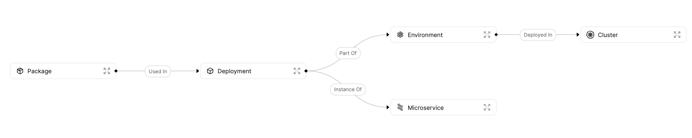

import Tabs from "@theme/Tabs"
import TabItem from "@theme/TabItem"


# Blueprints

## What Is a Blueprint?

Blueprints are the most basic building block in Port.

Modern infrastructure is composed of many moving parts. a blueprint represents each and every asset you manage, from `microservice` to `environments` of all kinds, `permissions`, `databases`, and more.

In this section you will:

1. **Map your software infrastructure** - To understand what blueprints and technical assets you want to manage
2. **Create your blueprints** - Including the relationships between them and their properties
3. **View the entities inside Port** - To see the blueprints you created

:::tip
The most important thing to know about blueprints is that they are **completely customizable**, they will support any number of properties you choose, with every type you might need.

You can be as precise or as abstract as you want, and the best thing is you can always go back and update your blueprints as your infrastructure grows, and as your Developer Platform evolves.
:::

## Define Your Blueprints

There are a few important steps when trying to define your blueprints:

1. **Think about the Entities that you want to manage** - What will your organization benefit from? For example, in one organization, managing microservices (with clusters, deployments, etc...) is a big issue. In another, it could be understating what environments the organization has in a given moment.
2. **What properties characterize your entities** - For example, a microservice might have a link to the Github repository, the slack channel of the responsible team and a healthcheck status
3. **What are the relationships between the different entities** - For example, we would like to create a relation between microservices and deployments in order to track where each microservice is deployed

By the end of this section, you should have something like this in mind:



:::tip
Check out the Templates Section to get inspiration on what you can manage with Port, and also get started with one click!
:::

## Understanding The Structure Of a Blueprint

The basic structure of a Blueprint request:

```json
{
    "identifier": "UniqueID",
    "title": "Title",
    "icon": "one of Airflow, Ansible, Argo, Aws, Azure, Blueprint, Bucket, Cloud, Cluster, CPU, Customer, Datadog, DefaultEntity, DefaultProperty, DeployedAt, Deployment, DevopsTool, Docs, Environment, Git, Github, GitVersion, GoogleCloud, GPU, Grafana, Jenkins, Lambda, Link, Lock, Microservice, Moon, Node, Okta, Package, Permission, Server, Service, Terraform",
    "dataSource": "Port",
    "schema": {
        "properties": {
            "foo": {
                "type": "string",
                "title": "Foo"
            },
            "bar": {
                "type": "number",
                "title": "Bar"
            },
            "date": {
                "type": "string",
                "format": "date-time",
                "title": "Date"
            }
        },
        "required": []
    }
}
```

Let's go over each field and explain its meaning:

- `identifier` - A unique identifier (Note that while the identifier is unique, it can be changed after creation)
- `title` - A nicely written name for the blueprint
- `icon` - An icon to visually distinguish from other blueprints, can be one of the following: `Airflow, Ansible, Argo, Aws, Azure, Blueprint, Bucket, Cloud, Cluster, CPU, Customer, Datadog, DefaultEntity, DefaultProperty, DeployedAt, Deployment, DevopsTool, Docs, Environment, Git, Github, GitVersion, GoogleCloud, GPU, Grafana, Jenkins, Lambda, Link, Lock, Microservice, Moon, Node, Okta, Package, Permission, Server, Service, Terraform`
- `dataSource` - The source entity data is ingested from for this Blueprint, can be either `Port` or `Github`
- `schema` - An object containing two more nested fields:
  - `properties` - An object containing a collection of type and format fields as shown in the Properties, types and formats document
  - `required` - An array of strings containing the name of properties that are mandatory in every entity created

:::note
All property fields are **Nullable** by default (`required=false`). So if you want to enforce a specific property, it needs to appear in the `required` array
:::

## Defining Blueprint Properties

Let's look at an example for a property definition:

```json
"string_prop": {
    "title": "String Property",
    "type": "string",
    "default": "foo",
    "description": "A string property"
}
```

Now let's look at the structure of this property definition and also explore the entire set of options for a single property:

- `title` - A nicely written name for the property
- `type` - The data type of the property, we will explore all available types in the [Blueprint Property Types](#blueprint-property-types) section
- `format` - A specific data format to pair with some of the available types, will be explored further in the [Blueprint Property Formats](#blueprint-property-formats) section
- `default` - A default value for this property in case an entity is created without explicitly providing a value
- `description` - A description for the property, this value is visible via in info node from the UI, and can help provide more information about the use of a property

:::note
The only mandatory property field is `type`
:::


## Blueprint Property Types

The API supports the following **types**:

- `string` - Just a simple string - `"hello"`
- `number` - Numeric field (including integers, doubles, floats, etc...) - `1`, `2.3`, `5e3`,...
- `boolean` - `true`/ `false`
- `object` - A well formatted object (i.e. python dictionary, javascript object, JSON, etc...)
- `array` - A multi-element array - `[1,2,3]`, `["a","b","c"]`

## Property Type Examples

Here are examples for property definitions for all available types (remember that only the `type` field is mandatory):

### String

```json
{
    "title": "String Property",
    "type": "string",
    "description": "A string property",
    "default": "foo"
}
```

### Number

```json
{
    "title": "Number Property",
    "type": "number",
    "description": "A number property",
    "default": 42
}
```

### Boolean

```json
{
    "title": "Boolean Property",
    "type": "boolean",
    "description": "A boolean property",
    "default": True
}
```

### Object

```json
{
    "title": "Object Property",
    "type": "object",
    "description": "An object property",
    "default": {
        "foo": "bar"
    }
}
```

### Array

```json
{
    "title": "Array Property",
    "type": "array",
    "description": "An array property",
    "default": [1, 2, 3]
}
```

## Blueprint Property Formats

The API supports the following **formats**:

- `url` - A formatted URL, for example `"https://getport.io"`
- `email` - A formatted Email, for example `"port@getport.io"`
- `date-time` - A formatted ISO string datetime, for example `"2022-04-18T11:44:15.345Z"`
- `ipv4` - A standard IPv4 address, for example `127.0.0.1`
- `ipv6` - A standard IPv6 address, for example `FE80:CD00:0A20:0CDE:1257:1C34:211E:729C`

:::note
The `format` field is only supported when the property `type` is `string`
:::

## Property Format Examples

Here are examples for property definitions for all available formats (remember that a `format` only works when `type="string"`):

### URL

```json
{
    "title": "URL Property",
    "type": "string",
    "format": "url",
    "description": "A URL property",
    "default": "https://getport.io"
}
```

### Email

```json
{
    "title": "Email Property",
    "type": "string",
    "format": "email",
    "description": "An Email property",
    "default": "mor@getport.io"
}
```

### Date Time

```json
{
    "title": "Datetime Property",
    "type": "string",
    "format": "date-time",
    "description": "A datetime property",
    "default": "2022-04-18T11:44:15.345Z"
}
```

### IPv4

```json
{
    "title": "IPv4 Property",
    "type": "string",
    "format": "ipv4",
    "description": "An IPv4 property",
    "default": "127.0.0.1"
}
```

### IPv6

```json
{
    "title": "IPv6 Property",
    "type": "string",
    "format": "ipv6",
    "description": "An IPv6 property",
    "default": "0000:0000:0000:0000:0000:0000:0000:0000"
}
```

## Create Blueprints and Relations

Let's see how we can use Port's API to create blueprints:

### Getting an API Token

:::note
For this next part you will need your Port `CLIENT_ID` and `CLIENT_SECRET`
:::

In order to perform any action with Port's API, you first need an access token, here are some code examples from various languages
<Tabs defaultValue="python" values={[
    {label: "Python", value: "python"},
    {label: "Javascript", value: "javascript"},
    {label: "cURL", value: "curl"}
]}>

<TabItem value="python">

```python
import requests

CLIENT_ID = "YOUR_CLIENT_ID"
CLIENT_SECRET = "YOUR_CLIENT_SECRET"

API_URL = "https://api.getport.io/v0.1"

credentials = {"client_id": CLIENT_ID, "client_secret": CLIENT_SECRET}

token_response = requests.get(f"{API_URL}/auth/access_token", params=credentials)

access_token = token_response.json()['accessToken']

# You can now use the value in access_token when making further requests

```

</TabItem>

<TabItem value="javascript">

```javascript
const axios = require('axios').default;

const CLIENT_ID = 'YOUR_CLIENT_ID';
const CLIENT_SECRET = 'YOUR_CLIENT_SECRET';

const API_URL = 'https://api.getport.io/v0.1';
const response = await axios.get(`${API_URL}/auth/access_token`, {
    params: {
        client_id: CLIENT_ID,
        client_secret: CLIENT_SECRET,
    },
});

const accessToken = response.data.accessToken;

// You can now use the value in accessToken when making further requests

```
</TabItem>

<TabItem value="curl">

```bash
access_token=$(curl --location --request GET "https://api.getport.io/v0.1/auth/access_token?client_id=YOUR_CLIENT_ID&client_secret=YOUR_CLIENT_SECRET" | jq '.accessToken' | sed 's/"//g')

# The token will be available in the access_token variable
```

</TabItem>

</Tabs>