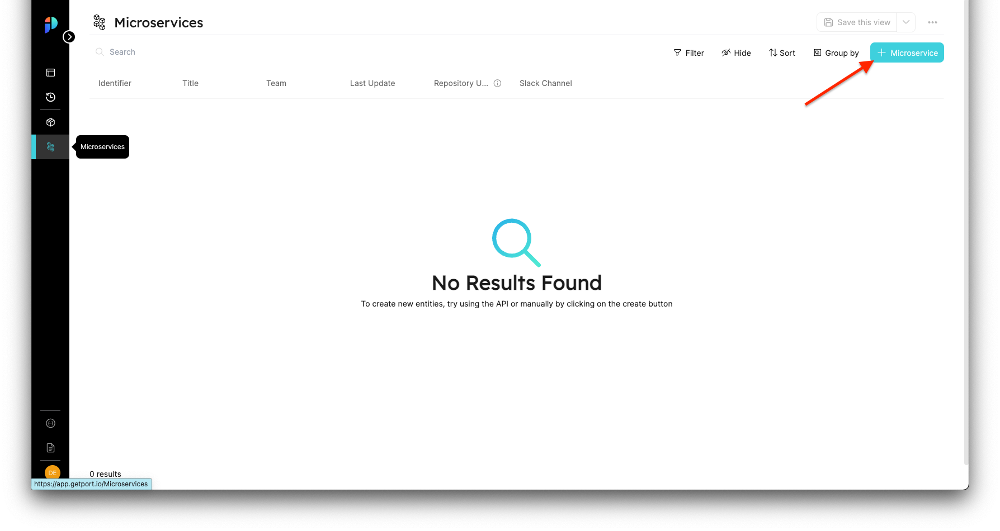

import Tabs from "@theme/Tabs"
import TabItem from "@theme/TabItem"

# Entities

An entity is the data inside Port that represents your software and infrastructure. Entities are created based on Blueprints.

**For example**, to create a new `Microservice` instance you will need to create an entity of a `Microservice`.

## understanding the structure of an entity

The basic structure of an Entity request:

```json
{
    "identifier": "UniqueID",
    "title": "Title",
    "blueprint": "blueprintName",
    "properties": {
        "property1": "",
        "property2": ""
    },
    "relations": {}
}
```

- `identifier` - A unique identifier (Note that while the identifier is unique, it can be changed after creation)
  - Port's API can automatically generate a unique identifier for entities, we will see how in the [Creating entities](#creating-entities) section
- `title` - A nicely written name for the entity that will be shown in the UI.
- `blueprint` - The name of the [Blueprint](blueprints) this entity is based on.
- `properties` - An object containing key-value pairs where each key is a property in the blueprint the entity is based on
- `relations` - An object containing key-value pairs where each key is the name of a [Relation](relations) defined over the blueprint this entity is based on.

:::info teams and ownership
Entities also have the `team` key which defines ownership over an entity and controls who can modify or delete an existing entity.

For now we are not going to assign a team to our entities, but we will explore this topic in more depth in the Teams, Users and Permissions section.
:::

## Creating entities

:::note
Remember that an access token is needed to make API requests, refer back to [Getting an API token](blueprints#getting-an-api-token) if you need to generate a new one
:::

:::info
We will be creating entities for the `Microservice` blueprint from [Creating a Blueprint](blueprints#creating-a-blueprint) and the `Package` blueprint from [Blueprint Next Steps](blueprints#next-steps), please make sure to create them before reading on if you want to follow along
:::

We'll present 2 ways to create entities:

- From the UI
- From the API

### From the UI

In order to create an entity from the UI, go to the [Page](pages) that matches the Blueprint you want to add an entity to. You can find the list of all the pages in the sidebar on the left side of Port's UI.

We will first go to the `Microservices` page:



After clicking the `+ Microservice` button, a UI form will open with the properties we created for the `Microservice` blueprint:


#### Code Format
Every entity has a format similar to the one we explained in the [Understanding the structure of an entity](#understanding-the-structure-of-an-entity) section, which is viewable via the the *Json Mode button*. You can paste in the following content to create your first `Microservice`:

```json
{
    "identifier": "notification-microservice",
    "title": "Notification Service",
    "blueprint": "microservice",
    "properties": {
        "repoUrl": "https://www.github.com/User/notification",
        "slackChannel": "#notification-service"
    },
    "relations": {}
}
```

### From the API

#### Getting an API Token
:::note
This next part assumes that you already have your API access Token. If not, see details in [Getting an API Token](blueprints#getting-an-api-token).
:::

#### Creating an entity
Let's create a new `Microservice` using the API. Our entity is based on the `Microservice` blueprint structure.

In order to create an entity from the API, we will make a POST request to the URL
`https://api.getport.io/v0.1/entities`.


<Tabs groupId="code-examples" defaultValue="python" values={[
    {label: "Python", value: "python"},
    {label: "Javascript", value: "javascript"},
    {label: "cURL", value: "curl"}
]}>

<TabItem value="python">

```python
# Dependencies to install:
# $ python -m pip install requests

# the access_token variable should already have the token from the previous example

import requests

API_URL = 'https://api.getport.io/v0.1'

headers = {
    'Authorization': f'Bearer {access_token}'
}

entity = {
    'identifier': 'notification-microservice',
    'title': 'Notification Service',
    'blueprint': 'microservice',
    'properties': {
        'repoUrl': 'https://www.github.com/User/notification',
        'slackChannel': '#notification-service'
    }    
}

response = requests.post(f'{API_URL}/entities', json=entity, headers=headers)

# response.json() contains the content of the resulting blueprint

```

</TabItem>

<TabItem value="javascript">

```javascript
// Dependencies to install:
// $ npm install axios --save

// the accessToken variable should already have the token from the previous example 

const axios = require('axios').default;

const API_URL = 'https://api.getport.io/v0.1';

const config = {
		headers: {
			Authorization: `Bearer ${accessToken}`,
		},
	};

	const entity = {
		identifier: 'notification-microservice',
		title: 'Notification Service',
		blueprint: 'microservice',
		properties:
            slackChannel: '#notification-service'
            repoUrl: 'https://www.github.com/user/notification'
	};

	const response = await axios.post(`${API_URL}/entities`, entity, config);

    // response.data contains the content of the resulting entity

```
</TabItem>

<TabItem value="curl">

```bash
# the access_token variable should already have the token from the previous example

curl --location --request POST "https://api.getport.io/v0.1/entities" \
	--header "Authorization: Bearer $access_token" \
	--header "Content-Type: application/json" \
	--data-raw "{
    \"identifier\": \"notification-microservice\",
    \"title\": \"Notification Service\",
    \"blueprint\": \"microservice\",
    \"properties\": {
            \"repoUrl\": \"#notification-service\",
            \"slackChannel\": \"https://www.github.com/user/notification\"
    }
}"

# The output of the command contains the content of the resulting entity
```

</TabItem>

</Tabs>


You should now have a new entity called `Notification Service` in the Microservice page that looks like this:


## Updating an entity

You can change any mutable entity, and edit/delete its property values.


### From the UI
- Click the Pencil icon in each of the table columns.
- Click the `...` button at the right end of an entity listing, then click `Show all properties`.


### From the API

- Make a **REST POST** request to the URL `https://api.getport.io/v0.1/entities?upsert=true`
  
  This request will the `upsert` flag set to `true` will overwrite the entity if it exists, and will create it if not. 
  The request body is the same as creating a new entity, just with the additional flag `upsert=true`.


- Make a **REST PUT** request to the URL `https://api.getport.io/v0.1/entities/{entity_identifier}`
  
  A PUT request has the same body as a POST request and it will simply overwrite the entity if it exists. It will return an error code if the entity does not exist (based on identidier-match).


- Make a **REST PATCH** request to the URL `https://api.getport.io/v0.1/entities/{entity_identifier}`
  
  A PATCH request has a specific format that allows precise changes in an existing entity, for example:

    - To Edit a specific property, let say: `slackChannel`, send a PATCH request with the following body:
        ```json
        'properties': {"chart-name": "new chart"}
        ```


## Deleting blueprints

:::danger
A blueprint cannot be restored after deletion!
:::

In order to delete an entity you can:

- Click the `...` button at the right end of an entity listing, then click `Delete`.
- Make a **REST DELETE** request to the URL `https://api.getport.io/v0.1/entities/{entity_identifier}`


    
## Next steps

Now that we understand **Entities**, we can start creating connected entities to model related data in the infrastructure!


