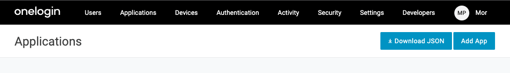
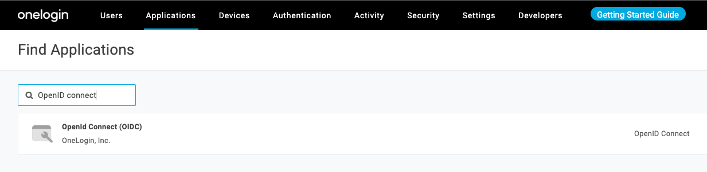
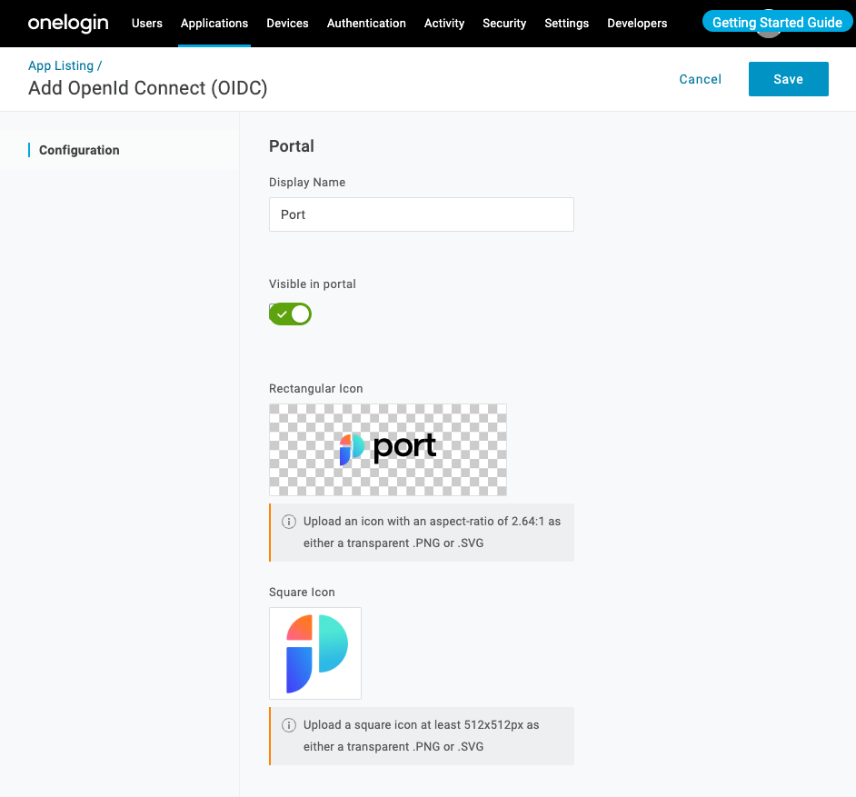
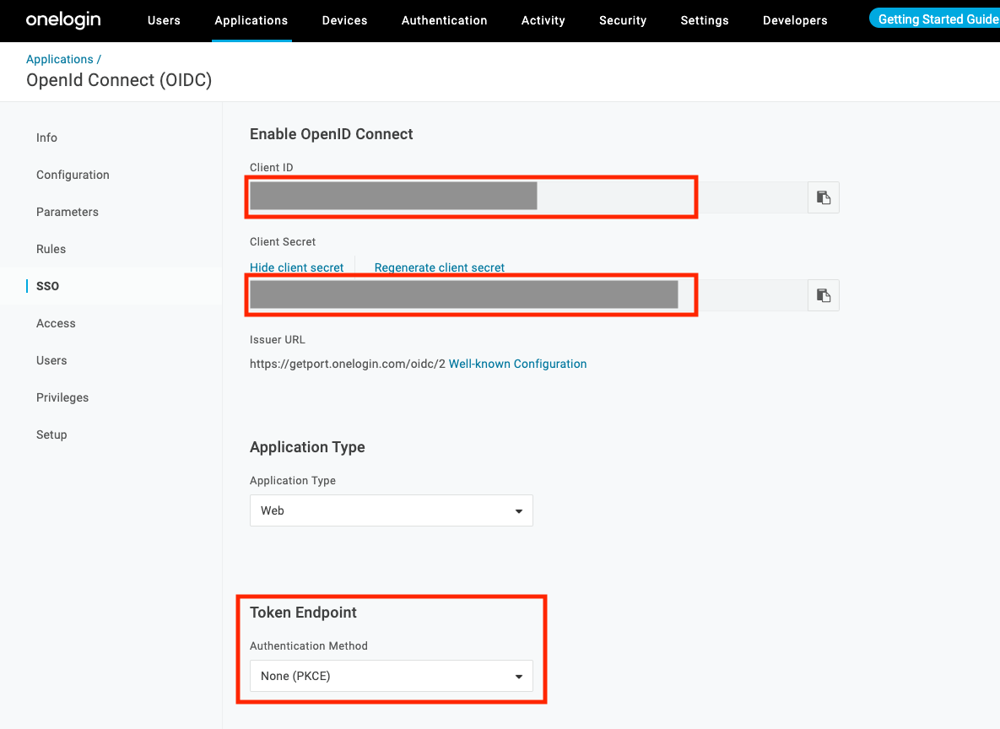
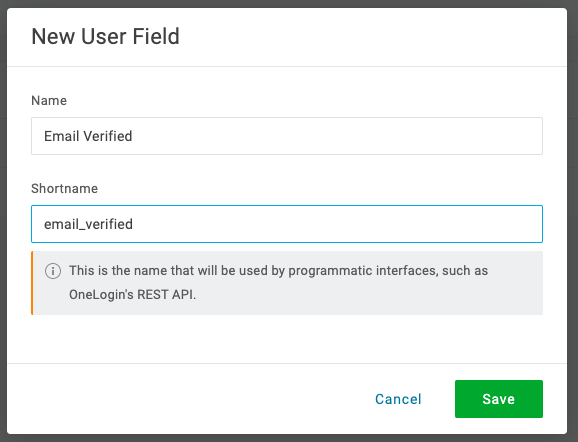
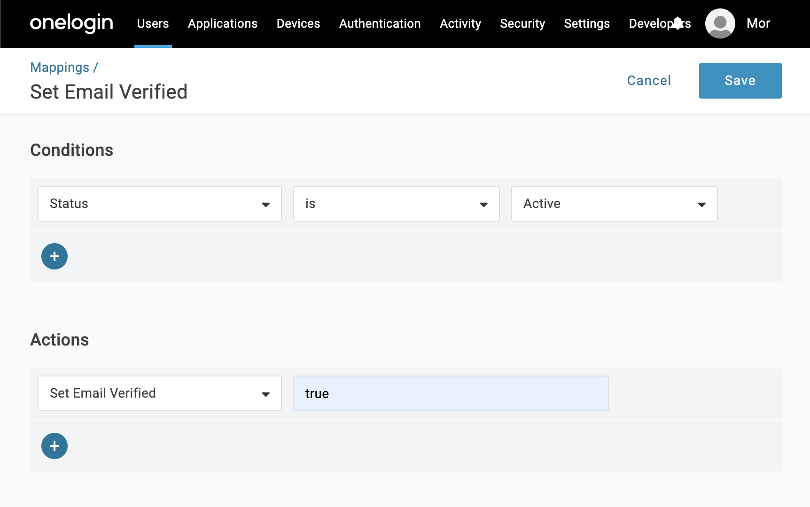
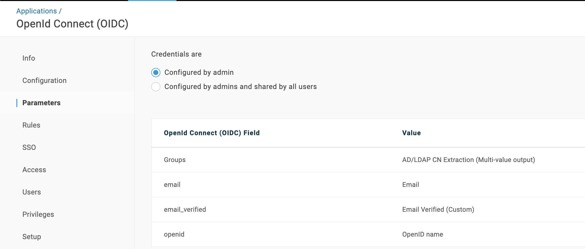
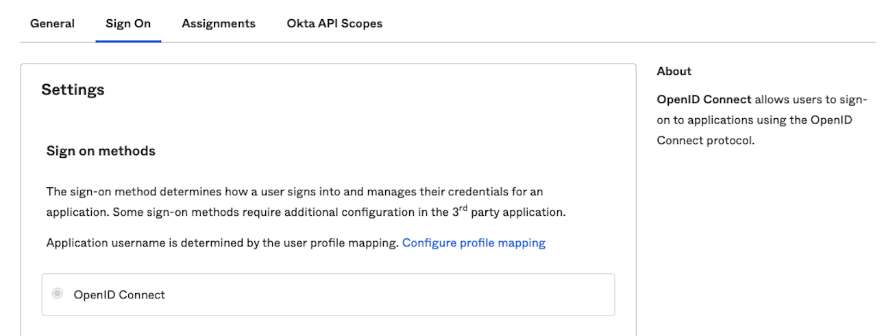
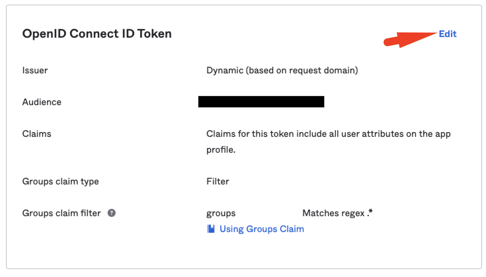
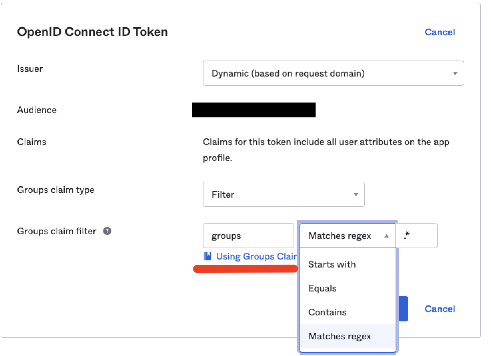

# How to configure Onelogin

This is a step-by-step guide to configuring the integration between Port and Onelogin.

:::info
In order to complete the process you will need to contact us, the exact information we need to provide, as well as the information Port requires from you is listed in this doc.
:::

## Port-Onelogin Integration Benefits ​

- Connect to the Port application via a Onelogin app.
- Your Onelogin roles will be synced with Port, automatically upon user sign-in.
- Set granular permissions on Port according to your Onelogin roles.

## How to Configure the Onelogin App Login to Port​

### Step #1: Create a new Onelogin application

1. In the Admin Console, go to Applications -> Applications.
2. Click `Add App`.

3. In the search box type **OpenID Connect**, then select `OpenId Connect (OIDC)`:

4. Define the initial Port application settings:

   1. `Display Name`: Insert a friendly name for the Port app, like `Port`.
   2. Add a rectangular icon and a square icon (optional):

   

   

Click `Save`.

### Step #2: Configure your Onelogin application

`Configuration` menu:

1. Under `Login URL` set the login URL to the one **provided to you by Port**.

   :::note
   Remember to contact us for your onelogin login URL
   :::

2. Under `Redirect URI's` set: `https://auth.getport.io/login/callback`.

   - The Redirect URI is where Onelogin sends the authentication response and ID token for the sign-in request.

Click `Save`.

:::caution
Be sure to click save before moving on to the other steps, without the `Login URL` and the `Redirect URI's` filled in, trying to save any other application parameter will result in an error.
:::

### Step #3: Configure OIDC settings

`SSO` menu:

1. Copy the `Client ID` and the `Client Secret` and send it to Port (on the slack channel).

2. Change the Token Endpoint - Authentication Method to `None (PKCE)`:

Click `Save`.

### Step #4: Add `email_verified` custom property to all users

The use of OpenID requires that Onelogin pass to Port an `email_verified` field upon user login. Onelogin does not store and expose that field by default, so in this step you are going to configure that field, and apply it to all users in your Onelogin account, the steps outlined here can also be found in the [Onelogin documentation](https://developers.onelogin.com/openid-connect/guides/email-verified).

1. In the Admin Console, go to Users -> Custom User Fields.
2. Click on `New User Field`.
3. Enter the following details:
   1. `Name`: Email Verified
   2. `Shortname`: email_verified

The custom field is `null` by default, in order to change its value to `true` you will create a custom mapping rule:

:::note
It is also possible to manually change the value of the `Email Verified` field to `true` manually for each user that needs access to Port in your organization. But if a large number of users in your organization need access to port, manual assignment is not scalable.
:::

:::tip
The mapping specified here will set the value of the `Email Verified` custom field to `true` for every user whose `Status` is `Active` in your Onelogin organization, feel free to use a different mapping if you need a more specific mapping.
:::

1. Go to Users -> Mappings
2. Click on `New Mapping`
3. Enter mapping details:
   1. `Name`: Insert a friendly name for the mapping, like `Set Email Verified`;
   2. `Conditions`: Set the condition: - Status - is - Active;
   3. `Actions`: Set the action: Set Email Verified - true.
4. Click `Save`.

After creating the mapping rule, go back to Users -> Mappings and click on `Reapply All Mappings`. The new mapping might take a few minutes before it is applied. You can check the status of the mapping job either by by going to Activity -> Jobs and checking the status of the mapping job or by looking at a specific user and verifying that it has the `Email Verified` field set to `true` (and not an empty field which is the default).

### Step #5: Configure OpenID Claims

Go back to the new Port OIDC app and in the `Parameters` menu follow these steps:

1. Click on the `+` button.
2. In the form that appears, under `Field Name` write: `openid` and click `save`.
3. In the value drop down that appears, select `OpenID name`

Repeat the process 2 more times and add the following additional parameters:

1. `Field Name`: email, `Value`: Email
2. `Field Name`: email_verified, `Value`: Email Verified (Custom)

At the end of the process, your `Parameters` section will look like this:

Click `Save`.

---

## How to allow pulling Okta groups to Port

:::note
This stage is **OPTIONAL** and is required only if you wish to pull all of your Okta groups into Port inherently.

**Benefit:** managing permissions and user access on Port.  
**Outcome:** for every user that logs in, we will automatically get their associated Okta groups, according to your definition in the settings below.
:::

To allow automatic Okta group support in Port, please follow these steps:

1. Under the `Application` page, select Port App and go to the `Sign On` tab:

   

2. Under `OpenID Connect Token` click `Edit`:

   

3. Add a `Groups claim type` and choose the option `filter`, then:

   3.1 Value = `groups`

   3.2 Select the required regex phrase to your needs.

   :::note
   To import all groups, insert `Matches regex` with the `.*` value.
   :::

   

   3.3 Click `Save`.
