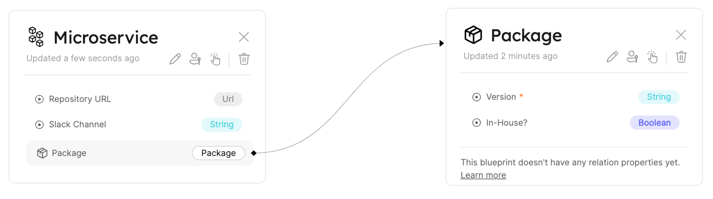

# Relation

## What is a Relation?

**Relations** enable us to make connections between Blueprints, consequently connecting the Entities based on these Blueprints. Doing so provides logical context to the Software Catalog.

**For example**, in order see where your `microservices` are deployed, you need to create a Relation between your `microservices` and `deployment` Blueprints.

## Relation JSON structure

The basic structure of a Relation object:

```json showLineNumbers
"UniqueId": {
    "title": "Title",
    "target": "Blueprint target identifier",
    "required": true,
    "many": false
}
```

:::note
The key of the Relation object is the Relation identifier, in the example above, `UniqueId` is the Relation identifier.
:::

:::info
A Relation exists under the `relations` key in the [Blueprint JSON schema](../blueprint/blueprint.md#blueprint-json-schema)
:::

---

## Structure table

| Field      | Type      | Description                                                                                                                                                    |
| ---------- | --------- | -------------------------------------------------------------------------------------------------------------------------------------------------------------- |
| `title`    | `String`  | Relation name that will be shown in the UI                                                                                                                     |
| `target`   | `String`  | Target Blueprint identifier                                                                                                                                    |
| `required` | `Boolean` | Boolean flag to define whether the target Entity is a must when creating a new Entity from the source Blueprint                                                |
| `many`     | `Boolean` | Boolean flag to define whether multiple target Entities can be mapped to the Relation. For more information refer to [X-to-many relation](#x-to-many-relation) |

## Relation example

Please see the following example of a relation between `microservices` and a `package` Blueprint.
Let's say we have both Blueprints defined and we want to connect between them in a way that the `microservice` will be the `source` and the `package` will be the `target`.

We need to add the following JSON schema of the relation to the `microservice` Blueprint's `relations` object:

```json showLineNumbers
"package": {
  "title": "Package",
  "target": "Package",
  "required": false,
  "many": false
}
```

Resulting in this outcome in the UI:


## X-to-many Relation

Relations also support `many` (its default value is `false`).

From a schema standpoint, when a Relation is defined `"many": true`, the corresponding Relation identifier in the Entities of the source Blueprint becomes an array(`[]`) as seen in [Entity Relation example - `many = true`](../entity/entity.md#entity-relation-example---many--true).

There is also a visual indicator in the Blueprints graph when using `"many": true` (note the `Array` label):


## Byproducts of a Relation

### Relation object for Entities

When two Blueprints are related, creating an Entity of the `source` Blueprint will show an additional option - a `Relation`.

This will add a property under the `relations` section, as shown in the [related entities section](../entity/entity.md#related-entities).

### Mirror properties

Creating a Relation between multiple Blueprints allows you to use **Mirror Properties** to enrich the data attached to your Entities, by querying additional data from related Entities with fewer steps.

You can learn more about these properties in the [Mirror Properties](../blueprint/mirror-properties) page.

## Next Steps

[Explore How to Create, Edit, and Delete Relations with basic examples](./tutorial)

[Dive into advanced operations on Relations with our API ➡️ ](../../api-providers/rest.md)
