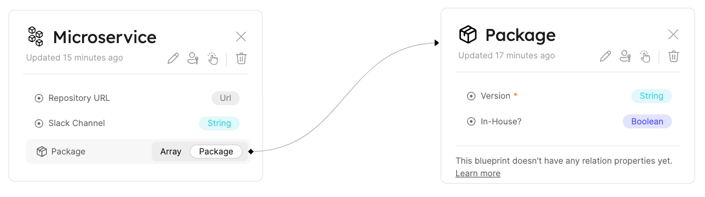

import Tabs from "@theme/Tabs"
import TabItem from "@theme/TabItem"

# Relation Tutorial

## Create Relations

Relations can be created using two methods:

- UI; or
- API.

:::info
A Relation is created between 2 Blueprints. So if you haven't created the `microservice` and `package` Blueprints, in [Creating a Blueprint](../blueprint/tutorial.md#creating-a-blueprint) and [Blueprint basics Next Steps](../blueprint/blueprint.md#next-steps), please make sure to do so in order to follow along.
:::

### From the UI

In order to create a relation from the UI, go to the Blueprints graph and click the pencil icon on the Blueprint that will be the `source` Blueprint of the Relation (for example, you want to map multiple `packages` that are used by a `microservice`, so `microservice` is the `source` Blueprint):


An editor window will open with the current schema of the Blueprint. Since there is no Relation configured on the Blueprint at the moment, the `relations` key in the JSON will be empty. Paste the following content in the `relations` key to create the Relation:

```json showLineNumbers
"relations": {
  "packages": {
      "title": "Package",
      "target": "Package",
      "required": false,
      "many": true
  }
}
```

### From the API

:::note
Remember that an access token is necessary in order to make API requests. If you need to generate a new token, refer back to [Getting an API token](../blueprint/tutorial.md#getting-an-api-token).
:::

In order to create a relation from the API, you will make a PUT request to the URL `https://api.getport.io/v1/{source_blueprint_identifier}`.

The request flow is:

1. Construct the Relation object
2. Get the existing Blueprint schema from Port API
3. Add the new Relation object to the `relations` key of the existing Blueprint
4. Send a PUT request with the complete Blueprint schema

Here are some request examples that will create the Relation between your `microservice` and `package` Blueprints:

<Tabs groupId="code-examples" defaultValue="python" values={[
{label: "Python", value: "python"},
{label: "Javascript", value: "javascript"}
]}>

<TabItem value="python">

```python showLineNumbers
# Dependencies to install:
# $ python -m pip install requests

# the access_token variable should already have the token from previous examples

import requests

API_URL = 'https://api.getport.io/v1'

source_blueprint_name = 'Microservice'

target_blueprint_name = 'Package'

relation_name = 'packages'

relation = {
    'title': 'Package',
    'target': target_blueprint_name,
    'required': False,
    'many': True
}

headers = {
    'Authorization': f'Bearer {access_token}'
}

blueprint_response = requests.get(f'{API_URL}/blueprints/{source_blueprint_name}', headers=headers)

blueprint = blueprint_response.json()['blueprint']

blueprint['relations'][relation_name] = relation

response = requests.post(f'{API_URL}/blueprints/{source_blueprint_name}', json=blueprint, headers=headers)

# response.json() contains the content of the resulting relation

```

</TabItem>

<TabItem value="javascript">

```javascript showLineNumbers
// Dependencies to install:
// $ npm install axios --save

// the accessToken variable should already have the token from previous examples

const axios = require("axios").default;

const API_URL = "https://api.getport.io/v1";

const sourceBlueprintName = "Microservice";

const targetBlueprintName = "Package";

const relationName = "packages";

const relation = {
  title: "Package",
  target: targetBlueprintName,
  required: false,
  many: true,
};

const config = {
  headers: {
    Authorization: `Bearer ${accessToken}`,
  },
};

const blueprintResponse = await axios.get(
  `${API_URL}/blueprints/${sourceBlueprintName}`,
  config
);

const blueprint = blueprintResponse.data.blueprint;

const updatedBlueprint = {
  ...blueprint,
  relations: {
    ...blueprint.relations,
    [relationName]: relation,
  },
};

const response = await axios.post(
  `${API_URL}/blueprints/${source_blueprint_name}`,
  updatedBlueprint,
  config
);

console.log(response.data);

// response.data contains the content of the resulting relation
```

</TabItem>

</Tabs>

After creating the Relation, you will see a visual indicator in the Blueprints graph:



## Update Relations

When updating a Relation, it is only possible to update the `title`, `required` and `many` keys.

:::caution
A few points to consider when updating an existing Relation:

- If you change a Relation identifier, it will effectively delete the old Relation and create a new one under the new identifier;
- If there are Entities that are already connected via Relation, you won't be able to change the identifier and an error message will appear;
- If an existing Relation is defined `many = true` and there are multiple connected Entities in the Relation array, you will fail to update the Relation to `many = false`.

:::

Just like before, you can update a Relation from the UI or from the API.

### From the UI

In order to update a Relation from the UI, go to the Blueprints graph, hover over the `source` Blueprint and click on the pencil icon that appears:


An editor window will open with the current schema of the Blueprint. In order to update the Relation, simply edit the value of the `title`, `required` or `many` properties as needed in the `microservice` Relation object

After editing the Relation, click on `save` at the bottom right corner of the editor and view the updated Blueprint and its Relation.

### From the API

In order to update a Relation from the API, you will make a PUT request to the URL `https://api.getport.io/v1/{source_blueprint_identifier}`.

The request body will include the existing body of the Blueprint, alongside the updated `relations` object, after the desired updates to the existing Relation have been applied.

#### Update Relations Identifiers

In order to rename the relation's identifiers, you can make a HTTP PATCH request to the URL: `https://api.getport.io/v1/{blueprint_identifier}/relations/{relation_identifier}/rename` with this following JSON:

```jsonShowLineNumbers
{
  newRelationIdentifier: "updatedRelationIdentifier"
}
```

## Delete Relations

:::danger
A Relation cannot be restored after deletion!
:::

In order to delete a Relation you can:

- Delete the object of the specific Relation in the Blueprint schema editor;
- Make an HTTP PUT request to the URL `https://api.getport.io/v1/{source_blueprint_identifier}` after removing the specific Relation object from `relations` key in the Blueprint schema.

## Next steps

Now that we understand **Relations**, we can begin to see how Port helps us understand and manage our infrastructure layout.

In the next section we will talk about **Entities**, which are objects that match the type of Blueprints we defined, and the final building block in creating our Software Catalog.
