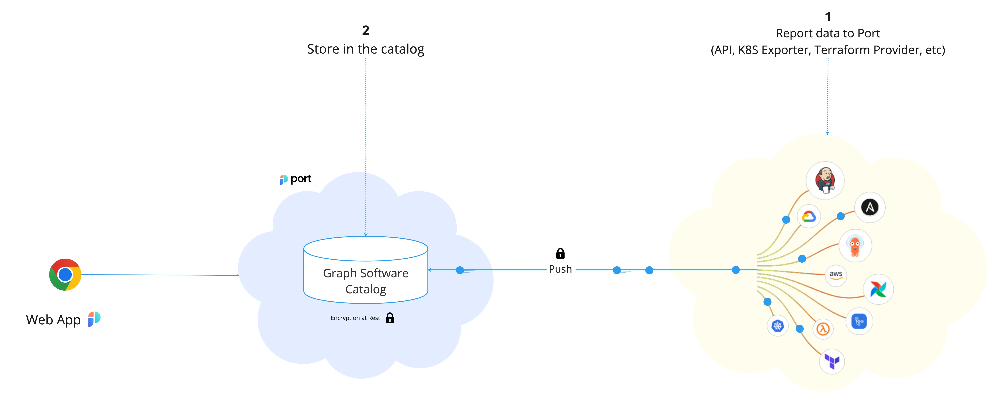

# Software Catalog

The Software Catalog is the core of your developer portal, it allows you to define which infrastructure assets you care about and provides you with a simple interface to ingest and view your assets:

The following section will explore the different Core Components that exist in Port. for more information click on any of the links below:

- [Blueprint](./blueprint/blueprint.md)
- [Relation](./relation/relation.md)
- [Entity](./entity/entity.md)
- [Mirror Properties](./mirror-properties.md)
- [Calculation Properties](./calculation-properties.md)
