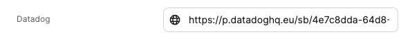
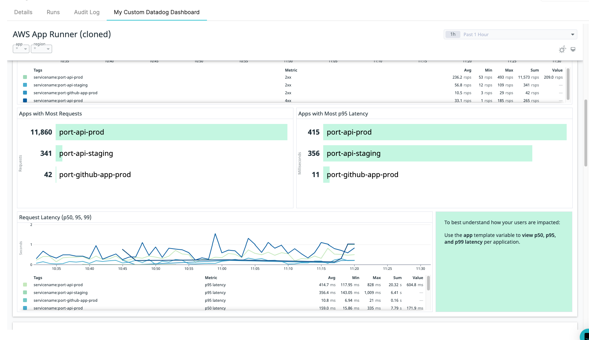

# Embedded URL

You can use the embedded-url `spec` property to embed any publicly available webpage into an additional tab in the [**Specific Entity Page**](../entity/entity.md#entity-page).

By using the combination of `"type": "string`, `"format": "url` and `"spec": "embedded-url"` in a [Blueprint property](../blueprint/blueprint.md#blueprint-properties), Port will display the url as a new tab matching the provided URL in the blueprint's entity.

:::note
Make sure the URL you want to embed in Port is publicly available (i.e. not inside a private VPC or only accessible using a VPN)
:::

## Prerequisites

In order to add an embedded view tab into your Specific Entity Page, all you need is a publicly available URL with the data you want to embed.

## Embedded URL property definition in Blueprint schema

```json showLineNumbers
{
  "title": "Embedded URL Tab",
  "type": "string",
  "format": "url",
  "spec": "embedded-url"
}
```

## Examples

### Datadog dashboard

In this example we are embedding a [Datadog](https://docs.datadoghq.com/dashboards/sharing/) dashboard in order to get application metrics directly inside Port.

Add the `embedded-URL` property to a Blueprint:

<details>
<summary>Blueprint property definition</summary>

```json showLineNumbers
{
  "datadog": {
    "title": "Datadog",
    "type": "string",
    "format": "url",
    "spec": "embedded-url"
  }
}
```

</details>

Create or edit an Entity of the Blueprint you added the `Datadog` property to, and specify the URL to the Datadog dashboard:



Now go to the Specific Entity Page of your Entity and the Datadog dashboard will be visible in a dedicated tab:


