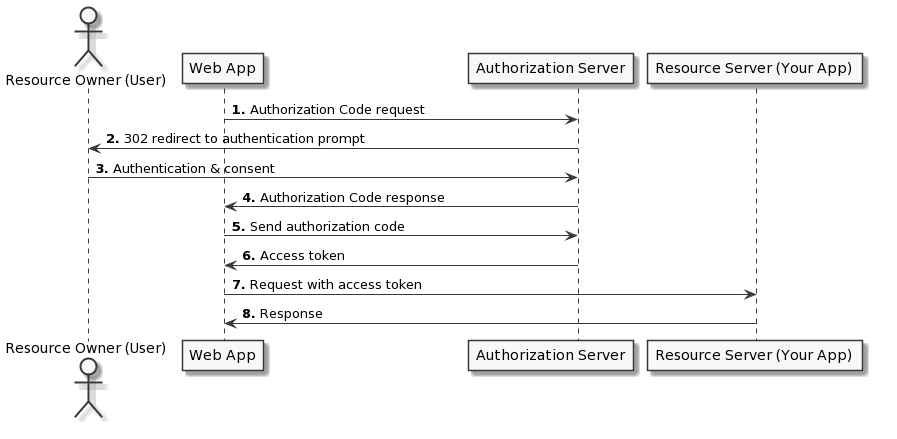

# Authentication

With this feature, you can embed another website that's protected by SSO authentication.
To do this, you'll need the required parameters to create a JWT token.

## Authentication code flow + PKCE

1. The widget will generate a PKCE `code_verifier` & `code_challange`
2. The widget URL is set to the `authorizationUrl` along with the `clientId` and the generated `code_challange`.
3. The widget will then be redirected to the SSO sign-in page.
4. The user will sign in using the SSO. (If the user is already signed in to the SSO, this step will happen automatically)
5. The SSO sign-in page will redirect the widget back to https://app.getport.io with the authorization `code` as a URL hash parameter.
6. The widget will send the `code`, `clientId` and the `code_verifier` to the `tokenURL`.
7. The SSO will validate the PKCE code.
8. A response will come back with an access token.
9. The widget will pass the access token as a query parameter `auth_token={accessToken}` to the URL specified in the property value.
10. Your page should be displayed now!



## Required Parameters

To set up the authentication, you'll need the following parameters:

- `clientId`
- `authorizationUrl`
- `tokenUrl`

Here's an example of how to apply these parameters in your Blueprint:

```json showLineNumbers
{
  "title": "Grafana",
  "type": "string",
  "format": "url",
  // highlight-start
  "spec": "embedded-url",
  "specAuthentication": {
    "clientId": "your-client-id",
    "authorizationUrl": "your-authorization-url",
    "tokenUrl": "your-token-url"
  }
  // highlight-end
}
```

## Examples

#### Okta

<details>
    <summary>Setup</summary>

**Steps:**

1. Follow steps in [right here on Okta documentation](https://developer.okta.com/docs/guides/implement-grant-type/authcodepkce/main/) to create an Application in your Okta Organization.
2. Make sure Port Host is in the Redirect Uris:
   1. Go to Applications > The application you just created > Login >
   2. Add https://app.getport.io as a Sign-in redirect URI.
3. Enable IFrame for Sign-In Page:
   1. Go to Customizations > Other
   2. Scroll to "IFrame Embedding" and enable it.

<br />

**How to configure my Grafana with OAuth & Port embedding?**
:::info Note
The following example is just for illustration purposes and may not reflect the actual URLs and client IDs used in
your Okta setup.

Based on Grafana docs for [JWT Configuration](https://grafana.com/docs/grafana/latest/setup-grafana/configure-security/configure-authentication/jwt/) & [OAuth Configuration](https://grafana.com/docs/grafana/latest/setup-grafana/configure-security/configure-authentication/generic-oauth/)

:::

```ini
[security] -> Required for the embedding
allow_embedding = true

[auth.jwt] -> Required for the embedding
...
jwk_set_url = https://{your-okta-org}.okta.com/oauth2/default/v1/keys
expected_claims = {"iss": "https://{your-okta-org}.okta.com", "aud": "https://{your-okta-org}.okta.com"}
url_login = true
...

[auth.generic_oauth] -> Regular OAuth authentication
...
client_id = {CLIENT_ID}
client_secret = {CLIENT_SECRET}
auth_url = https://{YOUR_OKTA_ORG}.okta.com/oauth2/v1/authorize
token_url = https://{YOUR_OKTA_ORG}.okta.com/oauth2/v1/token
api_url = https://{YOUR_OKTA_ORG}.okta.com/oauth2/v1/userinfo
enable_login_token = true
use_pkce = true
...
```

**Troubleshoot**

- Okta 400 Bad Request displayed
  - Check you used the correct authorizationUrl & clientId.
  - Check your application is activated.
- Okta 400 Bad Request displayed. Your request resulted in an error. The 'redirect_uri' parameter must be a Login redirect URI in the client app settings.

  - Make sure you entered https://app.getport.io as a Sign-in redirect URI for your application as mentioned in the steps above.

- "refused to connect." is displayed
  - Make sure you enabled "IFrame Embedding" as mentioned in the steps above
- Could not fetch your auth token.
  - Make sure your tokenUrl is the correct url.

</details>
