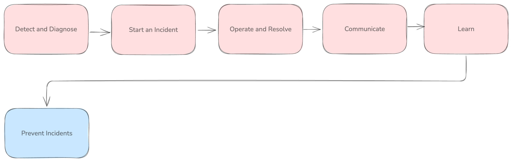

# Incident Management

## Why Manage Incidents through a Developer Portal?

Incident management is much more than just selecting a tool for paging and rotating on-call shifts. It is a discipline that requires almost parallel investigation, communication and reflection - where with little notice, developers are tasked with understanding a problem, identifying a root cause, keeping all internal and external stakeholders aware of what's going on, understanding the impact, resolving the issue and identifying lessons for the future. Quite a tall order. Making this harder is the spread of tools they need to engage with through each step of the process.

Imaging you're going to bed on the first night of your first on-call shift at a new company. Predictably, you receive a phone call from an unknown number an some notoriously unfriendly and robotic sounding voice-to-text programme starts reading you an alert description, one syllable at a time.

Your palms sweat, you open your refurbished macbook pro and start logging into everything all at once:
- Pagerduty to see and acknowledge the event
- Slack to start an incident channel and open a bridge for all those investigating
- Dynatrace to explore the telemetry
- Statuspage to be ready to notify customers of impact
- Github to review recent changes
- ArgoCD to review app sync states
- AWS to be ready to do further investigation around the infrastructure, or take actions to remediate
- Notion to start taking notes I'll later use in a post-mortem

Regardless of whether it's your first on-call or hundredth, the story above highlights the fact that our fragmented toolchains and complex application architecture takes lots of time away from incident triage, investigation and remediation, towards manual tasks around communication and investigation of the incident itself.

## Your Advantage in Port

You're able to close more incidents with less time and stress, thanks to some key features of our portal:
- Prevent incidents with scorecards that improve your posture and production readiness
- Technological and business context in the software catalog (like data on past incidents, recent changes, people with subject matter expertise and active company-wide initiatives)
- Time-saving automations and self-service actions (like automated updates of statuspages, requests for privileged access or incident lifecycle management)
- Streamlined approvals and dynamic permissions (optionally gating key decisions and requests, but allowing for escalation or approval by leadership)
- No-code per-role and identity personalization of dashboards (allowing for unique experiences and collaboration between different devs and SREs across different teams and on-call shifts)
- Drive down MTTR, from time saving automation and self-service actions, but even moreso as a result of continuous improvement of standards and improvement of engineering practices

