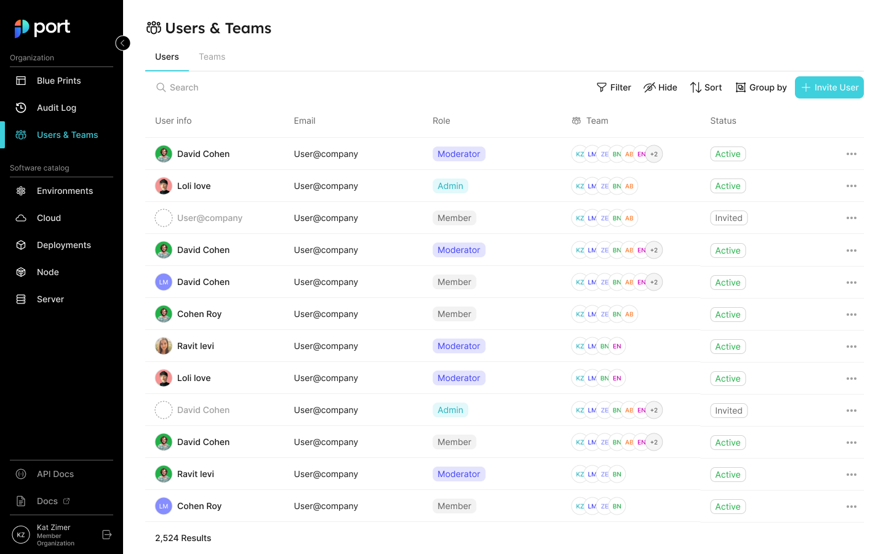

# RBAC

## Users and Teams management

In Port, you can control and manage all your users and teams, in one place.

This allows admins to manage their users and teams inside Port:

1. Invite users to your organization and assign them specific roles and teams.
2. Manage teams and their members.
3. Promote ownership of assets within the organization (with team assignments).
4. Set granular permissions on the portal (permission management).

It will also benefit developers, who could:

1. Know what software assets they own and are responsible for.
2. View and perform actions on their assets, according to their role and team belonging.

### Users & Teams Page

Users and teams management is done from the **Users & Teams page**.

Each user is defined by the following properties:

1. Basic information - image, name, and email.
2. Role - the user’s permissions level (see the [set catalog RBAC](../../build-your-software-catalog/set-catalog-rbac/set-catalog-rbac.md) section);
3. Teams - a `team` is a group of users that owns Entities (see the [team](#team-meta-property) section).



#### Users tab

In the users tab, you can:

- View all users;
- Invite new users;
- Edit users;
- Delete users;
- Etc.

#### Teams tab

In the teams tab, you can:

- View all teams;
- Create new teams;
- Edit teams;
- Delete teams;
- Etc.

:::tip Using SSO for users and teams
When Single Sign-On (SSO) is enabled, users and teams information (including team membership) is taken directly from your identity provider (IdP).

Since the information is taken from your IdP, some actions can't be performed when SSO is active, such as:

- Create teams;
- Edit team membership;
- Delete teams.

If you try to perform one of the disabled actions, the interface will display an explanation:


:::

### `Team` meta property

Each entity has a [meta-property](../../build-your-software-catalog/define-your-data-model/setup-blueprint/properties/meta-properties.md) called `team`, that allows you to set which team owns the entity. As an admin, you can also set blueprint permissions according to this field.

Entity JSON example with `team` field:

```json showLineNumbers
{
  "identifier": "unique-ID",
  "title": "Entity Title",
  "team": "",
  "blueprint": "testBlueprint",
  "properties": {
    "prop1": "value"
  },
  "relations": {}
}
```

Team dropdown selector in the entity create/edit page:


| Field | Type | Description                                            | Default      |
| ----- | ---- | ------------------------------------------------------ | ------------ |
| team  | List | System field that defines the team that owns an Entity | `"team": []` |

- We support the manual creation of teams on Port, as well as integrating with identity providers, such as [Okta](../sso-providers/okta.md) and [AzureAD](../sso-providers/azure-ad.md), to import existing teams.
- When users log in to Port, their groups will be pulled automatically from their identity provider, and the allowed team values will be updated accordingly.

:::info
Okta and AzureAD integrations are only available after configuring SSO from the relevant identity provider, refer to the [Single Sign-On (SSO)](../sso-providers/) section for more details
:::
