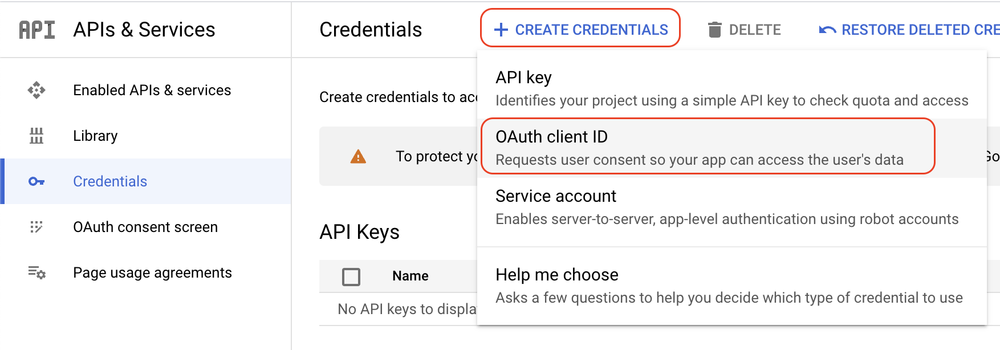

import Image from "@theme/IdealImage";
import credentialsNav from "../../../static/img/sso/google-workspace/credentialsNav.png"
import appType from "../../../static/img/sso/google-workspace/appType.png"
import clientIdAndSecret from "../../../static/img/sso/google-workspace/clientIdAndSecret.png"

# How to configure Google Workspace

Follow this step-by-step guide to configure the integration between Port and Google Workspace.

:::info
In order to complete the process you will need to contact us to receive the information you require, as well as the information Port requires from you. All is elaborated below in the following section.

:::

## Port-Google Workspace integration benefits

- Connect to the Port application via your Google Workspace SSO organization.
- Your Google Workspace teams will be automatically synced with Port upon a user sign-in.
- Set granular permissions on Port according to your Google Workspace groups.

## How to configure Port authentication in Google Workspace

### Step #1: Create OAuth credentials

1. In the [Google API Console](https://console.developers.google.com/), choose your project and navigate to `Credentials`.

<Image img={credentialsNav} style={{ width: 300 }} />

2. Click on `CREATE CREDENTIALS` followed by `OAuth client ID`.

   

3. In the `Application type` field, choose `Web application`, and give you credentials a name.

<Image img={appType} style={{ width: 600 }} />

4. Set the `Authorized JavaScript Origins` and `Authorized redirect URIs`:

   4.1 `Authorized JavaScript Origins`: Add `https://auth.getport.io` URI

   4.2 `Authorized redirect URIs`: Add `https://port-production.eu.auth0.com/login/callback` URI

   4.3 Click `CREATE`.

### Step #2: Contact Port

After creating the credentials in [step #1](./google-workspace.md#step-1-create-oauth-credentials), a new `CLIENT ID` and `CLIENT SECRET` should be created.

<Image img={clientIdAndSecret} style={{ width: 350 }} />

 

Contact Port (via Intercom/Slack) and provide them with:

- Your new credential's `Client ID`;
- Your new credential's `Client Secret`;
- Your `Google Workspace domain` - the domain for your login.
