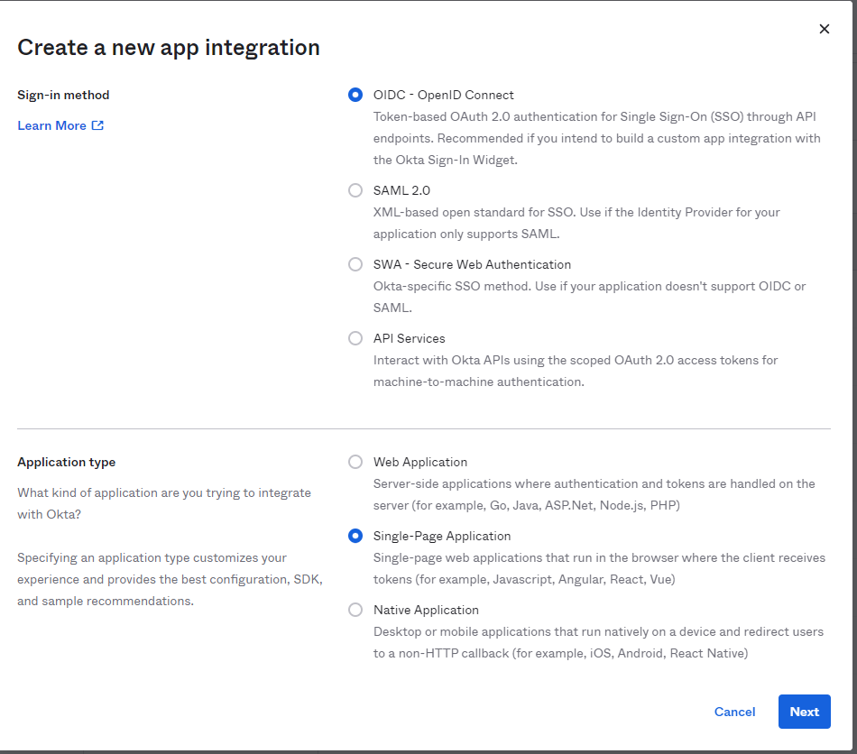
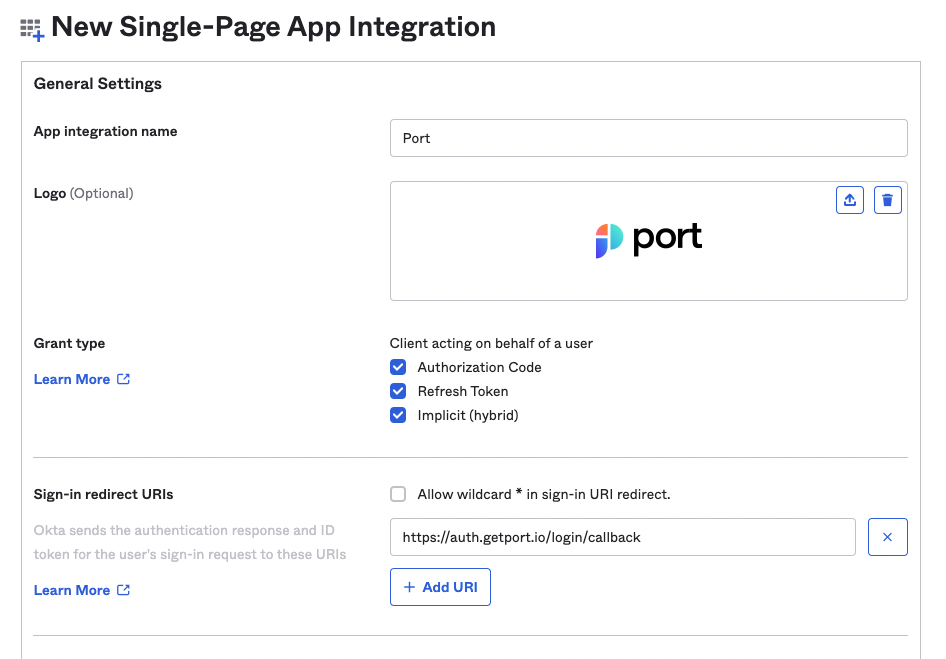
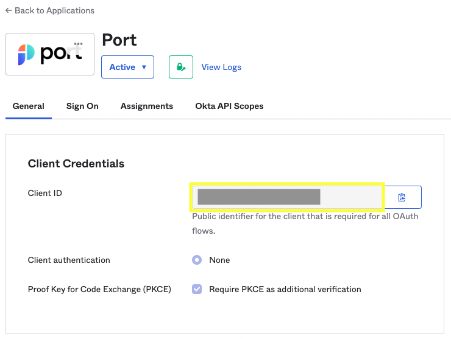
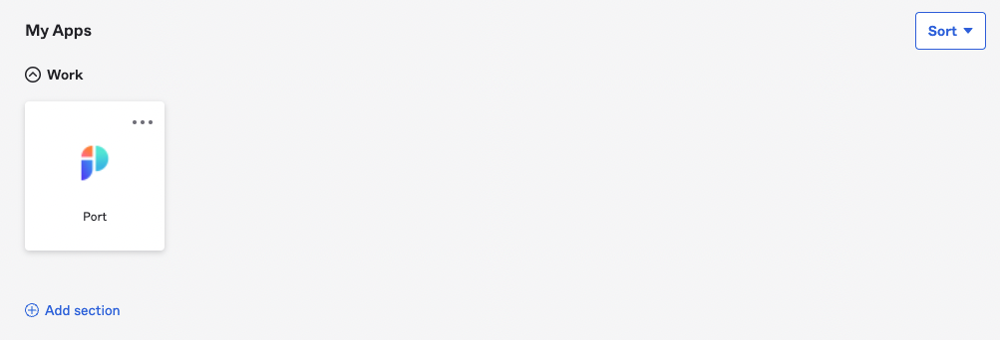

# How to configure Okta

This is a step-by-step guide to configuring the integration between Port and Okta.

:::info
In order to complete the process you will need to contact us, the exact information we need to provide, as well as the information Port requires from you is listed in this doc.
:::

## Port-Okta Integration Benefits ​

- Connect to the Port application via an Okta app.
- Your Okta teams will be synced with Port, automatically upon user sign-in.
- Set granular permissions on Port according to your Okta groups.

## How to configure the Okta app integration for Port​

### Step #1: Create a new Okta application

1. In the Admin Console, go to Applications -> Applications.
2. Click `Create App Integration`.


3. Create an OIDC app integration. Select **OIDC - OpenID Connect** in the Wizard.


4. Choose **Single-Page application** as your application type.



Click `Next`.

### Step #2: Configure your Okta application

Under `General Settings`:

1. Choose an `app integration name` (a specific name that will appear on your Okta apps).
2. Add an application logo (optional).

   

3. Under `Grant type` mark all options.

4. Under `Sign-in redirect URIs` set: `https://auth.getport.io/login/callback`.

   - The Sign-in redirect URI is where Okta sends the authentication response and ID token for the sign-in request.

5. Remove the sign-out redirect URIs.

6. Under `Assignments`: Set `Allow everyone in your organization to access`.

   
   

### Step #3: Configure OIDC settings

Under `General` tab:

1. Copy the `Client ID` and the `Okta Domain` and send it to Port (on the slack channel).

   

2. Click on the `Edit` button on the `General Settings` tab.

   2.1 Set the `Login initiated by` option to `Either Okta or App`:

   

   2.2 Check all the options in `Application visibility`:

   

   2.3 Check `Login flow` to be `Redirect to app to initiate login (OIDC Compliant)`

   2.4 Under `initiate login URI` paste the following URI:

   ```text showLineNumbers
   https://auth.getport.io/authorize?response_type=token&client_id=96IeqL36Q0UIBxIfV1oqOkDWU6UslfDj&connection={CONNECTION_NAME}&redirect_uri=https%3A%2F%2Fapp.getport.io
   ```

   :::note
   We will provide your `{CONNECTION_NAME}` (Contact us on Slack/Intercom).
   :::

   

   2.5 Click `Save` and you’re done! now you’ll have the Port app on your Okta dashboard.

   

---

## How to allow pulling Okta groups to Port

:::note
This stage is **OPTIONAL** and is required only if you wish to pull all of your Okta groups into Port inherently.

**Benefit:** managing permissions and user access on Port.  
**Outcome:** for every user that logs in, we will automatically get their associated Okta groups, according to your definition in the settings below.
:::

To allow automatic Okta group support in Port, please follow these steps:

1. Under the `Application` page, select Port App and go to the `Sign On` tab:

   

2. Under `OpenID Connect Token` click `Edit`:

   

3. Add a `Groups claim type` and choose the option `filter`, then:

   3.1 Value = `groups`

   3.2 Select the required regex phrase to your needs.

   :::note
   To import all groups, insert `Matches regex` with the `.*` value.
   :::

   

   3.3 Click `Save`.
