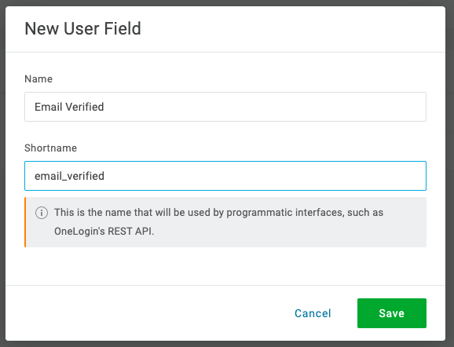
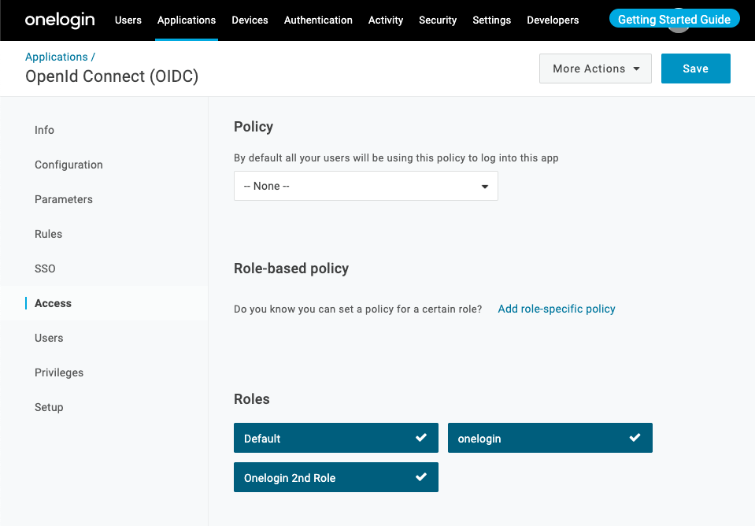

# How to configure Onelogin

This is a step-by-step guide to configuring the integration between Port and Onelogin.

:::info
In order to complete the process you will need to contact Port to deliver and receive information, as detailed in the guide below.
:::

## Port-Onelogin Integration Benefits ​

- Connect to the Port application via a Onelogin app;
- Your Onelogin roles will be automatically synced with Port, upon user sign-in;
- Set granular permissions on Port according to your Onelogin roles.

## How to configure the Onelogin app integration for Port​

### Step #1: Create a new Onelogin application

1. In the Admin Console, go to Applications -> Applications.
2. Click `Add App`.


3. In the search box type **OpenID Connect**, then select `OpenId Connect (OIDC)`:


4. Define the initial Port application settings:

   1. `Display Name`: Insert a name of your choice for the Port app, like `Port`.
   2. Add rectangular and square icons (optional):

   

   


Click `Save`.

:::tip
Most of the following steps involve editing the initial Port app you created. Keep in mind you can always go back to it by opening the admin console and going to Applications -> Applications, the Port app will appear in the application list.
:::

### Step #2: Configure your Onelogin application

In the Port app, go to the `Configuration` menu and follow these steps:

1. Under `Login URL` paste the following login URL:

```text showLineNumbers
https://auth.getport.io/authorize?response_type=token&client_id=96IeqL36Q0UIBxIfV1oqOkDWU6UslfDj&connection={CONNECTION_NAME}&redirect_uri=https%3A%2F%2Fapp.getport.io
```

:::note
We will provide your `{CONNECTION_NAME}` (Contact us on Slack/Intercom).
:::

2. Under `Redirect URI's` set: `https://auth.getport.io/login/callback`.

   - The Redirect URI is where Onelogin sends the authentication response and ID token for the sign-in request.

Click `Save`.

:::caution
Be sure to click save before moving on to the next step because without the `Redirect URI's` filled in, trying to save any other application parameter will result in an error.
:::

### Step #3: Configure OIDC settings

In the Port app, go to the `SSO` menu and follow these steps:

1. Copy the `Client ID` and the `Client Secret` and send it to Port (on the slack channel).

2. Click on the `Well-known Configuration` Link, and send the page address to Port (its format will be `https://{YOUR_DOMAIN}.onelogin.com/oidc/2/.well-known/openid-configuration`)

3. Change the Token Endpoint - Authentication Method to `None (PKCE)`:


Click `Save`.

### Step #4: Add `email_verified` custom property to all users

The use of OpenID requires that Onelogin passes to Port an `email_verified` field upon user login. Onelogin does not store and expose that field by default, so in this step, you are going to configure that field and apply it to all users in your Onelogin account. The steps outlined here can also be found in the [Onelogin documentation](https://developers.onelogin.com/openid-connect/guides/email-verified).

1. In the Admin Console, go to Users -> Custom User Fields.
2. Click on `New User Field`.
3. Enter the following details:
   1. `Name`: Email Verified
   2. `Shortname`: email_verified



The custom field is `null` by default, in order to change its value to `true` you will create a custom mapping rule:

:::note
It is also possible to manually change the value of the `Email Verified` field to `true` for each user that requires access to Port in your organization. However, granting access manually to a large number of users is not scalable.
:::

:::tip
The mapping specified here will set the value of the `Email Verified` custom field to `true` for every user whose `Status` is `Active` in your Onelogin organization. Feel free to use a different mapping if you seek a specific mapping.
:::

1. Go to Users -> Mappings
2. Click on `New Mapping`
3. Enter mapping details:
   1. `Name`: Insert a friendly name for the mapping, like `Set Email Verified`;
   2. `Conditions`: Set the condition: - Status - is - Active;
   3. `Actions`: Set the action: Set Email Verified - true.
4. Click `Save`.


After creating the mapping rule, go back to Users -> Mappings and click on `Reapply All Mappings`. The new mapping might process for a few minutes before it is applied. You can check the mapping job status either by going to Activity -> Jobs or by looking at a specific user and verifying that it has the `Email Verified` field set to `true` (and not the default empty field).

### Step #5: Configure OpenID Claims

In the Port app, go to the `Parameters` menu and follow these steps:

1. Click on the `+` button;
2. In the form that appears, under `Field Name` write: `openid` and click `save`;
3. In the value drop down that appears, select `OpenID name`.

Repeat the process two more times and add the following additional parameters:

1. `Field Name`: email, `Value`: Email
2. `Field Name`: email_verified, `Value`: Email Verified (Custom)

At the end of the process, your `Parameters` section will look like this:


Click `Save`.

### Step #6: Exposing the application to your organization

1. In the `Application` page, select the Port app and go to the `Access` menu.
2. In the `Roles` section, select the roles you want to expose the Port app to:

   

3. Click `Save`.

After completing these steps, users with roles that the Port app was assigned to, will see the Port app in their Portal and upon clicking it, will be logged in to Port:

[Onelogin Portal With Port App](../../../static/img/sso/onelogin/OneloginPortalWithApp.png)

---

## How to allow pulling Onelogin roles to Port

:::note
This stage is **OPTIONAL** and is required only if you wish to pull all of your Onelogin roles into Port inherently.

**Benefit:** managing permissions and user access on Port.  
**Outcome:** for every user that logs in, we will automatically get their associated Onelogin roles, according to your definition in the settings below.
:::

To allow automatic Onelogin roles support in Port, please follow these steps:

1. In the `Application` page, select the Port app and go to the `Parameters` menu;

2. Click on the `Groups` claim:

   

3. Update the groups claim:

   1. Change the value of `Default if no value selected` to `User Roles`;
   2. From the dropdown, select `Semicolon delimited input`:

   

   3. Click `Save`.

4. Click `Save`.
