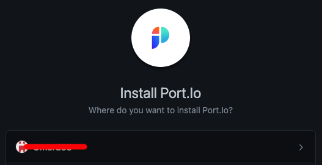
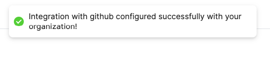

# GitHub App

Port allows DevOps teams to build a catalog of software assets empowering everyone to perform self-service actions.  
As part of our goal to 

Visit [our GitHub App](https://github.com/apps/getport-io) page.

You'll find here a step-by-step guide to installing the GitHub App of Port.

## What does our GitHub application give you?

## How is our GitHub App built?

### Architecture

### Inputs

#### YAML files

### Triggers

- Merging a branch to the `main` (default) branch will trigger the app look for the input type.

### Permissions

## What our GitHub app provides out of the box?

### GitHub environment variables

| variable name | Type | Description | 
| ----------- | ----------- | ----------- | 
| `identifier` | `String` | A unique identifier.   **Note that** while the identifier is unique, it can be changed after creation. |

## Installing Port's GitHub application

:::note Prerequisites 
- A registered organization in Port. 
- Your Port user role is set to `DevOps`.
::: 

### Installation

1. Go to the [GitHub App page](https://github.com/apps/getport-io).

2. Click `Install`.

    

3. Choose to which repositories you wish to install the app:

    

4. You'll be redirected to Port, please **log in**.

5. Once Logged in, see the success indication on the top of the screen:

    

## Trying out our App with mock data

:::note
This repo is `private` at the moment, so you’ll get a 404.
Please contact us with your GitHub user for access.
:::

1. Clone our example repo: [github-app-setup-example](https://github.com/port-labs/github-app-setup-example).

2. 