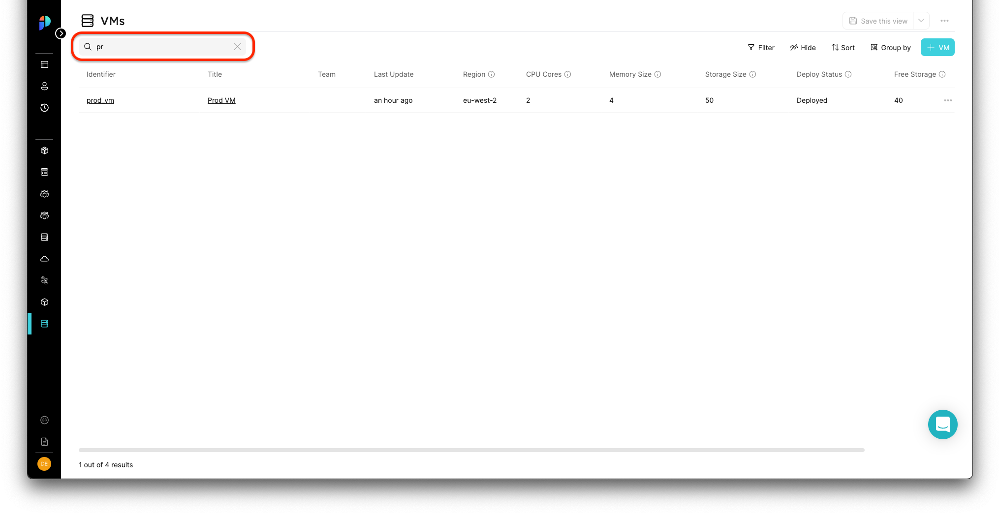

# Pages

## What is a page?

A page is a viewing component that displays data of entities in a few forms, such as table form, data summary, etc.

### Basic concepts of pages
- blueprint's **default pages**: Created automatically when a blueprint is created, and located in the navigation bar. They contain a single table widget.
- Pages are **dynamic**: We can create multiple pages, each of which displays data according to the filtering parameters we set for it.
- **Entity pages**: Created automatically for each new entity we create.

### Pages architecture

**1. **Pages are built from **Widgets**.

:::note Widgets
A Widget is a view component from which Pages are built.
It contains the entity type, and a default configuration of the view. 
:::

A page can hold a single widget or multiple widgets, for example: 
- A full table view widget.
- Details section widget in an entity page.
  

**2. **Pages can contain **tabs**.

:::note Tabs
A tab is a sub-page view of a page, and itself is a page.
:::
   
   Pages can be separated into several tabs, each of which is a page that holds one or many widgets.

   **Default Tabs:**
   - Overview
   - Audit Log  

:::note Pages Hierarchy
**Pages** contain Widgets and Tabs.  
**Tabs** are pages within pages.
:::

## Blueprint Page

A full page table widget that holds all of the blueprints specific entities. 

#### Default view

## Entity Page

Each entity has a specific page that contains two tabs (by default).  
The first is the `Overview` tab, which shows two widgets: the details of the entity and a table(s) of its related entity(ies). The second is an `Audit Log` tab that contains a full-page table widget.   

:::note Relations within an entity page
**Related entities** of an entity are presented on the entity page a bulk of table widgets. 
:::

## Page operations

Each page type has a set of operations that can be done from the UI.  
The table below summarizes the available operation according to the page type:

| Page Type | Save a view | Save view as  a new page | Edit page | Delete Page |
| ----------- | :-----------: | :-----------: | :-----------: | :-----------: | 
| Blueprint page | V | V | V | V |
| Entity page | V | X | X | X |
| Users page | V | X | X | X |
| Audit log page | V | X | X | X |
 

All page operations are available on the top bar of the bar, as shown here:   

### Saving views

Every change made on a specific page, such as [widget operations](#widgets), enables the `Save this view` button.  
Clicking on it will save the new view for all users.

:::note
The ability to save a view for all users is available only for the **DevOps role**. 
:::

### Saving new pages

Each time a change is made on a page, and the `Save this view` becomes enabled, you can press the small arrow on its right side to open the drop menu.

After clicking the `Save as a new page` button, a window will pop:  

:::note
When saving a new page or editing an existing one, a set of icons is available to you:

:::

### Edit or delete a page

#### Editing pages

By clicking the `...` button on the top right corner, you can edit the page name and its icon.

Editing a page:

#### Deleting pages
:::note
Deleting an entity page occurs when deleting the entity itself.
:::
:::danger Deleting a page
Notice that deleting a blueprint page cannot be restored.  
If the page you try to delete is *the only* view for blueprints, you'll **lose access** to all the blueprints entities.
:::

## Widgets

A widget is a UI component that shows data to the user.
On Port, we have a few types of widgets:

- Table widget.
- Summary (Details) widget.
  

## Table widget operations

Table operations are used to define the view that the user will see on Port.  

:::tip
We highly recommend using the table operations to provide the cleanest and most accurate view for your developers. 
:::

All table operations are available on the top bar of the table:

### Filter 

Filtering a table is done using the following menu:

You can choose any field to filter, and define a filtering operator and a value to it.  
You can filter according to *one or many fields* while setting the relation between each field filter: `And/Or`.

 

:::note
We support the following filtering operators: `'contains', '=', '!=', 'begins with', 'Has any of', 'end with', 'does not contain', 'does not begin with', 'does not end with'`.
:::

### Sort

Sorting the table is done on the following menu:

You can sort by any field, and use *one or many* fields to sort according to. We support `Ascending` and `Descending` sorting options.

:::note
Sorting a specific column can be done by clicking on the column title.
:::

### Hide

Hiding table columns is done on the following menu:

You can decide whether each field is viewable to users or not.

:::tip
We highly recommend hiding irrelevant data from users, to provide a clean view.
:::

### Group By

Grouping by entities is done on the following menu:

You can group results according to any field in the table.

:::tip
Group by is recommended when you want to create custom views for users, such as Microservices by Owners.  
Just create your group by setting, add additional viewing settings if needed, and Save the page **as a new view** ([See How.](#saving-new-pages)) 
:::

### Search

We provide a free search option on tables.  
Searching on a table is available on the left side of the top bar:

  

[Explore Advanced Operations on Pages with our API ➡️ ](../api-reference)