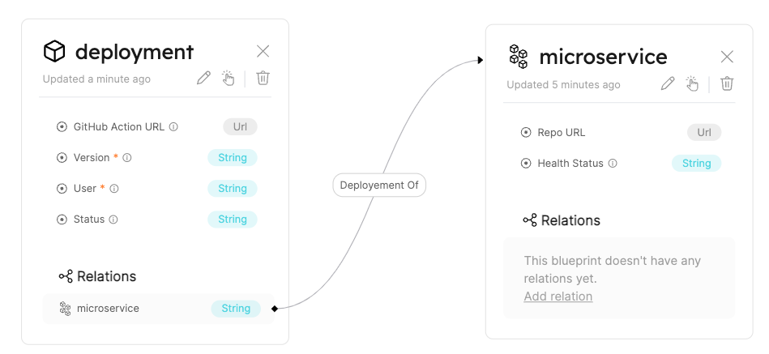

# Relation

## What is a relation?

**Relations** enable us to make connections between blueprints. This gives logical context to your software catalog.  

In practice we can use relations to connect between entities of the related blueprints.  

**For example**, to see where your `microservices` are deployed, you need to create a relation between your `microservices` and `deployment` blueprints.

## Relation JSON structure

The basic structure of a Relation schema:

```json showLineNumbers
{
    "identifier": "UniqueId",
    "title": "Title",
    "source": "Blueprint Source Identifier",
    "target": "Blueprint Target Identifier",
    "required": false
}
```

---
## Structure table
| Field | Type | Description | 
| ----------- | ----------- | ----------- | 
| `identifier` | `String` | A unique identifier. <br /> **Note that** while the identifier is unique, it can be changed after creation. |
| `title` | `String` | A nicely written name for the relation that will be shown in the UI. |
| `source` | `String` | The source blueprint identifier. |
| `target` | `String` | The target blueprint identifier. |
| `required` | `Boolean` | A boolean flag to define whether the target entity is a must when creating a new source. | 


:::tip
The title allows you to give human-readable names to relations. For example, A `Package` <-> `Deployment` relation can be called  `Used By` to describe the context of the relation to the user.

Using titles also allows you to conveniently access relations programmatically in a generic way while keeping the UI readable.

For example, you can define a convention where all relations are named in a specific format:
- `{blueprint_1}-{blueprint_2}`
- `{blueprint_1}-to-{blueprint_2}`
- `{blueprint_1}<->{blueprint_2}`
- or anything similar that works for you

This will allow you to interact with relations in code in a generic way, without impacting UX.
:::

:::note
When creating a blueprint from the API, there is no need for the `source` field. For more info refer to the [API reference](../api-reference) section.
:::


## Relation example

Please see the following example of a relation between `microservices` and `deployment` blueprint.
Let's say we have those two blueprints defined, and we want to connect between them, in a way that the `deployment` is the `source` and `microservice` is the `target`.  

The JSON schema of the relation is as follows:
```json
{
    "identifier": "deploy-2-microservice",
    "title": "Deployement Of",
    "source": "deployment",
    "target": "microservice",
    "required": false
}
```

Resulting in this outcome in the UI:


:::info
Our `source` to `target` relations are one-to-many, at the moment. Meaning that the `target` blueprint can have many entities of the `source` blueprint.  
For example, a `deployment -> microservices` relation means that a `microservice` can be deployed many times, while a `deployment` represents a single `microservice`.
:::
:::note
We will support many-to-many relations soon 🚀🤘
:::


## Byproducts of a relation

### Mirror properties in blueprints

When two blueprints are connected via a relation, a new set of properties becomes available to entities in the `source` blueprint.
Those new properties are called `mirrorProperties`.

On the `source` blueprint, there will be an additional section called `mirrorProperties` that represents the mirror to the identifier of the `target` blueprint.

See the `mirrorProperties` structure in the [blueprint schema](./blueprint#mirror-properties).

### Relation object for entities

When two blueprints are connected, creating an entity of the `source` blueprint will show an additional option - a `relation`.  
This will add a property under the `relations` section, as shown in the [relations section.](./entity#related-entities)

## Next Steps

[Explore How to Create, Edit, and Delete Relations with basic examples](../../how-to-guides/basic-operations/relation-operations.md)

[Dive into advanced operations on Relations with our API ➡️ ](../api-reference)