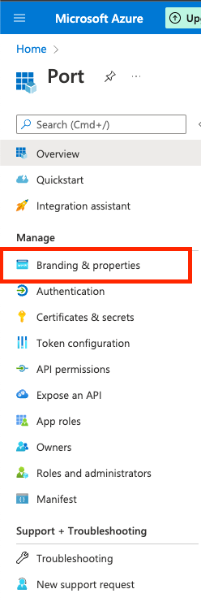
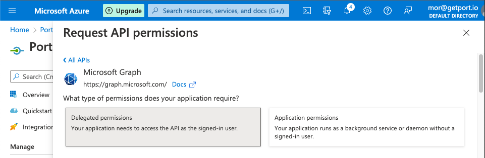
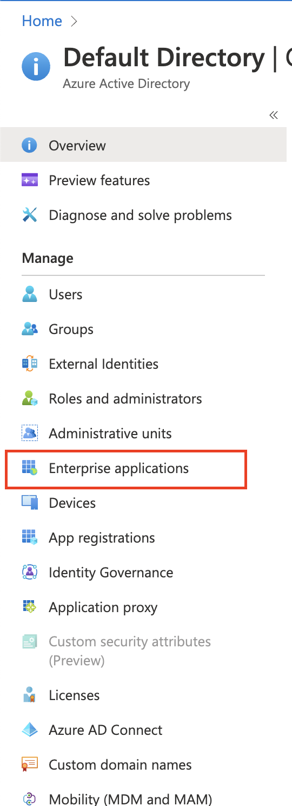
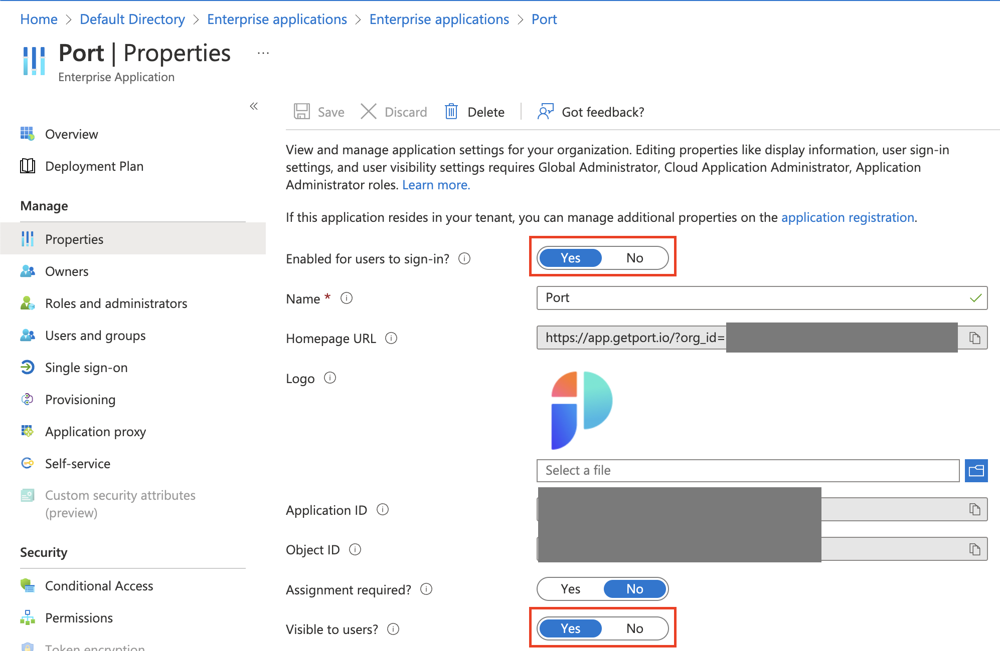

# How to configure AzureAD

This is a step-by-step guide to configuring the integration between Port and Azure Active Directory.  

## What does the Port-AzureAd integration give you?

- You'll be able to connect to the Port application via an AzureAD app. 
- Your AzureAD teams will be synced with Port automatically upon a user sign-in.
- You'll be able to set granular permissions on Port according to your AzureAD groups.

## How to configure a Port application in Azure AD

### Step #1: Register a new application

1. In the Microsoft Azure Portal, go to `Azure Active Directory`.
   
2. Click `App registrations`.
    
    

    
    
    

3. Click `New registration` at the top of the page

    

4. Define the Port application settings:

    4.1 `Name`: Insert a friendly name for the Port app, like `Port`.

    4.2 `Supported account types`: Please select the option that is appropriate for your organization.

    :::note
        For most use cases this would be **Accounts in this organizational directory only (Default Directory only - Single tenant)**.
    :::

    4.3 `Redirect URI`: 
     * Set `Platform` to `Web`.
     * Set `URL` to ` https://auth.getport.io/login/callback`.

    

    4.4 Click `Register`.

### Step #2: Customize your Port app with Login URL and Logo

   1. On the new Port App page, click `Branding & Properties`.

    

    
    

    

    1.1 `Home page URL`: paste the following URL: `https://app.getport.io/?org_id={YOUR_ORGANIZATION_ID}`.

    :::note
        We will provide your organization id.
    :::
    
    1.2 Add the Port logo (Optional):
        
    

    1.3 `Publisher domain`: Select the domain matching **your** user emails (for example `getport.io`).

    

    1.4 Click `Save`.

### Step #3: Configuring the application permissions

1. On the Port App page, click `API Permissions`.

    

    
    
    

2. Click `Add a permission`:

    

3. On the `Microsoft APIs` tab:
    
    3.1 Click on `Microsoft Graph` 
    
    

    3.2 Click on `Delegate Permissions`

    

    3.3 Search and mark the following permissions:

    - `email`, `openid`, `profile`, `User.read`.

    

    3.4 Click `Add permissions`.

    :::note
    (OPTIONAL) `Grant admin consent`: When users from your organization will first log in, they will be prompted to confirm the permissions specified here.  You can click the `Grant admin consent for Default Directory` to approve the permissions automatically to them.
    :::

### Step #4: Configuring the application claims

1. On the Port App page, click `Token configuration`:

    

        

    

2. Click `Add optional claim`:

        

3. Select `ID` as the token type and then select the `email` claim, then click `Add`.

        

    :::note
        Repeat the same process for `Access` and `SAML` (3 times total).
    :::

4. Your optional claims should look like this:

        

    :::info    
    If you wish to configure the `groups claim` to pull your AzureAD groups into Port, please follow [How to allow pulling AzureAD groups to Port](#how-to-allow-pulling-azuread-groups-to-port).
    :::

### Step #5: Configuring application secret

1. On the Port App page, click `Certificates & Secrets`:

    

        

    

2. On the `Client secrets` tab, click the `New client secret` button:
   
        

    2.1 `Description`: Enter a description for the secret, for example `Port Login Client Secret`.

    2.2 `Expires`: Select when will the secret will expire.

    :::danger
    Be sure to mark on your calendar the expiration date of the secret, the secret should be replaced before it expires otherwise login to Port will be disabled.
    :::

    2.3 Click `Add`.

    A secret will be created, the Secret Value will appear as shown in the image below. Record the value of the secret right now, we will need it in the next step. 
    
    :::danger COPY YOUR SECRET NOW
    Note that: your secret will be never displayed again after you leave this page.
    :::

        

### Step #6: Providing the application information to Port

:::note
To support Port from our side, Port needs the following information.
:::

- The `Client Secret` Value that you created on [Step 5: Configuring application secret](#step-5-configuring-application-secret).
- The `Application (Client) ID`, which appears on the Port Application Overview page:

        

:::note
**Port** will provide you the `organization_id` needed for the Homepage URL of the App, as described on [Step 2](#step-2-customize-your-port-app-with-login-url-and-logo).
:::

### Step #7: Exposing the application to your organization

1. Assigning the App to organization users and groups  
   
   After the App setup is complete, you can begin distributing it in your organization:

    1.1 Go to `Azure Active Directory`.

    1.2 Go to `Enterprise Applications`.

    

        

    

2. Click on the Port app

        

3. Click on `Users and Groups`

    

        

    

4. Click `Add user/group`

        

    4.1 Select users and groups you want to give access to Port

    4.2 Click `Assign`.

    :::note
    **IMPORTANT:** To make the **Port** app connection work, users who have access need to have a legal value in their `Email` field in Azure AD.
    :::

5. Make the Port application visible on the `myapplications` page:

    5.1 Go to `Azure Active Directory`.

    5.2 Go to `Enterprise Applications`.

    5.3 Click on the Port app.

    5.4 Click on `Properties`:

    

            

    

    5.5 Set the application peroperties:

    - Mark `Enabled for users to sign-in?` as `Yes`.

    - Mark `Visible to users?` as `Yes`.

    - Visiting application page permissions

    :::note
    By default the `Assignment required?` flag is set to `No`, meaning any user with the Homepage URL to the Port app can access it, even if the app isn’t directly assigned to him.  
    Changing the flag to `Yes` means only users and groups the app is directly assigned to can use and access it.
    :::

            

    Directing users to `myapplications.microsoft.com`, they should see the Port app on the dashboard.

    

    :::note
    Users can also manually access Port by going to the App Homepage URL: `https://app.getport.io/?org_id={your_organization_id}`
    :::

---

## How to allow pulling AzureAD groups to Port

:::note
This stage is **OPTIONAL** and is required only if you wish to pull all of your AzureAD groups into Port inherently.

**Benefit:** managing permissions and user access on Port.  
**Outcome:** For every user that logs we will get automatically his associate AzureAD groups, according to your definition in the settings below.
:::

1. On the `Token configuration` tab, Click `Add groups claim`

        

2. On the groups' claim window, check the following options: `Security Groups`, `Directory roles`, `All groups`.
   
   :::note
    You can also edit how the ID of the groups that are provided to Port. in the following example we left it as Group ID:

    
   :::

3. Click `Add`.
