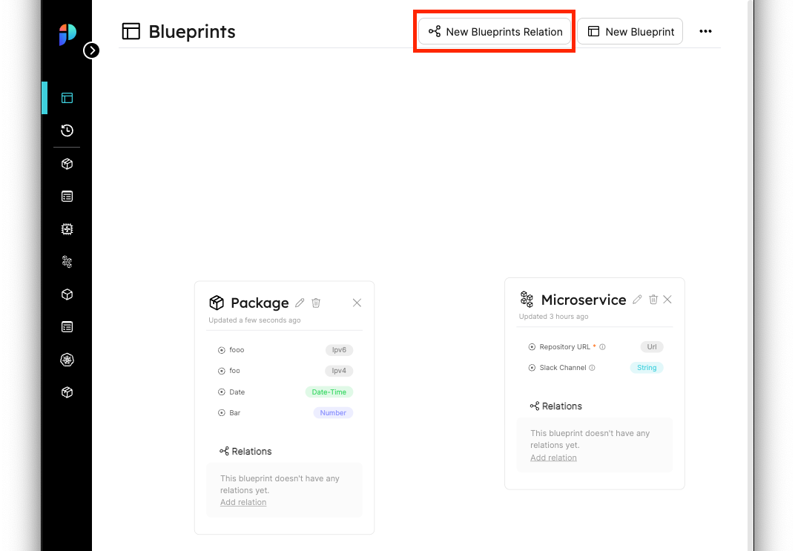
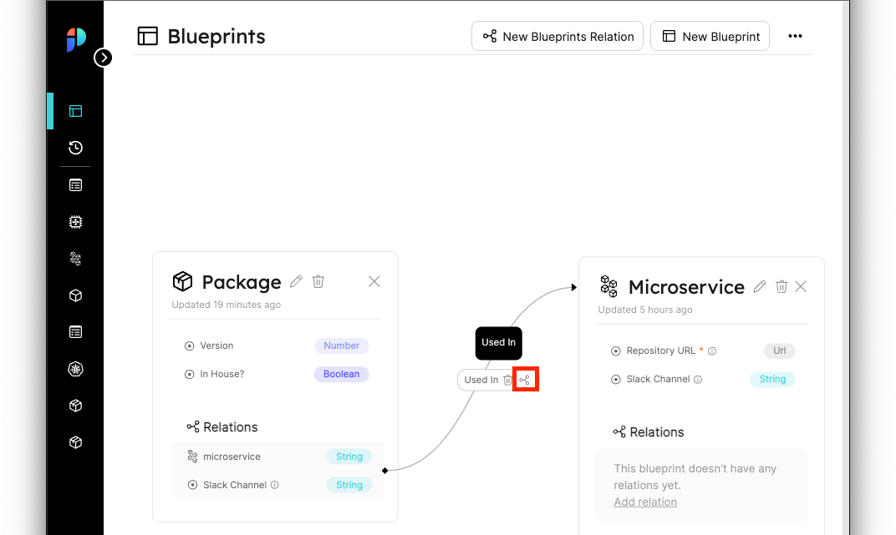
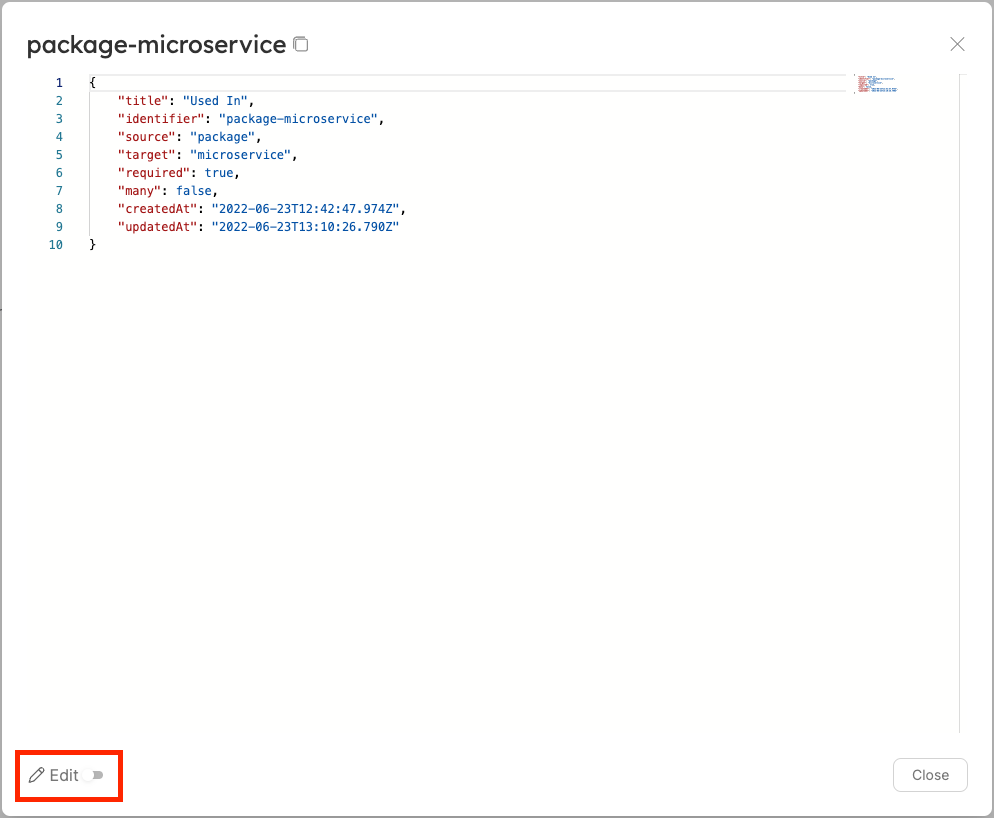
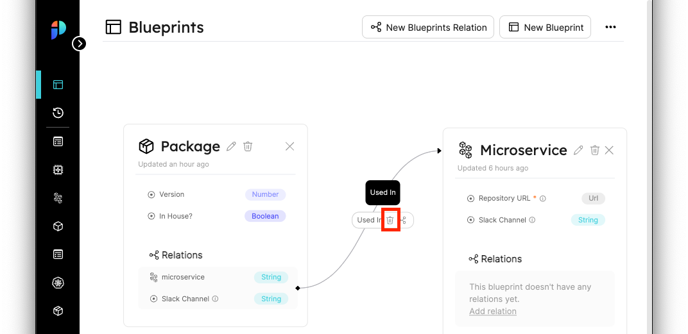

import Tabs from "@theme/Tabs"
import TabItem from "@theme/TabItem"

# Relation Operations

## Creating relations

Relations can be created in two ways:

- From the UI
- From the API

:::note
Remember that an access token is needed to make API requests, refer back to [Getting an API token](blueprints#getting-an-api-token) if you need to generate a new one
:::

:::info
Relations require 2 blueprints to map a connection between, if you haven't created the `Microservice` blueprint in [Creating a Blueprint](blueprints#creating-a-blueprint) and the `Package` blueprint in [Blueprint Next Steps](blueprints#next-steps), please make sure to do so if you want to follow along
:::


### From the UI

In order to create a relation from the UI, go to the Blueprints Graph, at the top right corner of the page you can find the `New Blueprints Relation` button:



After clicking the button an editor window will open with a format similar to the one we explained in the [Understanding the structure of a relation](#understanding-the-structure-of-a-relation) section, paste in the following content to create the `Package-Deployment` relation:

```json
{
    "identifier": "package-microservice",
    "title": "Used In",
    "source": "package",
    "target": "microservice",
    "required": false
}
```

### From the API

In order to create a relation from the API, we will make a POST request to the URL `https://api.getport.io/v0.1/{source_blueprint_identifier}/relations`.

The request body is almost identical to the one we have seen in the [Understanding the structure of a relation](#understanding-the-structure-of-a-relation) section, the only difference is that we don't need the `source` key anymore, because we define that in the request URL.

Here are some request examples that will create our `Package-Deployment` relation:

<Tabs groupId="code-examples" defaultValue="python" values={[
    {label: "Python", value: "python"},
    {label: "Javascript", value: "javascript"},
    {label: "cURL", value: "curl"}
]}>

<TabItem value="python">

```python
# Dependencies to install:
# $ python -m pip install requests

# the access_token variable should already have the token from previous examples

import requests

API_URL = 'https://api.getport.io/v0.1'

source_blueprint_name = 'package'

headers = {
    'Authorization': f'Bearer {access_token}'
}

relation = {
    'identifier': 'package-microservice',
    'title': 'Used In',
    'target': 'microservice',
    'required': False
}

response = requests.post(f'{API_URL}/blueprints/{source_blueprint_name}/relations', json=relation, headers=headers)

# response.json() contains the content of the resulting relation

```

</TabItem>

<TabItem value="javascript">

```javascript
// Dependencies to install:
// $ npm install axios --save

// the accessToken variable should already have the token from previous examples

const axios = require('axios').default;

const API_URL = 'https://api.getport.io/v0.1';

const config = {
		headers: {
			Authorization: `Bearer ${accessToken}`,
		},
	};

	const relation = {
		identifier: 'package-microservice',
		title: 'Used In',
		target: 'microservice',
		required: false,
	};

	const response = await axios.post(`${API_URL}/blueprints/${source_blueprint_name}/relations`, relation, config);

	console.log(response.data);

    // response.data contains the content of the resulting relation

```
</TabItem>

<TabItem value="curl">

```bash
# the access_token variable should already have the token from previous examples

source_blueprint_name='package'

curl --location --request POST "https://api.getport.io/v0.1/blueprints/$source_blueprint_name/relations" \
	--header "Authorization: Bearer $access_token" \
	--header "Content-Type: application/json" \
	--data-raw "{
    \"identifier\": \"package-microservice\",
    \"title\": \"Used In\",
    \"target\": \"microservice\",
    \"required\": false
}"

# The output of the command contains the content of the resulting blueprint
```

</TabItem>

</Tabs>

After creating the relation, you should see a visual indicator in the blueprints graph:


## Updating relations

When updating a relation, it is only possible to update the `title`, `identifier` and `required` keys

Just like before, we can update a relation from the UI or from the API.

### From the UI

In order to update a relation from the UI, go to the Blueprints Graph, hover over the relation connector line between the 2 blueprints and click on the relations icon that appears:



A json editor will appear in read-only mode.

You can toggle editing at the bottom left corner of the editor.



:::info editing relations
Toggling edit mode will remove the fields that cannot be updated in the relation from the editor, don't worry about it, they are still saved in the background, but because they cannot be updated they are hidden away.
:::

After editing the relation, click on `save` at the bottom right corner of the editor and you should see the updated relation.

### From the API

In order to update a relation from the API, we will make a PATCH request to the URL `https://api.getport.io/v0.1/{source_blueprint_identifier}/relations/{relation_identifier}`.

A PATCH request has a specific format that allows for precise changes in an existing relation, let's look at an example:

If we want to rename the relation to `Used In MS`, our PATCH request body will look like this:

```json
{
    "type": "renameTitle",
    "newTitle": "Used In MS"
}
```

For more information about the PATCH request format, refer to the [API Reference](https://app.getport.io/Api-docs)

## Deleting relations

:::danger
A relation cannot be restored after deletion!
:::

In order to delete a relation you can:

- Click on the trash can icon in the specific relation node in the Blueprints Graph
- Make a REST DELETE request to the URL `https://api.getport.io/v0.1/{source_blueprint_identifier}/relations/{relation_identifier}`



## Next steps

Now that we understand **Relations**, we can start to see how Port helps us understand our infrastructure layout, and helps us make sure everything is organized.

In the next section we will talk about **Entities**, entities are the real objects that use the blueprints we defined, and they are the final building block in creating our Software Catalog! 