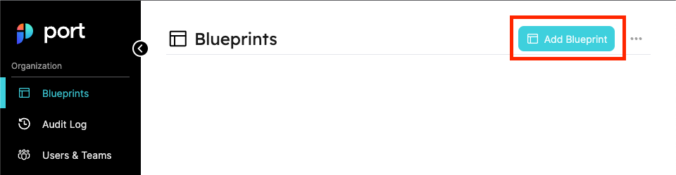
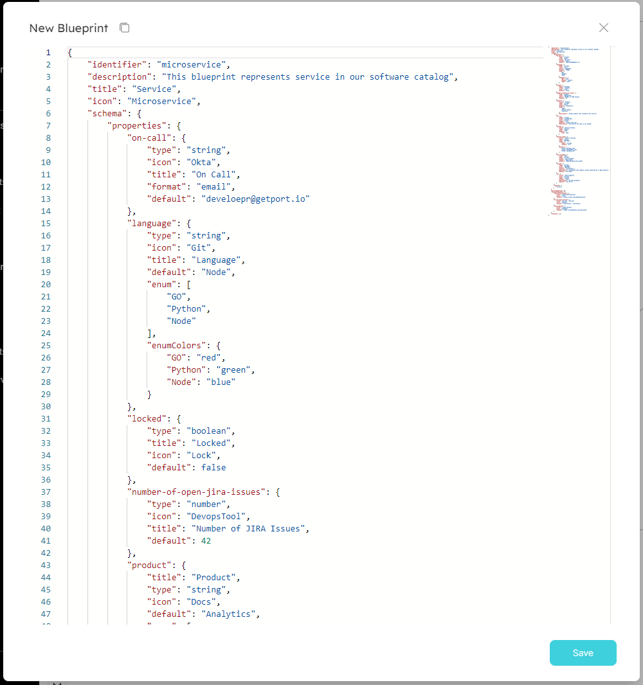
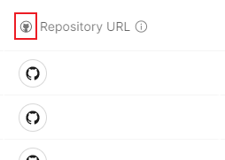
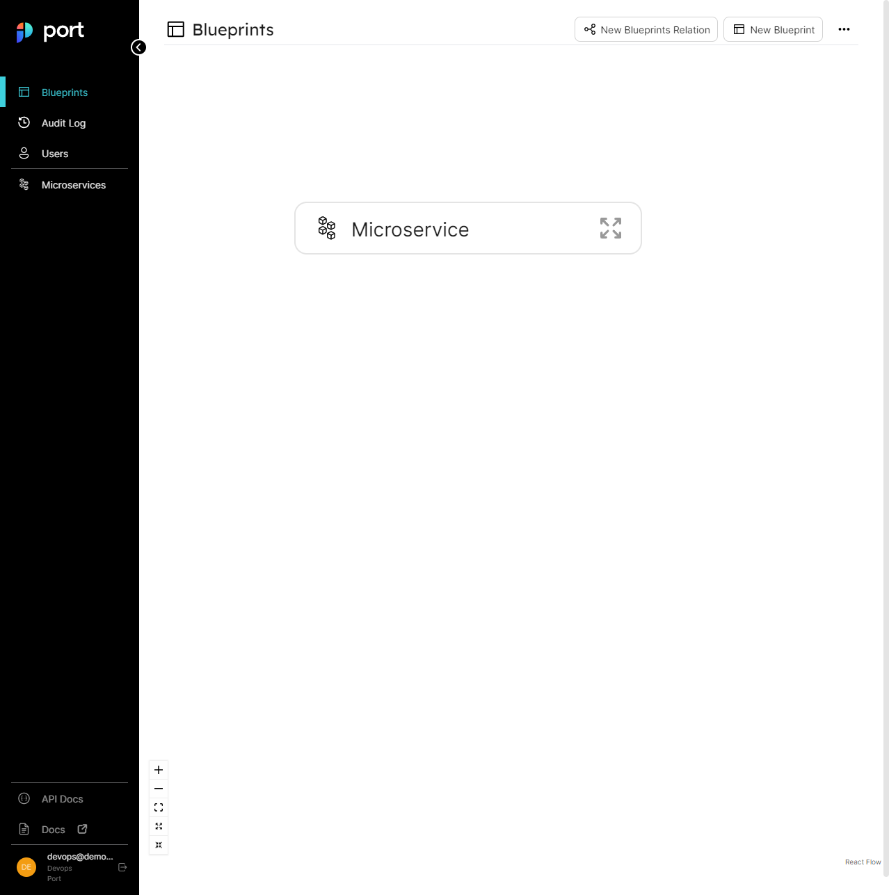
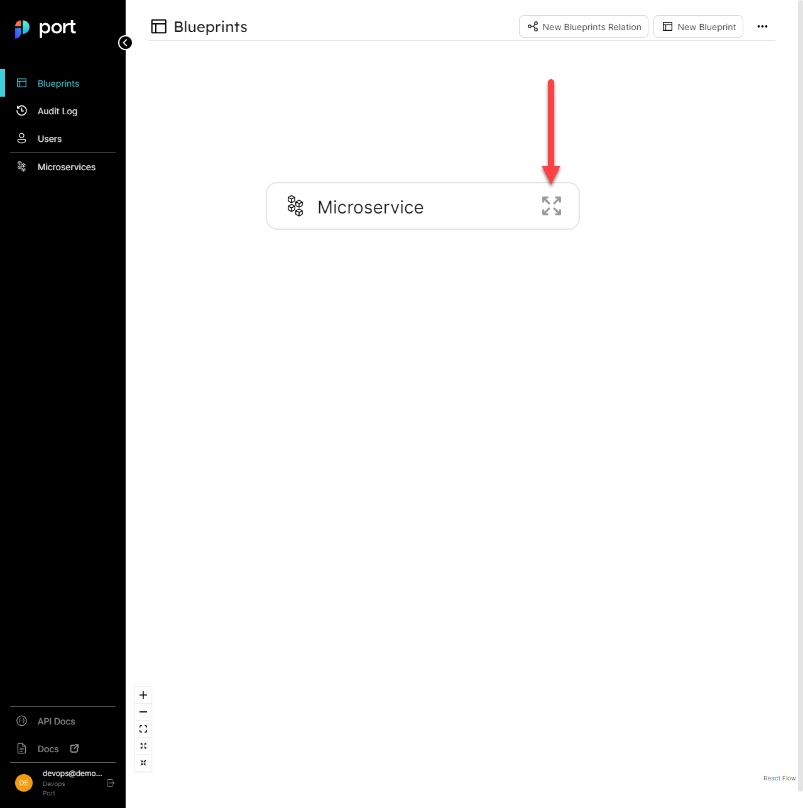
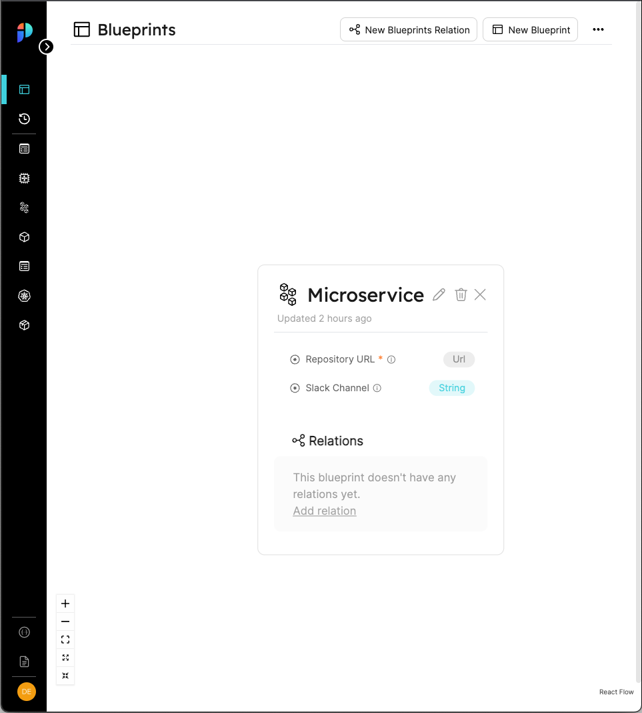
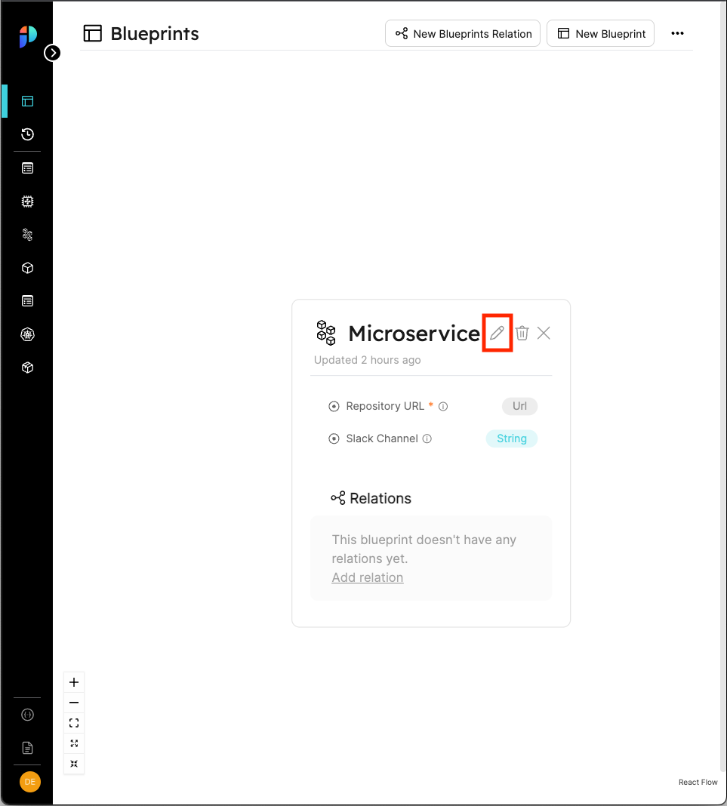
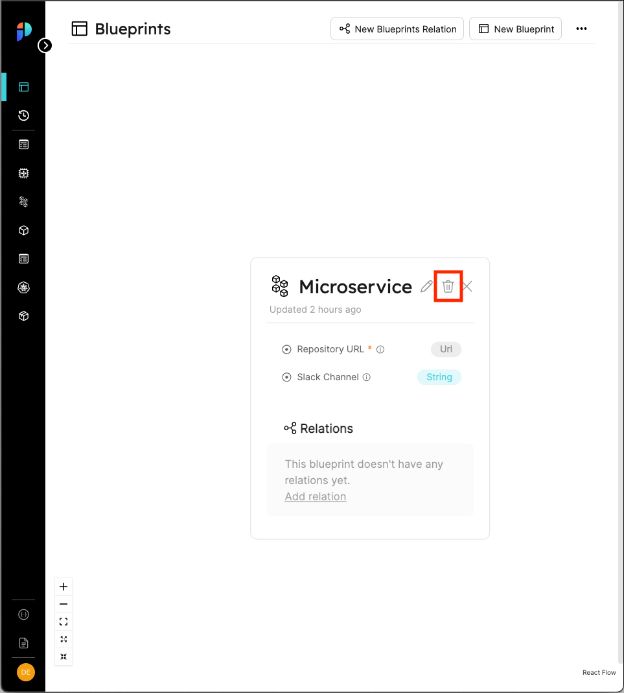
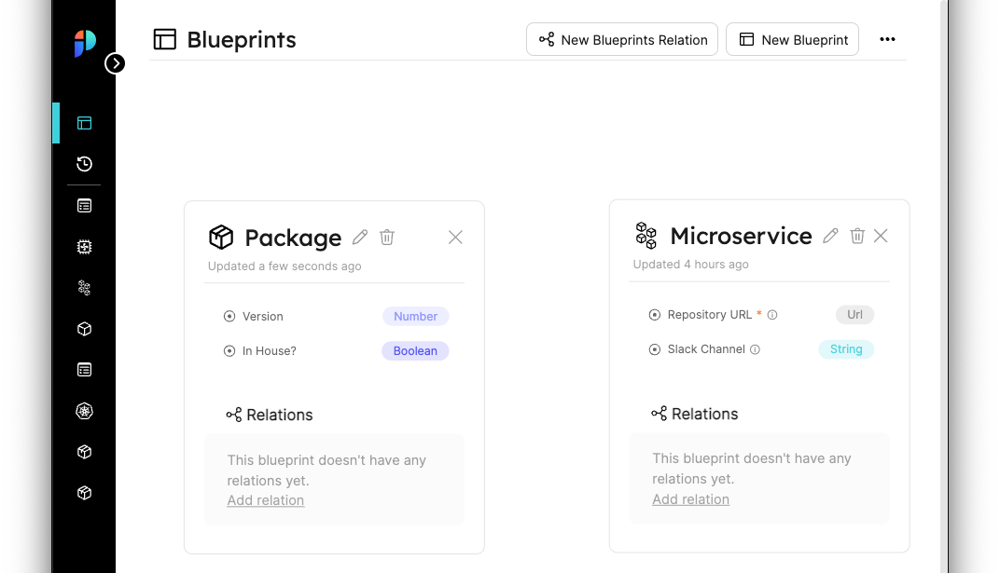

import Tabs from "@theme/Tabs"
import TabItem from "@theme/TabItem"


# Blueprint Basics

## Create blueprints

### From the UI

Let's head to [Port](https://app.getport.io/blueprints) and look at the Blueprints page, at the top right corner let's click on **New Blueprint** and configure a `Microservice` blueprint as shown in the image below:



After clicking the button, you should see a creation form similar to what is shown in the image below:



Our Microservice Blueprint is going to include the following properties:

- **Repo** - A URL to the source code repository storing the code for the Microservice
- **Slack Channel** - The Slack Channel of the team responsible for the Microservice

:::note
Don't worry if you feel like the `Microservice` blueprint should include more properties, you can always go back and add or remove properties later. 
:::

:::tip Available Icons
You will notice that in the image above the icon field already has the value `Microservice` filled in. In addition to the icon for `Microservice` Port also supports the following:

`Airflow, Ansible, Argo, Aws, Azure, Blueprint, Bucket, Cloud, Cluster, CPU, Customer, Datadog, DefaultEntity, DefaultProperty, DeployedAt, Deployment, DevopsTool, Docs, Environment, Git, Github, GitVersion, GoogleCloud, GPU, Grafana, Jenkins, Lambda, Link, Lock, Microservice, Moon, Node, Okta, Package, Permission, Server, Service, Terraform`
:::

In order to create a Blueprint with the following properties, we will use the following JSON body:

```json showLineNumbers
{
    "identifier": "microservice",
    "title": "Microservice",
    "icon": "Microservice",
    "dataSource": "Port",
    "formulaProperties": {},
    "schema": {
        "properties": {
            "slackChannel": {
                "type": "string",
                "title": "Slack Channel",
                "description": "The channel of the microservice\\'s maintainers"
            },
            "repoUrl": {
                "type": "string",
                "format": "url",
                "title": "Repository URL",
                "description": "A URL to the Git repository of the microservice"
            }
        },
        "required": ["repoURL"]
    }
}
```

:::tip icon property:

```json showLineNumbers
{
    ...
    "schema": {
        "properties": {
            "repoUrl": {
                "icon": "Github",
                ...
            },
            ...
        },
    }
}
```
The icon will be displayed in the column header of the property "repoUrl":



:::tip

Click on the `save` button, and you should see your new Blueprint in the Blueprints graph:



If you click on the `expand` button as shown in the image below:



You should see an expanded view of the blueprint we just created, with all of the properties listed alongside the types we provided for them:




### From the API

Let's see how we can use Port's API to create blueprints:

#### Getting an API token

:::note
For this next part you will need your Port `CLIENT_ID` and `CLIENT_SECRET`
:::

In order to perform any action with Port's API, you first need an **access token**, here are some code examples from various languages

<Tabs groupId="code-examples" defaultValue="python" values={[
    {label: "Python", value: "python"},
    {label: "Javascript", value: "javascript"},
    {label: "cURL", value: "curl"}
]}>

<TabItem value="python">

```python showLineNumbers
# Dependencies to install:
# $ python -m pip install requests

import requests

CLIENT_ID = 'YOUR_CLIENT_ID'
CLIENT_SECRET = 'YOUR_CLIENT_SECRET'

API_URL = 'https://api.getport.io/v0.1'

credentials = {'client_id': CLIENT_ID, 'client_secret': CLIENT_SECRET}

token_response = requests.get(f'{API_URL}/auth/access_token', params=credentials)

access_token = token_response.json()['accessToken']

# You can now use the value in access_token when making further requests

```

</TabItem>

<TabItem value="javascript">

```javascript showLineNumbers
// Dependencies to install:
// $ npm install axios --save

const axios = require('axios').default;

const CLIENT_ID = 'YOUR_CLIENT_ID';
const CLIENT_SECRET = 'YOUR_CLIENT_SECRET';

const API_URL = 'https://api.getport.io/v0.1';

const response = await axios.get(`${API_URL}/auth/access_token`, {
    params: {
        client_id: CLIENT_ID,
        client_secret: CLIENT_SECRET,
    },
});

const accessToken = response.data.accessToken;

// You can now use the value in accessToken when making further requests

```
</TabItem>

<TabItem value="curl">

```bash showLineNumbers
# Dependencies to install:
# For apt:
# $ sudo apt-get install jq
# For yum:
# $ sudo yum install jq

access_token=$(curl --location --request GET "https://api.getport.io/v0.1/auth/access_token?client_id=YOUR_CLIENT_ID&client_secret=YOUR_CLIENT_SECRET" | jq '.accessToken' | sed 's/"//g')

# The token will be available in the access_token variable
```

</TabItem>

</Tabs>

#### Creating a blueprint

Let's create a basic Blueprint for a `Microservice` using the API, our Blueprint will include a **Slack Channel** and a **Repo URL**.

In order to interact with the Blueprints API our basic URL will be [https://api.getport.io/v0.1/blueprints](https://api.getport.io/v0.1/blueprints), and we will create the blueprint using a REST **POST** request.

:::note
Remember the **access token** we generated earlier, we will use it while making new requests to Port's API
:::


<Tabs groupId="code-examples" defaultValue="python" values={[
    {label: "Python", value: "python"},
    {label: "Javascript", value: "javascript"},
    {label: "cURL", value: "curl"}
]}>

<TabItem value="python">

```python showLineNumbers
# Dependencies to install:
# $ python -m pip install requests

# the access_token variable should already have the token from the previous example

import requests

API_URL = 'https://api.getport.io/v0.1'

headers = {
    'Authorization': f'Bearer {access_token}'
}

blueprint = {
    'identifier': 'microservice',
    'title': 'Microservice',
    'icon': 'Microservice',
    'formulaProperties': {},
    'schema': {
        'properties': {
            'slackChannel': {
                'type': 'string',
                'title': 'Slack Channel',
                'description': 'The channel of the microservice\'s maintainers'
            },
            'repoUrl': {
                'type': 'string',
                'format': 'url',
                'title': 'Repository URL',
                'description': 'A URL to the Git repository of the microservice'
            }
        },
        'required': ['repoUrl'],
    }
}

response = requests.post(f'{API_URL}/blueprints', json=blueprint, headers=headers)

# response.json() contains the content of the resulting blueprint

```

</TabItem>

<TabItem value="javascript">

```javascript showLineNumbers
// Dependencies to install:
// $ npm install axios --save

// the accessToken variable should already have the token from the previous example 

const axios = require('axios').default;

const API_URL = 'https://api.getport.io/v0.1';

const config = {
		headers: {
			Authorization: `Bearer ${accessToken}`,
		},
	};

	const blueprint = {
		identifier: 'microservice',
		title: 'Microservice',
		icon: 'Microservice',
        formulaProperties: {},
		schema: {
			properties: {
				slackChannel: {
					type: 'string',
					title: 'Slack Channel',
					description: "The channel of the microservice's maintainers",
				},
				repoUrl: {
					type: 'string',
					format: 'url',
					title: 'Repository URL',
					description: 'A URL to the Git repository of the microservice',
				},
			},
			required: ['repoUrl'],
		},
	};

	const response = await axios.post(`${API_URL}/blueprints`, blueprint, config);

    // response.data contains the content of the resulting blueprint

```
</TabItem>

<TabItem value="curl">

```bash showLineNumbers
# the access_token variable should already have the token from the previous example

curl --location --request POST "https://api.getport.io/v0.1/blueprints" \
	--header "Authorization: Bearer $access_token" \
	--header "Content-Type: application/json" \
	--data-raw "{
    \"identifier\": \"microservice\",
    \"title\": \"Microservice\",
    \"icon\": \"Microservice\",
    \"formulaProperties\": {},
    \"schema\": {
        \"properties\": {
            \"slackChannel\": {
                \"type\": \"string\",
                \"title\": \"Slack Channel\",
                \"description\": \"The channel of the microservice's maintainers\"
            },
            \"repoUrl\": {
                \"type\": \"string\",
                \"format\": \"url\",
                \"title\": \"Repository URL\",
                \"description\": \"A URL to the Git repository of the microservice\"
            }
        },
        \"required\": [\"repoUrl\"]
    }
}"

# The output of the command contains the content of the resulting blueprint
```

</TabItem>

</Tabs>

You should now have a blueprint in the Blueprints Graph that looks like this:


## Updating blueprints

You can always change the blueprint, add/remove properties or change existing property types as necessary.

In order to update a blueprint you can:

- Click the Pencil icon in the Blueprints Graph
- Make a REST PUT request to the URL `https://api.getport.io/v0.1/{blueprint_identifier}`
- Make a REST PATCH request to the URL `https://api.getport.io/v0.1/{blueprint_identifier}`



A PUT request has the exact same body as a POST request, it will simply overwrite the blueprint with the new data provided

A PATCH request has a more specific format that allows for precise changes in an existing blueprint, let's look at an example:

If we want to add a property called `Is Deployed?` with the `boolean` type, our PATCH request body will look like this:

```json showLineNumbers
{
    "type": "setSchemaProperty",
    "propertyName": "isdeployed",
    "definition": {
      "type": "boolean",
      "title": "Is Deployed?",
    }
}
```

For more information about the PATCH request format, refer to the [API Reference](https://app.getport.io/Api-docs)


:::info A note about mirror properties
If you try to update a blueprint that has a [relation](relations), you will notice that its JSON body contains a key called `mirrorProperties`:

```json showLineNumbers
"mirrorProperties": {
    "microservice": {
        "path": "package-microservice.$identifier"
    }
}
```

You can refer to the [Mirror Properties](../platform-overview/port-components/mirror-properties.md) page for more information, but for now just know that any edits to a blueprint should leave the objects that have `.$identifier` in their path property intact

:::

## Deleting blueprints

:::danger
A blueprint cannot be restored after deletion!
:::

In order to delete a blueprint you can:

- Click on the trash can icon in the specific blueprint node in the Blueprints Graph
- Make a REST DELETE request to the URL `https://api.getport.io/v0.1/{blueprint_identifier}`



## Next steps

Now that we understand **Blueprints**, we can start to model separate entities in our infrastructure!

In the next section we will talk about **Relations**, relations are a connection between two blueprints, and they will help us go from separate entities to a connected infrastructure map.

As preparation for the relations section, let's create a blueprint for `Package` to go with the `Microservice` blueprint we created earlier:

You can create the new blueprint from the UI (using the `New Blueprint` button in the Blueprints Graph) or from the API, the body of the request for the new blueprint should be:

```json showLineNumbers
{
    "identifier": "package",
    "title": "Package",
    "icon": "Package",
    "formulaProperties": {},
    "schema": {
        "properties": {
            "version": {
                "title": "Version",
                "type": "number",
                "default": "1.0.0"
            },
            "inhouse": {
                "title": "In House?",
                "type": "boolean"
            }
        },
        "required": []
    },
    "dataSource": "Port"
}
```

At the end of this section, your Blueprints Graph should include the two blueprints shown below:

