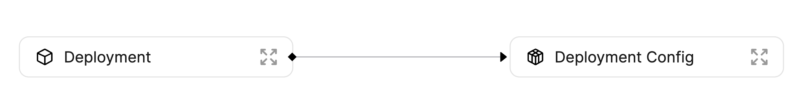

# Environment Locking

Using Port, it is very simple to implement convenient environment locking for your different development and production environments.

## Goal

In this guide you will implement an environment locking mechanism using Port's [GitHub Action](../../integrations/github/github-action.md).

The environment we're going to use includes 2 [Blueprints](../../platform-overview/port-components/blueprint.md) with a [Relation](../../platform-overview/port-components/relation.md) between them:



Let's go over the different Blueprints shown above and how we will create [Entities](../../platform-overview/port-components/entity.md) for each of them:

- **Deployment** - a new version deployment of a microservice, will be reported using Port's GitHub Action as part of the deployment process.
- **Deployment Config** - a version of a microservice, running in a specific environment in your infrastructure, will be reported manually in this guide.

Now that you know the end-result of this guide, let's start by creating the Blueprints and Relations.

## Blueprints and Relations

Below you can find the JSON for all of the Blueprints you need to create to follow this guide:

:::note
The Blueprint JSON provided below already includes the Relations between the different Blueprints, so please create them in the order that they appear.
:::

<details>
<summary>Deployment Config Blueprint JSON</summary>

```json showLineNumbers
{
  "identifier": "DeploymentConfig",
  "title": "Deployment Config",
  "icon": "Service",
  "schema": {
    "properties": {
      "locked": {
        "type": "boolean",
        "title": "Locked",
        "default": false,
        "description": "Are deployments currently allowed for this configuration",
        "icon": "Lock"
      }
    },
    "required": []
  },
  "mirrorProperties": {},
  "formulaProperties": {},
  "relations": {}
}
```

</details>

<details>
<summary>Deployment Blueprint JSON</summary>

```json showLineNumbers
{
  "identifier": "Deployment",
  "title": "Deployment",
  "icon": "Deployment",
  "schema": {
    "properties": {
      "jobUrl": {
        "type": "string",
        "format": "url",
        "title": "Job URL"
      },
      "commitSha": {
        "type": "string",
        "title": "Commit SHA"
      }
    },
    "required": []
  },
  "mirrorProperties": {},
  "formulaProperties": {},
  "relations": {
    "instanceOf": {
      "title": "Deployment Config",
      "target": "DeploymentConfig",
      "required": false,
      "many": false
    }
  }
}
```

</details>

:::tip
Remember that Blueprints can be created both from the [UI](../blueprint-basics.md#from-the-ui) and from the [API](../blueprint-basics.md#from-the-api)
:::

Now that you have your Blueprints created, connected and ready to go, time to create your Entities:

## Entities

### Deployment Config - Port API

A deployment config is used to represent a deployment of a microservice, in a specific environment in your infrastructure. A deployment config is a logical object which doesn't translate to a real Entity in your infrastructure. Instead, a deployment config has multiple `deployments` tied to it, each representing a new version of the deployed code of the matching microservice, in the matching environment.

Let's manually create a deployment config Entity for the `Notification Service` microservice in the Production environment:

:::tip
We are using the same `DeploymentConfig` Blueprint used in the [software catalog](./software-catalog.md) use case, so if you followed that guide, there is no need to create new Blueprints.
:::

```json showLineNumbers
{
  "identifier": "notification-service-prod",
  "title": "Notification Service Production",
  "properties": {
    "locked": true
  },
  "relations": {}
}
```

Below is a `python` code snippet to create this deployment config:

<details>
<summary>Click here to see the code</summary>

```python showLineNumbers
import requests

CLIENT_ID = 'YOUR_CLIENT_ID'
CLIENT_SECRET = 'YOUR_CLIENT_SECRET'

API_URL = 'https://api.getport.io/v1'

target_blueprint = 'DeploymentConfig'

credentials = {'clientId': CLIENT_ID, 'clientSecret': CLIENT_SECRET}

token_response = requests.post(f'{API_URL}/auth/access_token', json=credentials)

access_token = token_response.json()['accessToken']

headers = {
    'Authorization': f'Bearer {access_token}'
}

entity = {
    "identifier": "notification-service-prod",
    "title": "Notification Service Production",
    "properties": {
        "locked": True
    },
    "relations": {}
}


response = requests.post(f'{API_URL}/blueprints/{target_blueprint}/entities', json=entity, headers=headers)

print(response.json())
```

</details>

Now let's use the deployment config Entity to lock the `Notification Service` for new deployments.

## Reading the `locked` field during deployment

Let's go ahead and create a [GitHub workflow](https://docs.github.com/en/actions/using-workflows) file in a GitHub repository meant for our `Notification Service` microservice:

- Create a GitHub repository (or use an existing one)
- Create a `.github` directory
  - Inside it create a `workflows` directory

Inside the `/.github/workflows` directory create a file called `deploy-with-check.yml` with the following content:
