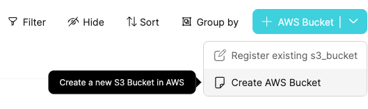
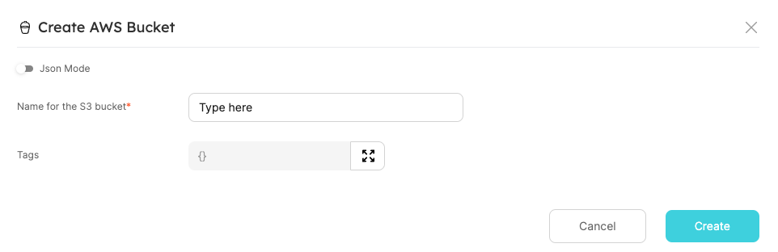
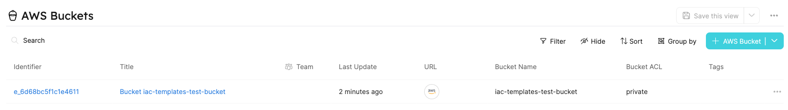
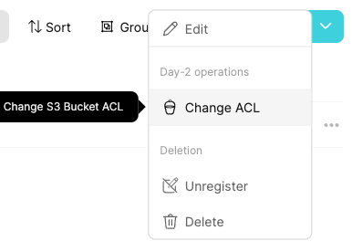
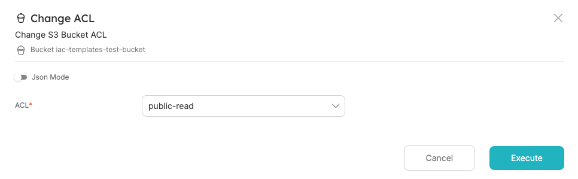
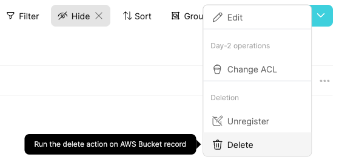
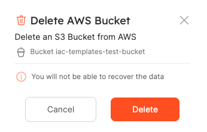

# IaC Templates

Infrastructure as Code templates are used for automating operations in the lifecycle of cloud resources, such as create, day-2, and delete.

Working with an IaC template allows developers to easily manage resources, with no need to know the underline practices and tools (such as Terraform).

Let's review an example of how to make use of IaC templates, using Port's Self-Service Actions.

## Example

The following example will walk you through how to set up Self-Service Actions to create, change ACL (Day-2 operation), and delete S3 buckets.

We will use a backend written in Go, which leverages Terraform templates to execute the aforementioned operations.

:::info
The full example can be found [here](https://github.com/port-labs/terraform-connector).
Another template for managing `SNS Topic` is available there.
:::

:::note Prerequisites

- An AWS credentials with permissions to create, change ACL, and delete S3 buckets.
- A Docker daemon for running the backend image.

:::

### Running the Backend

First, run the backend image with the following command (replace placeholders):

```shell
docker run \
  -e PORT_CLIENT_ID=<PORT_CLIENT_ID> \
  -e PORT_CLIENT_SECRET=<PORT_CLIENT_SECRET> \
  -e AWS_ACCESS_KEY_ID=<AWS_ACCESS_KEY_ID> \
  -e AWS_SECRET_ACCESS_KEY=<AWS_SECRET_ACCESS_KEY> \
  -e AWS_SESSION_TOKEN=<AWS_SESSION_TOKEN> \
  -e AWS_REGION=<AWS_REGION> \
  -e DEBUG=true \
  -p 8080:8080 \
  -it hedwigz/webhook-terraform:v0.2
```

Now we have a running server that gets webhook request from Port and applies them to terraform files!

To make your local machine public to Port, you can use either [ngrok](https://ngrok.com/download) or [smee](https://smee.io/).

In case of choosing `ngrok`, run:

```shell
ngrok http 8080
```

And you should see similar output:

```shell
ngrok

Session Status                online
...
Forwarding                    https://1234-5678-9101-112-1314-1516-abcd-efgh-ijkl.eu.ngrok.io -> http://localhost:8080
...
```

Keep the `Forwarding URL` for later use.

### Setup Port Resources

First, set up a Blueprint for an S3 bucket in Port.

This can be achieved by using the Web UI or using the [Port's Terraform Provider](../../integrations/terraform.md).

You can create as many properties as you want for the bucket, but for this example we will keep it lean with 4 properties - `URL`, `Bucket Name`, `Bucket ACL` and `Tags`.

<details>
<summary> AWS Bucket Blueprint </summary>

```json showLineNumbers
{
  "identifier": "s3_bucket",
  "title": "AWS Bucket",
  "icon": "Bucket",
  "schema": {
    "properties": {
      "url": {
        "type": "string",
        "title": "URL",
        "format": "url"
      },
      "bucket_name": {
        "type": "string",
        "title": "Bucket Name"
      },
      "bucket_acl": {
        "type": "string",
        "title": "Bucket ACL",
        "default": "private"
      },
      "tags": {
        "type": "object",
        "title": "Tags"
      }
    },
    "required": ["url", "bucket_name"]
  },
  "mirrorProperties": {},
  "formulaProperties": {},
  "relations": {}
}
```

</details>

Next, we want to create actions that will support create, change ACL, and delete S3 buckets.

<details>
<summary> Self-Service Actions for AWS Bucket Blueprint </summary>

Replace `<your ngrok forwarding URL>` with the URL you got earlier.

```json showLineNumbers
[
  {
    "identifier": "create_bucket",
    "title": "Create",
    "icon": "Bucket",
    "userInputs": {
      "properties": {
        "bucket_name": {
          "type": "string",
          "title": "Name for the S3 bucket"
        },
        "tags": {
          "type": "object",
          "title": "Tags",
          "default": {}
        }
      },
      "required": ["bucket_name"]
    },
    "invocationMethod": {
      "type": "WEBHOOK",
      "url": "<your ngrok forwarding URL>"
    },
    "trigger": "CREATE",
    "description": "Create a new S3 Bucket in AWS"
  },
  {
    "identifier": "change_acl",
    "title": "Change ACL",
    "icon": "Bucket",
    "userInputs": {
      "properties": {
        "bucket_acl": {
          "type": "string",
          "enum": ["private", "public-read"],
          "title": "ACL"
        }
      },
      "required": ["bucket_acl"]
    },
    "invocationMethod": {
      "type": "WEBHOOK",
      "url": "<your ngrok forwarding URL>"
    },
    "trigger": "DAY-2",
    "description": "Change S3 Bucket ACL"
  },
  {
    "identifier": "delete_bucket",
    "title": "Delete",
    "icon": "Bucket",
    "userInputs": {
      "properties": {},
      "required": []
    },
    "invocationMethod": {
      "type": "WEBHOOK",
      "url": "<your ngrok forwarding URL>"
    },
    "trigger": "DELETE",
    "description": "Delete an S3 Bucket from AWS"
  }
]
```

</details>

### Running the Self-Service Actions

#### Create

Everything is ready to run the configured Self-Service Actions.

- Go to `AWS Bucket` Blueprint page, and run `Create AWS Bucket`:



- Fill in the name of the S3 Bucket (must be globally unique!) and `Create`:



Hooray! In a minute, you'll have a new S3 bucket, recorded also as Port entity.



#### Change ACL (Day-2 Operation)

After creating the bucket, you might want to do some changes in its configuration over time.

For example, a valid use-case is to change the bucket visibility from `private` to `public-read`.

- Go to the Bucket entity and choose `Change ACL` Day-2 operation:



- Choose the `public-read` option for `ACL`, and `Execute`:



`Terraform apply` was triggered behind the scenes, and when finished, you will see the entity's `Bucket ACL` property updates to `public-read`.

#### Delete

Finally, you can clear your environment and delete the bucket.

- Go to the Bucket entity and choose `Delete`:



- Click on `Delete`:



Done! As soon as the backend will finish the operation, your bucket will get deleted from AWS and Port.

## Summary

IaC templates helps your team to efficiently control and configure any cloud resources in your possession.

Port Self-Service Actions allows you to quickly ramp up an event based infrastructure to leverage your IaC templates.
