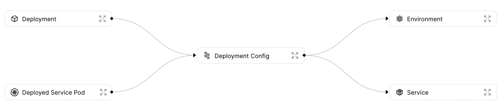

# Software Catalog

A software catalog keeps track of all of your cloud and development resources and assets. A software catalog gives your developers a complete understanding of your development infrastructure and who is responsible for which service.

:::tip
You can read more about software catalogs on our [blog](https://www.getport.io/blog/microservice-catalog-isnt-enough-why-software-catalogs-with-resources-inside-are-the-right-approach-for-developer-portal)
:::

## Goal

In this guide you will setup an initial software catalog. This guide will show you how to use:

- Port's [Terraform provider](../../integrations/terraform.md) - to document your cloud resources
- Port's [GitHub App](../../integrations/github/app/introduction.md) - to document your services
- Port's [GitHub Action](../../integrations/github/github-action.md) - to document your service deployments

By the end of this guide, you will have the _Basic Model_ of a software catalog.

The Basic Model covers the main SDLC intersections: from Services, through Environments and Deployments, all the way up to the cloud:



Before we dive into the details of each [Blueprints](../../platform-overview/port-components/blueprint.md) in the software catalog, here’s a brief explanation of the ontology diagrammed here, and how we will create [Entities](../../platform-overview/port-components/entity.md) for each of them:

- **Service** - a service can be a microservice, software monolith or any other software architecture. In this example services will be reported by Port's GitHub App.
- **Environment** - an environment is any production, staging, QA, DevEnv, on-demand or any other environment type. In this example environments will be reported using Port's Terraform Provider.
- **Deployment Config** - A deployment config is a representation of the current “live” version of a service running in a specific environment. It will include references to the service, environment and deployment, as well as real-time information such as status, uptime and any other relevant metadata. In this example deployment configs will be reported manually.
- **Deployment** - A deployment could be described as an object representing a CD job. It includes the version of the deployed service and a link to the job itself. Unlike other objects, the deployment is an immutable item in the software catalog. It is important to keep it immutable to ensure the catalog remains a consistent source of truth. In this example deployments will be reported using Port's GitHub Action as part of the deployment process.

Now that you know the end-result of this guide, let's start by creating the Blueprints and [Relations](../../platform-overview/port-components/relation.md) of your software catalog

## Blueprints and Relations

Below you can find the JSON for all of the Blueprints you need to create to follow this guide:

:::note
The Blueprint JSON provided below already includes the Relations between the different Blueprints, so please create them in the order that they appear.
:::

<details>
<summary>Service Blueprint JSON</summary>

```json showLineNumbers
{
  "identifier": "Service",
  "title": "Service",
  "icon": "Service",
  "schema": {
    "properties": {
      "slackChannel": {
        "type": "string",
        "format": "url",
        "title": "Slack Channel"
      },
      "repo": {
        "type": "string",
        "title": "Repository URL",
        "format": "url",
        "description": "Link to the service repo on GitHub"
      }
    },
    "required": []
  },
  "mirrorProperties": {},
  "formulaProperties": {},
  "relations": {}
}
```

</details>

<details>
<summary>Environment Blueprint JSON</summary>

```json showLineNumbers
{
  "identifier": "Environment",
  "title": "Environment",
  "icon": "Environment",
  "schema": {
    "properties": {
      "awsRegion": {
        "type": "string",
        "enum": ["eu-west-1", "us-west-1"],
        "title": "AWS Region"
      }
    },
    "required": []
  },
  "mirrorProperties": {},
  "formulaProperties": {},
  "relations": {}
}
```

</details>

<details>
<summary>Deployment Config Blueprint JSON</summary>

```json showLineNumbers
{
  "identifier": "DeploymentConfig",
  "title": "Deployment Config",
  "icon": "Microservice",
  "schema": {
    "properties": {
      "locked": {
        "type": "boolean",
        "title": "Locked",
        "default": false,
        "description": "Are deployments currently allowed for this configuration",
        "icon": "Lock"
      }
    },
    "required": []
  },
  "mirrorProperties": {},
  "formulaProperties": {},
  "relations": {
    "deployedAt": {
      "title": "Environment",
      "target": "Environment",
      "required": false,
      "many": false
    },
    "instanceOf": {
      "title": "Service",
      "target": "Service",
      "required": false,
      "many": false
    }
  }
}
```

</details>

<details>
<summary>Deployment Blueprint JSON</summary>

```json showLineNumbers
{
  "identifier": "Deployment",
  "title": "Deployment",
  "icon": "Deployment",
  "schema": {
    "properties": {
      "jobUrl": {
        "type": "string",
        "format": "url",
        "title": "Job URL"
      },
      "commitSha": {
        "type": "string",
        "title": "Commit SHA"
      }
    },
    "required": []
  },
  "mirrorProperties": {
    "awsRegion": {
      "title": "AWS Region",
      "path": "instanceOf.deployedAt.awsRegion"
    }
  },
  "formulaProperties": {},
  "relations": {
    "instanceOf": {
      "title": "Deployment Config",
      "target": "DeploymentConfig",
      "required": false,
      "many": false
    }
  }
}
```

</details>

:::tip
Remember that Blueprints can be created both from the [UI](../blueprint-basics.md#from-the-ui) and from the [API](../blueprint-basics.md#from-the-api)
:::

Now that you have your Blueprints created, connected and ready to go, time to create your Entities:

## Entities

### Environment - Terraform provider

To keep things short and simple, let's assume you only have a production environment, we'll use Port's [Terraform provider](../../integrations/terraform.md) to create an Entity for the production environment.

:::info
In a real environment, this terraform file would also include actual provisioning of cloud resources, such as the kubernetes namespace corresponding to the environment Entity.
:::

Create a file called `env.tf` with the following content:

```hcl showLineNumbers
terraform {
  required_providers {
    port-labs = {
      source  = "port-labs/port-labs"
      version = "~> 0.4.5"
    }
  }
}

provider "port-labs" {
  client_id = "{YOUR CLIENT ID}"     # or set the env var PORT_CLIENT_ID
  secret    = "{YOUR CLIENT SECRET}" # or set the env var PORT_CLIENT_SECRET
}

software "port-labs_entity" "production" {
  identifier = "production"
  title      = "Production"
  blueprint  = "Environment"
  properties {
    name  = "aws_region"
    value = "eu-west-1"
  }
}
```

:::note
Remember to replace the placeholders for `YOUR_CLIENT_ID` and `YOUR_CLIENT_SECRET` with your Port client ID and secret.
:::

Now, in the same directory as the one you created `env.tf` in, run the following commands:

```bash showLineNumbers
terraform init
terraform plan
terraform apply
```

Now that you have your environment ready, it's time to create a service.

### Service - GitHub app

To create your service, you will connect Port's [GitHub app](../../integrations/github/app/installation.md) to your service repository, and add a `port.yml` file describing the service you want to create an Entity for in Port.

Here is an example `port.yml` file for a service called `Notification Service`:

```yml showLineNumbers
identifier: notification-service
title: Notification Service
blueprint: Service
properties:
  slackChannel: "https://yourslack.slack.com/archives/CHANNEL-ID"
```

:::tip
You don't need to manually include the `repo` property in the `port.yml` file, `repo` is one of the GitHub App's [auto-imported properties](../../integrations/github/app/auto-importing-properties.md), so it will be added to the service Entity automatically.
:::

After you commit the `port.yml` file to your repository, you should now see your service in Port.

### Deployment Config - Port API

A deployment config is used to represent a deployment of a service, in a specific environment in your infrastructure. A deployment config has multiple `deployments` tied to it, each representing a new version of the deployed code of the matching service, in the matching environment.

A deployment config is also just what it sounds like - a `config`, that means it is a good place to store runtime variables and values, links to logging, tracing or dashboard tools and more static data that does not change between deployments.

Let's manually create a deployment config Entity for the `Notification Service` service in the `Production` environment:

```json showLineNumbers
{
  "identifier": "notification-service-prod",
  "title": "Notification Service Production",
  "properties": {
    "locked": false
  },
  "relations": {
    "deployedAt": "production",
    "instanceOf": "notification-service"
  }
}
```

Below is a `python` code snippet to create this deployment config:

<details>
<summary>Click here to see the code</summary>

```python showLineNumbers
import requests

CLIENT_ID = 'YOUR_CLIENT_ID'
CLIENT_SECRET = 'YOUR_CLIENT_SECRET'

API_URL = 'https://api.getport.io/v1'

target_blueprint = 'DeploymentConfig'

credentials = {'clientId': CLIENT_ID, 'clientSecret': CLIENT_SECRET}

token_response = requests.post(f'{API_URL}/auth/access_token', json=credentials)

access_token = token_response.json()['accessToken']

headers = {
    'Authorization': f'Bearer {access_token}'
}

entity = {
    "identifier": "notification-service-prod",
    "title": "Notification Service Production",
    "properties": {
        "locked": False
    },
    "relations": {
        "deployedAt": "production",
        "instanceOf": "notification-service"
    }
}


response = requests.post(f'{API_URL}/blueprints/{target_blueprint}/entities', json=entity, headers=headers)

print(response.json())
```

</details>

Time to move on to the final piece: consistent deployment reporting.

### Deployment - GitHub Action

In order to keep track of your services, you will implement a [Github Workflow](https://docs.github.com/en/actions/using-workflows) that will create a new deployment Entity every time code is merged to the `main` branch of your service repo.

:::tip
The example we're working with here assumes you only have one service in your repository, but the workflow file we are going to create can be the template for a workflow file that creates a specific deployment Entity based on provided parameters.
:::

In your repository create a directory called `.github` under the repository root, inside the new directory, create a `workflows` directory.

Now inside the `/.github/workflows` directory create a file called `report-deployment.yml` with the following content:

```yml showLineNumbers
name: Report Deployment

on:
  push:
    branches:
      - "main"

jobs:
  report-deployment:
    name: Report new deployment Entity
    runs-on: ubuntu-latest
    steps:
      - name: Extract SHA short
        run: echo "SHA_SHORT=${GITHUB_SHA:0:7}" >> $GITHUB_ENV
      - name: "Report deployment Entity to port 🚢"
        uses: port-labs/port-github-action@v1
        with:
          clientId: ${{ secrets.PORT_CLIENT_ID }}
          clientSecret: ${{ secrets.PORT_CLIENT_SECRET }}
          identifier: notification-service-prod-${{ env.SHA_SHORT }}
          title: Notification-Service-Production-${{ env.SHA_SHORT }}
          blueprint: Deployment
          properties: |
            {
               "jobUrl": "${{ github.server_url }}/${{ github.repository }}/actions/runs/${{ github.run_id }}",
               "commitSha": "${{ env.SHA_SHORT }}"
            }
          relations: |
            {
               "instanceOf": "notification-service-prod"
            }
```

:::tip
For security reasons it is recommended to save the `CLIENT_ID` and `CLIENT_SECRET` as [GitHub Secrets](https://docs.github.com/en/actions/security-guides/encrypted-secrets), and access them as shown in the example above.

:::

## Summary

At this point, you should have a basic software catalog up and running, with new deployments Entities being created in Port, allowing you to keep track of how your code changes across your different environments.

This guide acts as a base for your complete software catalog - go ahead and add more environments, more services and more cloud infrastructure resources to give your developers a complete image of your infrastructure.

Then, begin providing [Self-Service](../../platform-overview/self-service-actions/self-service-actions.md) capabilities to your developers.
