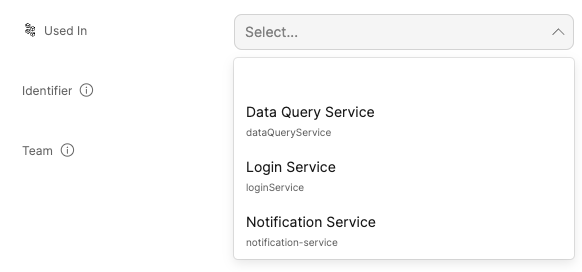

import Tabs from "@theme/Tabs"
import TabItem from "@theme/TabItem"


# Entity Basics

## Creating entities

There are 2 ways to create entities:

- From the UI
- From the API

:::info
We will be creating entities for the `Microservice` blueprint from [Creating a Blueprint](./blueprint-basics.md#creating-a-blueprint) and the `Package` blueprint from [Blueprint Next Steps](./blueprint-basics.md#next-steps), please make sure to create them before reading on if you want to follow along
:::

:::note
An entity page will be created upon the creation of a new entity.
:::

### From the UI

To create an entity from the UI, go to the [Page](../platform-overview/port-components/page.md) that matches the Blueprint you want to add an entity to. You can find the list of all the pages in the sidebar on the left side of Port's UI.

We will first go to the `Microservices` page:


To create a new `Microservice` we click the `+ Microservice` button:


After clicking the `+ Microservice` button, a UI form will open with the properties we created for the `Microservice` blueprint:


#### Creating with the JSON editor
Every entity has a format similar to the one we explained in the [Understanding the structure of an entity](../platform-overview/port-components/entity.md#entity-json-structure) section, which is viewable via the *Json Mode button*. You can paste in the following content to create your first `Microservice`:

```json showLineNumbers
    {
        "identifier": "notification-microservice",
        "title": "Notification Service",
        "blueprint": "microservice",
        "properties": {
            "repoUrl": "https://www.github.com/User/notification",
            "slackChannel": "#notification-service"
        },
        "relations": {}
    }
```


### From the API

:::note
Remember that an access token is needed to make API requests, refer back to [Getting an API token](./blueprint-basics.md#getting-an-api-token) if you need to generate a new one
:::

#### Creating an entity
Let's create a new `Microservice` using the API. Our entity is based on the `Microservice` blueprint structure.

In order to create an entity from the API, we will make a POST request to the URL
`https://api.getport.io/v0.1/entities`.


<Tabs groupId="code-examples" defaultValue="python" values={[
    {label: "Python", value: "python"},
    {label: "Javascript", value: "javascript"},
    {label: "cURL", value: "curl"}
]}>

<TabItem value="python">

```python showLineNumbers
# Dependencies to install:
# $ python -m pip install requests

# the access_token variable should already have the token from the previous example

import requests

API_URL = 'https://api.getport.io/v0.1'

headers = {
    'Authorization': f'Bearer {access_token}'
}

entity = {
    'identifier': 'notification-microservice',
    'title': 'Notification Service',
    'blueprint': 'microservice',
    'properties': {
        'repoUrl': 'https://www.github.com/User/notification',
        'slackChannel': '#notification-service'
    }    
}

response = requests.post(f'{API_URL}/entities', json=entity, headers=headers)

# response.json() contains the content of the resulting entity

```

</TabItem>

<TabItem value="javascript">

```javascript showLineNumbers
// Dependencies to install:
// $ npm install axios --save

// the accessToken variable should already have the token from the previous example 

const axios = require('axios').default;

const API_URL = 'https://api.getport.io/v0.1';

const config = {
		headers: {
			Authorization: `Bearer ${accessToken}`,
		},
	};

	const entity = {
		identifier: 'notification-microservice',
		title: 'Notification Service',
		blueprint: 'microservice',
		properties:
            slackChannel: '#notification-service'
            repoUrl: 'https://www.github.com/user/notification'
	};

	const response = await axios.post(`${API_URL}/entities`, entity, config);

    // response.data contains the content of the resulting entity

```
</TabItem>

<TabItem value="curl">

```bash showLineNumbers
# the access_token variable should already have the token from the previous example

curl --location --request POST "https://api.getport.io/v0.1/entities" \
	--header "Authorization: Bearer $access_token" \
	--header "Content-Type: application/json" \
	--data-raw "{
    \"identifier\": \"notification-microservice\",
    \"title\": \"Notification Service\",
    \"blueprint\": \"microservice\",
    \"properties\": {
            \"repoUrl\": \"https://www.github.com/user/notification\",
            \"slackChannel\": \"#notification-service\"
    }
}"

# The output of the command contains the content of the resulting entity
```

</TabItem>

</Tabs>


You should now have a new entity called `Notification Service` on the Microservice page that looks like this:


## Updating an entity

You can change any mutable entity, and edit/delete its property values.


### From the UI
- Click the Pencil icon in each of the table columns.
- Click the `...` button at the right end of an entity listing, then click `Show all properties`.


### From the API

- Make a **REST POST** request to the URL `https://api.getport.io/v0.1/entities?upsert=true`
  
  This request with the `upsert` flag set to `true` will overwrite the entity if it exists and will create it if not. 
  The request body is the same as creating a new entity, just with the additional flag `upsert=true`.


- Make a **REST PUT** request to the URL `https://api.getport.io/v0.1/entities/{entity_identifier}`
  
  A PUT request has the same body as a POST request and it will simply overwrite the entity if it exists. It will return an error code if the entity does not exist (based on identifier-match).


- Make a **REST PATCH** request to the URL `https://api.getport.io/v0.1/entities/{entity_identifier}`
  
  A PATCH request has a specific format that allows precise changes in an existing entity, for example:

    - To Edit a specific property, let's say: `slackChannel`, send a PATCH request with the following body:
        ```json showLineNumbers
        'properties': {"slackChannel": "#my-awesome-channel"}
        ```


## Deleting entities

:::danger
An entity cannot be restored after deletion!
:::

To delete an entity you can:

- Click the `...` button at the right end of an entity listing, then click `Delete`.
- Make a **REST DELETE** request to the URL `https://api.getport.io/v0.1/entities/{entity_identifier}`


    
## Next steps

Now that we understand **Entities**, we can start creating related entities to model our related data in the infrastructure!

First, let's create a new `Package` entity (If you haven't created a `Package` blueprint yet, please refer to the [Next steps](blueprint-basics.md#next-steps) section in [Blueprint basics](./blueprint-basics.md).

We will go to the `Packages` page:


After clicking the `+ package` button, a UI form will open with the properties we created for the `Package` blueprint:


:::note
Since `Package` is **related** to `Microservice` when creating a new package we will see an additional field(s) representing the relation(s). Selecting a related entity is done according to the entity title (via the UI), or according to the entity identifier (via the JSON editor).
:::

#### From the UI

We would like to connect our newly created `Package` entity to the `Microservice` entity we created above.



#### Code Format
We can also paste in the following content to create our first `Package`, in `JSON mode`.

```json showLineNumbers
{

        "identifier": "requests-pkg-v2-28",
        "title": "Requests",
        "team": "",
        "blueprint": "package",
        "properties": {
            "version": "2.28",
            "inhouse": "false"
        },
        "relations": {
            "package-to-service": "notification-microservice"
        }
    
}
```

Once we click the `Create` button, we will see our newly created entity in the `Packages` table:

