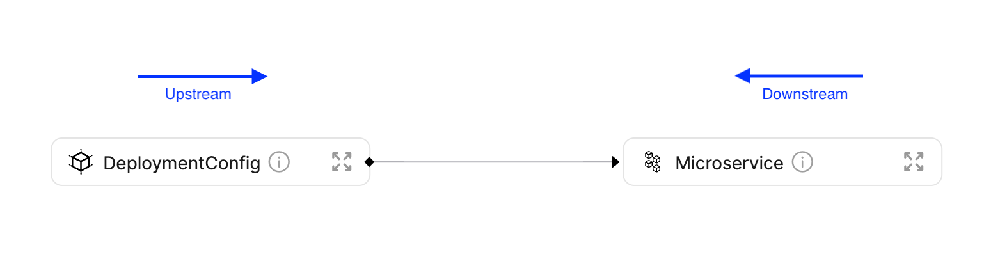

import Tabs from "@theme/Tabs"
import TabItem from "@theme/TabItem"

# Search In Port

Port’s API comes with a built-in search route that allows you to navigate your Service Catalog with ease.

Using the search route’s filters and rules, you can search different Entities.

## Search basics

Search in Port is performed by writing simple querying rules which can be combined together to form a more complex and precise query.

The base search route is `https://api.getport.io/v1/entities/search`, it receives `HTTP POST` requests.

## Search request

A search request defines the logical Relation between different search rules, and contains filters and rules to find suitable Entities. Each search request is represented by a `JSON object`, as shown in the following section:

```json showLineNumbers
{
  "combinator": "and",
  "rules": [
    {
      "property": "$blueprint",
      "operator": "=",
      "value": "Microservice"
    },
    {
      "property": "$identifier",
      "operator": "contains",
      "value": "admin"
    }
  ]
}
```

```json showLineNumbers
{
  "combinator": "or",
  "rules": [
    {
      "property": "environment",
      "operator": "=",
      "value": "production"
    },
    {
      "property": "environment",
      "operator": "=",
      "value": "staging"
    }
  ]
}
```

---

### Search request structure table

| Field        | Description                                                        |
| ------------ | ------------------------------------------------------------------ |
| `combinator` | Defines the query’s logical Relations between different conditions |
| `rules`      | An array of search rules to filter results with                    |

## Search rules

A search rule is a small filtering unit, used to control the output

Here is an example search rule:

```json showLineNumbers
{
  "property": "$blueprint",
  "operator": "=",
  "value": "Microservice"
}
```

---

### Search rule structure table

Port has 2 types of search rule operators: comparison operators (`=,` `>`, etc...) and Relation operators (`relatedTo`, `dependedOn`, etc...). Let’s dive in on the structure of each search rule:

#### Comparison operators structure

| Field      | Description                                                                                                                                                                                                                              |
| ---------- | ---------------------------------------------------------------------------------------------------------------------------------------------------------------------------------------------------------------------------------------- |
| `operator` | Search operator to use when evaluating this rule, see a list of available operators below                                                                                                                                                |
| `property` | Property to filter by according to its value. It can be a [meta-property](../platform-overview/port-components/mirror-properties.md#meta-property-mirror-property) such as `$identifier`, or a standard property such as `slack_channel` |
| `value`    | The value to filter by                                                                                                                                                                                                                   |

#### Relation operators structure

| Field       | Description                                                                               |
| ----------- | ----------------------------------------------------------------------------------------- |
| `operator`  | Search operator to use when evaluating this rule, see a list of available operators below |
| `blueprint` | Blueprint of the Entity identifier specified in the `value` field                         |
| `value`     | Value to filter by                                                                        |

## Search operators

Search currently supports the following operators:

| Operator          | Description                                                |
| ----------------- | ---------------------------------------------------------- |
| `=`               | Equality operator                                          |
| `!=`              | Inequality operator                                        |
| `>`,`>=`,`<`,`<=` | Numeric comparison operators                               |
| `between`         | Date range matching                                        |
| `contains`        | String pattern matching                                    |
| `relatedTo`       | Returns Entities that have a Relation with the rule target |
| `dependedOn`      | Returns Entities that depend on rule target                |

## Operator examples

Here are examples for each available search rule operator:

### `=` operator

The following rule will return Entities whose identifier is `port-api`:

```json showLineNumbers
{
  "operator": "=",
  "property": "$identifier",
  "value": "port-api"
}
```

:::info Available properties
We can search over a variety of properties:

- "[Meta-properties](../platform-overview/port-components/mirror-properties.md#meta-property-mirror-property)" such as `$identifier`, `$title`, `$createdAt` and more.
- User-defined properties that appear under the `properties` key in the `blueprint` definition

:::

### `!=` operator

The following rule will return Entities whose identifier **is not** `port-api`:

```json showLineNumbers
{
  "operator": "!=",
  "property": "$identifier",
  "value": "port-api"
}
```

### `>`,`>=`,`<`,`<=` operators

The following rule will return Entities whose version value is less than `5`:

```json showLineNumbers
{
  "operator": "<",
  "property": "version",
  "value": 5
}
```

### `between` operator

The following rule will return Entities which were created in the last week:

```json showLineNumbers
{
  "operator": "between",
  "property": "$createdAt",
  "value": {
    "preset": "lastWeek"
  }
}
```

**Available Presets:**

- tomorrow
- today
- yesterday
- lastWeek
- lastMonth

The `between` operator also supports standard date ranges:

```json showLineNumbers
{
  "combinator": "and",
  "rules": [
    {
      "operator": "between",
      "property": "$createdAt",
      "value": {
        "from": "2022-07-26T16:38:06.839Z",
        "to": "2022-07-29T17:00:28.006Z"
      }
    }
  ]
}
```

### `contains` operator

The following rule will return Entities whose environment property contains the word `prod`:

```json showLineNumbers
{
  "operator": "contains",
  "property": "environment",
  "value": "prod"
}
```

### `relatedTo` operator

The following rule will return all Entities that have a relationship with the Entity whose identifier is `port-api` (both children and ancestors):

```json showLineNumbers
{
  "operator": "relatedTo",
  "blueprint": "microservice",
  "value": "port-api"
}
```

#### `direction` property

The `relatedTo` operator also supports the `direction` property - which allows you to search for dependent Entities in a specific direction on the dependency graph, to better understand the functionality of this property, let's take a look at this example:

Let's assume that we have the Blueprints `DeploymentConfig` and `Microservice` with the following Relation definition (declared on the `DeploymentConfig` Blueprint):

```json showLineNumbers
"relations": {
  "DeploymentConfig": {
    "description": "The service this DeploymentConfig belongs to",
    "many": false,
    "required": false,
    "target": "Microservice",
    "title": "Microservice"
  }
}
```

By looking at the resulting graph layout, we can also map the directions:



- To search for Entities which depend on the source - use `"direction": "upstream"`
  - In the diagram above, `DeploymentConfig` is **upstream** from `Microservice`, because `DeploymentConfig` Entities depend on `Microservice` Entities
- To search for Entities which the source depends on - `"direction": "downstream"`
  - In the diagram above, `Microservice` is **downstream** from `DeploymentCOnfig`, because `DeploymentConfig` Entities depend on `Microservice` Entities

```json showLineNumbers
{
  "operator": "relatedTo",
  "blueprint": "microservice",
  "value": "port-api",
  "direction": "upstream"
}
```

:::info entity page and search

The output received from the `relatedTo` operator without any other rule added to the search, is the same output you will receive when viewing the [Entity page](../platform-overview/port-components/page.md#entity-page) of the Entity you specified in the `value` field
:::

### `dependedOn` operator

The following rule will return all Entities that depend on the specified Entity in the query.

For example, if we have the **required** Relation `deployment -> microservice`, then the deployment Entities depend on the microservice Entities, and a `dependedOn` rule specifying a `microservice` Entity will return all `deployments` of that microservice (because those `deployments` depend on the `microservice`).

```json showLineNumbers
{
  "operator": "dependedOn",
  "blueprint": "microservice",
  "value": "port-api"
}
```

:::tip deleting a depended on entity

The output received from the `dependedOn` operator without any other rule added to the search, is similar to the output you will receive when trying to delete a depended Entity from the UI.

The output will include the identifiers of all the dependent Entities, so you can decide if you really want to perform the delete operation (and also delete all the dependents), or cancel the delete operation
:::

## Search route query parameters

The search route also supports several query parameters that affect the returned output:

| Parameter                       | Description                                                                                                                                                                                                 | Available values | Default value |
| ------------------------------- | ----------------------------------------------------------------------------------------------------------------------------------------------------------------------------------------------------------- | ---------------- | ------------- |
| `attach_title_to_relation`      | `true`: Both the identifier and the title of the related Entity will appear under the Relation key <br></br><br></br> `false`: Only the identifier of the related Entity will appear under the Relation key | `true`/`false`   | `false`       |
| `exclude_calculated_properties` | Should [mirror properties](../platform-overview/port-components/blueprint.md#mirror-properties) and [formula properties](../platform-overview/port-components/blueprint.md#) be returned with the result    | `true`/`false`   | `false`       |

### `attach_title_to_relation` example

Here is a search response with `attach_title_to_relation=true`:

```json showLineNumbers
{
  "ok": true,
  "matchingBlueprints": [
    "Region",
    "deployment",
    "vm",
    "microservice",
    "k8sCluster",
    "permission",
    "RunningService"
  ],
  "entities": [
    {
      "identifier": "e_vb9EPyW1zOamcbT1",
      "title": "cart-deployment",
      "blueprint": "deployment",
      "team": "Team BE",
      "properties": {
        "version": "1.4",
        "user": "yonatan",
        "status": "failed",
        "github-action-url": "https://a.com",
        "Region": "AWS"
      },
      "relations": {
        "RelatedService": {
          "identifier": "e_47MwTvQj03MpVyBx",
          "title": "admin-test"
        }
      },
      "createdAt": "2022-07-27T17:11:04.344Z",
      "createdBy": "auth0|6278b02000955c006f9132d3",
      "updatedAt": "2022-07-27T17:11:04.344Z",
      "updatedBy": "auth0|6278b02000955c006f9132d3"
    }
  ]
}
```

And here is the same search response with `attach_title_to_relation=false`:

```json showLineNumbers
{
  "ok": true,
  "matchingBlueprints": [
    "Region",
    "deployment",
    "vm",
    "microservice",
    "k8sCluster",
    "permission",
    "RunningService"
  ],
  "entities": [
    {
      "identifier": "e_vb9EPyW1zOamcbT1",
      "title": "cart-deployment",
      "blueprint": "deployment",
      "team": "Team BE",
      "properties": {
        "version": "1.4",
        "user": "yonatan",
        "status": "failed",
        "github-action-url": "https://a.com",
        "Region": "AWS"
      },
      "relations": {
        "RelatedService": "e_47MwTvQj03MpVyBx"
      },
      "createdAt": "2022-07-27T17:11:04.344Z",
      "createdBy": "auth0|6278b02000955c006f9132d3",
      "updatedAt": "2022-07-27T17:11:04.344Z",
      "updatedBy": "auth0|6278b02000955c006f9132d3"
    }
  ]
}
```

## Code examples

The following examples provide a foundation to begin using the search route. Remember that you can always change the content of the `rules` array to the search query that fits your search.

<Tabs groupId="code-examples" defaultValue="python" values={[
{label: "Python", value: "python"},
{label: "Javascript", value: "javascript"},
{label: "cURL", value: "curl"}
]}>

<TabItem value="python">

```python showLineNumbers
# Dependencies to install:
# $ python -m pip install requests

import json
import requests

CLIENT_ID = "YOUR_CLIENT_ID"
CLIENT_SECRET = "YOUR_CLIENT_SECRET"

API_URL = "https://api.getport.io/v1"

credentials = {"clientId": CLIENT_ID, "clientSecret": CLIENT_SECRET}

token_response = requests.post(f"{API_URL}/auth/access_token", json=credentials)

access_token = f"Bearer {token_response.json()['accessToken']}"

# You can now use the value in access_token when making further requests

headers = {
    'Authorization': access_token
}

query = {
    "combinator": "or",
    "rules": [
        {
            "property": "$title",
            "operator": "=",
            "value": "admin-prod"
        },
        {
            "property": "$title",
            "operator": "=",
            "value": "admin-test"
        }
    ]
}

search_req = requests.post(f"{API_URL}/entities/search", headers=headers, json=query)

search_entities = search_req.json()['entities']

for entity in search_entities:
    print(json.dumps(entity))
```

</TabItem>

<TabItem value="javascript">

```javascript showLineNumbers
// Dependencies to install:
// $ npm install axios --save

const axios = require("axios").default;

const CLIENT_ID = "YOUR_CLIENT_ID";
const CLIENT_SECRET = "YOUR_CLIENT_SECRET";

const API_URL = "https://api.getport.io/v1";

(async () => {
  const tokenResp = await axios.post(`${API_URL}/auth/access_token`, {
    data: {
      clientId: CLIENT_ID,
      clientSecret: CLIENT_SECRET,
    },
  });

  const accessToken = tokenResp.data.accessToken;

  // You can now use the value in accessToken when making further requests

  const config = {
    headers: {
      Authorization: `Bearer ${accessToken}`,
    },
  };

  const query = {
    combinator: "or",
    rules: [
      {
        property: "$title",
        operator: "=",
        value: "admin-prod",
      },
      {
        property: "$title",
        operator: "=",
        value: "admin-test",
      },
    ],
  };

  const response = await axios.post(
    `${API_URL}/entities/search`,
    query,
    config
  );

  console.log(response.data["entities"]);
})();
```

</TabItem>

<TabItem value="curl">

```bash showLineNumbers
#!/bin/bash

# Dependencies to install:
# For apt:
# $ sudo apt-get install jq
# For yum:
# $ sudo yum install jq

access_token=$(curl --location --request POST 'https://api.getport.io/v1/auth/access_token' \
--header 'Content-Type: application/json' \
--data-raw '{
    "clientId": "CLIENT_ID",
    "clientSecret": "CLIENT_SECRET"
}' | jq '.accessToken' | sed 's/"//g')

# The token will be available in the access_token variable

curl --location --request POST 'https://api.getport.io/v1/entities/search?attach_title_to_relation=true&exclude_calculated_properties=false' \
	--header "Authorization: Bearer $access_token" \
	--header 'Content-Type: application/json' \
	--data-raw '{
    "combinator": "or",
    "rules": [
        {
            "property": "$title",
            "operator": "=",
            "value": "admin-prod"
        },
        {
            "property": "$title",
            "operator": "=",
            "value": "admin-test"
        }
    ]
}'

```

</TabItem>

</Tabs>
