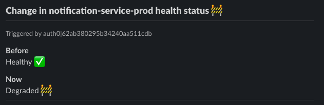

# Changelog Listener

A common use case of Self-Service Actions is listening to changes in the software catalog and reacting to them.

For example:

- When the CPU utilization % of a DB crosses the 80% mark, you might want to trigger a job that closes stale connections, kills stalled queries or just makes sure that everything is behaving correctly.
- When the healthcheck status of a microservice deployment goes from `healthy` to `degraded`, you might want to perform some scale-up or scale-out operation, or maybe send an alert message to the slack channel of the team that owns the microservice to make sure the on-call is aware of the issue.

## Goal

In the following example, you will create a changelog listener that can react to changes in Port in a way that works for you.

To implement the listener, you will use:

- Python with [FastAPI](https://fastapi.tiangolo.com/) - to setup a REST API that will handle webhook requests.
- [Smee.io](https://smee.io) and [pysmee](https://pypi.org/project/pysmee/) - to redirect webhook requests to your local API.
- Port's changelog capabilities - to send an event to your REST API every time something changes in your software catalog.
- Slack webhooks - to send a message to your slack server, alerting your users of the change.

Your API will trigger every time a change happens to your `deploymentConfig` Blueprint, or one of it's Entities.

## Creating a webhook URL with Smee

Go to [smee.io](https://smee.io) and click on `Start a new channel`, you should see your `webhook proxy URL` at the top of the page. You are going to use it to specify the webhook destination in the next section.

## Creating the deployment config Blueprint

A deployment config is used to represent a deployment of a service, in a specific environment in your infrastructure. A deployment config has multiple `deployments` tied to it, each representing a new version of the deployed code of the matching service, in the matching environment.

A deployment config is also just what it sounds like - a `config`, that means it is a good place to store runtime variables and values, links to logging, tracing or dashboard tools and more static data that does not change between deployments.

For this limited example, the `deployment config` Blueprint will include mostly status properties that are likely to change frequently, thus showing Port's changelog listener capabilities:

<details>
<summary>Deployment Config Blueprint JSON</summary>

```json showLineNumbers
{
  "identifier": "DeploymentConfig",
  "title": "Deployment Config",
  "icon": "Microservice",
  "schema": {
    "properties": {
      "healthStatus": {
        "type": "string",
        "title": "Health Status",
        "enum": ["Healthy", "Degraded", "Crashed", "Restarting"],
        "enumColors": {
          "Healthy": "green",
          "Degraded": "orange",
          "Crashed": "red",
          "Restarting": "yellow"
        }
      },
      "cpuUtil": {
        "type": "number",
        "title": "CPU Utilization"
      },
      "memoryUtil": {
        "type": "number",
        "title": "Memory Utilization"
      },
      "newRelicUrl": {
        "type": "string",
        "format": "url",
        "title": "New Relic",
        "description": "Link to the new relic dashboard of the service"
      },
      "sentryUrl": {
        "type": "string",
        "format": "url",
        "title": "Sentry URL",
        "description": "Link to the new sentry dashboard of the service"
      },
      "prometheusUrl": {
        "type": "string",
        "format": "url",
        "title": "Prometheus URL"
      },
      "locked": {
        "type": "boolean",
        "title": "Locked",
        "default": false,
        "description": "Are deployments currently allowed for this configuration",
        "icon": "Lock"
      }
    },
    "required": []
  },
  "mirrorProperties": {},
  "formulaProperties": {},
  "relations": {},
  "changelogDestination": {
    "type": "WEBHOOK",
    "url": "YOUR_WEBHOOK_URL"
  }
}
```

</details>

:::info
Remember that in order to report changelog events to a webhook, the [changelogDestination](../../../platform-overview/port-components/blueprint.md#changelog-destination) key needs to be provided and filled in the Blueprint definition.
:::

In addition, here is a `deployment config` Entity matching the Blueprint schema:

<details>
<summary>Deployment Config Entity JSON</summary>

```json showLineNumbers
{
  "identifier": "notification-service-prod",
  "title": "Notification Service Production",
  "properties": {
    "healthStatus": "Healthy",
    "cpuUtil": 25,
    "memoryUtil": 30,
    "newRelicUrl": "https://newrelic.com",
    "sentryUrl": "https://sentry.io/",
    "prometheusUrl": "https://prometheus.io",
    "locked": false
  },
  "relations": {}
}
```

</details>

Below is a `python` code snippet to create both the deployment config Blueprint and Entity:

:::note
Remember to replace the placeholders for `YOUR_CLIENT_ID`, `YOUR_CLIENT_SECRET` and `YOUR_WEBHOOK_URL` with your Port client ID, secret and your webhook URL (or Smee proxy URL).
:::

<details>
<summary>Click here to see the code</summary>

```python showLineNumbers
import requests

CLIENT_ID = 'YOUR_CLIENT_ID'
CLIENT_SECRET = 'YOUR_CLIENT_SECRET'
WEBHOOK_URL = 'YOUR_WEBHOOK_URL'

API_URL = 'https://api.getport.io/v1'

target_blueprint = 'DeploymentConfig'

credentials = {'clientId': CLIENT_ID, 'clientSecret': CLIENT_SECRET}

token_response = requests.post(f'{API_URL}/auth/access_token', json=credentials)

access_token = token_response.json()['accessToken']

headers = {
    'Authorization': f'Bearer {access_token}'
}

blueprint = {
    "identifier": "DeploymentConfig",
    "title": "Deployment Config",
    "icon": "Microservice",
    "schema": {
        "properties": {
            "healthStatus": {
                "type": "string",
                "title": "Health Status",
                "enum": ["Healthy", "Degraded", "Crashed", "Restarting"],
                "enumColors": {
                    "Healthy": "green",
                    "Degraded": "orange",
                    "Crashed": "red",
                    "Restarting": "yellow"
                }
            },
            "cpuUtil": {
                "type": "number",
                "title": "CPU Utilization"
            },
            "memoryUtil": {
                "type": "number",
                "title": "Memory Utilization"
            },
            "newRelicUrl": {
                "type": "string",
                "format": "url",
                "title": "New Relic",
                "description": "Link to the new relic dashboard of the service"
            },
            "sentryUrl": {
                "type": "string",
                "format": "url",
                "title": "Sentry URL",
                "description": "Link to the new sentry dashboard of the service"
            },
            "prometheusUrl": {
                "type": "string",
                "format": "url",
                "title": "Prometheus URL"
            },
            "locked": {
                "type": "boolean",
                "title": "Locked",
                "default": False,
                "description": "Are deployments currently allowed for this configuration",
                "icon": "Lock"
            }
        },
        "required": []
    },
    "mirrorProperties": {},
    "formulaProperties": {},
    "relations": {},
    "changelogDestination": {
        "type": "WEBHOOK",
        "url": WEBHOOK_URL
    }
}

entity = {
    "identifier": "notification-service-prod",
    "title": "Notification Service Production",
    "properties": {
        "healthStatus": "Healthy",
        "cpuUtil": 25,
        "memoryUtil": 30,
        "newRelicUrl": "https://newrelic.com",
        "sentryUrl": "https://sentry.io/",
        "prometheusUrl": "https://prometheus.io",
        "locked": False
    },
    "relations": {}
}

blueprint_response = requests.post(f'{API_URL}/blueprints', headers=headers, json=blueprint)
print(blueprint_response.json())

entity_response = requests.post(f'{API_URL}/blueprints/{target_blueprint}/entities', json=entity, headers=headers)

print(entity_response.json())
```

</details>

## Setting up a slack webhook

Now head to your [slack apps](https://api.slack.com/apps) page and create a new app (or select one of your existing apps). Then go to the `Incoming Webhooks` page and create a new webhook, you will need to specify a target channel on your server where messages sent to the slack webhook will be delivered.

Copy the webhook URL, you will use it to set up your python FastAPI in the next step.

## Setting up a webhook target

Now you're going to set up a basic API fully ready to receive changelog events from your software catalog in Port.

### Prerequisites

Please use `pip` to install `python` dependencies for the API:

```bash showLineNumbers
pip install fastapi pysmee pydantic uvicorn slack_sdk
```

### Setting up the API

:::tip
All of the code shown below is also available in the [**changelog-listener-example-api**](https://github.com/port-labs/port-changelog-listener-example-api) repository, you can clone it and then replace the `YOUR_CLIENT_ID`, `YOUR_CLIENT_SECRET` and `SLACK_WEBHOOK_URL` placeholders with your Port client ID, secret and the Slack webhook URL you generated in [setting up a slack webhook](#setting-up-a-slack-webhook).
:::

After cloning the repository, you will have the following directory structure:

```
.
├── actions
│   ├── __init__.py
│   └── send_message.py
├── api
│   ├── endpoints
│   │   ├── __init__.py
│   │   └── slack.py
│   ├── __init__.py
│   └── deps.py
├── core
│   ├── __init__.py
│   └── config.py
├── schemas
│   ├── __init__.py
│   └── webhook.py
└── main.py
```

Here is the content of each file:

<details>
<summary>./actions/send_message.py</summary>

````python showLineNumbers title=./actions/send_message.py
from core.config import settings
import logging
from typing import Literal, Union
from slack_sdk.webhook import WebhookClient

logging.basicConfig(level=logging.INFO)
logger = logging.getLogger(__name__)


webhook = WebhookClient(settings.SLACK_WEBHOOK_URL)


def send_message_to_slack(
        event: str, resource_type: str,  status: str, before: dict, after: dict, triggered_by: str):
    try:
        logger.info(f"sending message to slack channel")
        response = webhook.send(
            blocks=[
                {
                    "type": "header",
                    "text": {
                        "type": "plain_text",
                        "text": "Change in Software Catalog :white_check_mark:"
                    }
                },
                {
                    "type": "divider"
                },
                {
                    "type": "context",
                    "elements": [
                        {
                            "type": "mrkdwn",
                            "text": f"Triggered by {triggered_by}"
                        }
                    ]
                },
                {
                    "type": "section",
                    "text": {
                        "type": "mrkdwn",
                        "text": f"*Change type*\n{event}"
                    }
                },
                {
                    "type": "section",
                    "text": {
                        "type": "mrkdwn",
                        "text": f"*Resource type*\n{resource_type}"
                    }
                },
                {
                    "type": "section",
                    "text": {
                        "type": "mrkdwn",
                        "text": f"*Status*\n{status}"
                    }
                },
                {
                    "type": "section",
                    "text": {
                        "type": "mrkdwn",
                        "text": f"*Before*\n```{before}```"
                    }
                },
                {
                    "type": "section",
                    "text": {
                        "type": "mrkdwn",
                        "text": f"*After*\n```{after}```"
                    }
                },
                {
                    "type": "divider"
                }
            ]
        )

        logger.info('message sent')
        return response.status_code
    except Exception as err:
        logger.error(f"error sending message: {err}")
        return 500

````

</details>

<details>
<summary>./api/endpoints/slack.py</summary>

```python showLineNumbers title=./api/endpoints/slack.py
import logging
from fastapi import APIRouter, Depends
from datetime import datetime

from actions import send_message
from api.deps import verify_webhook
from core.config import settings
from schemas.webhook import Webhook

logging.basicConfig(level=logging.INFO)
logger = logging.getLogger(__name__)

router = APIRouter()


@router.post("/slack", dependencies=[Depends(verify_webhook)])
async def handle_changelog_webhook(webhook: Webhook):
    logger.info(f"Webhook body: {webhook}")
    event = webhook.action
    resource_type = webhook.resourceType
    status = webhook.status
    before = webhook.diff.before
    after = webhook.diff.after
    triggered_by = webhook.trigger.by.userId
    response = send_message.send_message_to_slack(event, resource_type, status, before, after, triggered_by)
    return {
        "status": response
    }

```

</details>

<details>
<summary>./api/deps.py</summary>

```python showLineNumbers title=./api/deps.py
import base64
import hashlib
import hmac
from datetime import timedelta, timezone, datetime
from fastapi import Request, Header, HTTPException

from core.config import settings


async def verify_webhook(request: Request, x_port_timestamp: str = Header(), x_port_signature: str = Header()):
    try:
        body = await request.body()
        data = body if isinstance(body, str) else body.decode()
        to_sign = f"{x_port_timestamp}.{data}".encode()
        signature = hmac.new(settings.PORT_CLIENT_SECRET.encode(), to_sign, hashlib.sha256).digest()
        expected_sig = base64.b64encode(signature).decode()
        assert expected_sig == x_port_signature.split(",")[1]

        time_tolerance = timedelta(minutes=5)
        now = datetime.now(tz=timezone.utc)
        timestamp = datetime.fromtimestamp(float(x_port_timestamp) / 1000.0, tz=timezone.utc)
        assert (now - time_tolerance) <= timestamp <= (now + time_tolerance)
    except Exception:
        raise HTTPException(status_code=400, detail="x-port headers invalid")

```

</details>

<details>
<summary>./core/config.py</summary>

```python showLineNumbers title=./core/config.py
from pydantic import BaseSettings


class Settings(BaseSettings):
    PROJECT_NAME = "ChangelogRest"

    API_STR: str = "/api"

    PORT_API_URL: str = "https://api.getport.io/v1"
    PORT_CLIENT_ID: str = 'YOUR_CLIENT_ID'
    PORT_CLIENT_SECRET: str = 'YOUR_CLIENT_SECRET'
    SLACK_WEBHOOK_URL: str = "YOUR_WEBHOOK_URL"

    class Config:
        case_sensitive = True


settings = Settings()

```

</details>

<details>
<summary>./schemas/webhook.py</summary>

```python showLineNumbers title=./schemas/webhook.py
from typing import Optional, Union, Literal
from pydantic import BaseModel
from datetime import datetime


class By(BaseModel):
    orgId: str
    userId: str


class Trigger(BaseModel):
    by: By
    origin: Union[Literal['UI'], Literal['API']]
    at: datetime


class Context(BaseModel):
    blueprint: Optional[str]
    entity: Optional[str]
    runId: Optional[str]


class Before(BaseModel):
    identifier: str
    title: str
    blueprint: str
    properties: dict
    relations: dict
    createdAt: str
    createdBy: str
    updatedAt: str
    updatedBy: str


class After(BaseModel):
    identifier: str
    title: str
    blueprint: str
    properties: dict
    relations: dict
    createdAt: str
    createdBy: str
    updatedAt: str
    updatedBy: str


class Diff(BaseModel):
    before: Optional[Before]
    after: Optional[After]


class Webhook(BaseModel):
    action: Union[Literal['CREATE'], Literal['UPDATE'], Literal['DELETE']]
    resourceType: Union[Literal['run'], Literal['entity'], Literal['blueprint']]
    status: str
    trigger: Trigger
    context: Context
    diff: Diff

```

</details>

<details>
<summary>./main.py</summary>

```python showLineNumbers title=./main.py
import uvicorn
from fastapi import FastAPI

from api.endpoints.slack import router
from core.config import settings

app = FastAPI(
    title=settings.PROJECT_NAME, openapi_url=f"{settings.API_STR}/openapi.json"
)

app.include_router(router, prefix=settings.API_STR)


if __name__ == "__main__":
    uvicorn.run("main:app", host="0.0.0.0", port=80, reload=True)
```

</details>

### Running the API

To run the API, open a new terminal and run the following command in the root directory of the cloned repository:

```bash showLineNumbers
python main.py
```

You will see output similar to this:

```bash showLineNumbers
INFO:     Uvicorn running on http://0.0.0.0:80 (Press CTRL+C to quit)
INFO:uvicorn.error:Uvicorn running on http://0.0.0.0:80 (Press CTRL+C to quit)
INFO:     Started reloader process [32362] using StatReload
INFO:uvicorn.error:Started reloader process [32362] using StatReload
INFO:     Started server process [32364]
INFO:uvicorn.error:Started server process [32364]
INFO:     Waiting for application startup.
INFO:uvicorn.error:Waiting for application startup.
INFO:     Application startup complete.
INFO:uvicorn.error:Application startup complete.
```

### Directing the webhook to the API

To redirect webhook triggers to your local API, open a new terminal and run the following command (replace `YOUR_WEBHOOK_URL` with the `Smee proxy URL`):

```bash showLineNumbers
pysmee forward YOUR_WEBHOOK_URL http://localhost:80/api/slack
```

## Watching change events in your slack channel

To see the result of your API, either create, update or delete a deployment config Entity.

:::tip
Remember that you can make changes to Entities both from the [UI](../../entity-basics.md#from-the-ui) and from the [API](../../entity-basics.md#from-the-api).
:::

After making a change, you should see a new message in the slack channel you chose when you created the slack webhook. For example, here is the message that is sent when updating an existing Entity:



## Summary

This example shows you the power of Port's changelog capabilities.

The action taken in this guide is informative and does not perform any change in your infrastructure, but it can be adapted to:

- Provision more cloud resources;
- Perform a scale-up action;
- Alert the on-call;
- etc.
