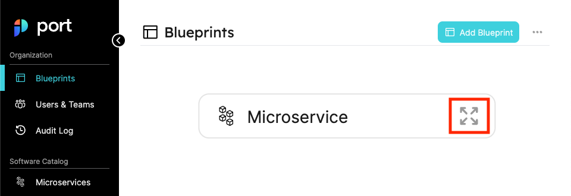
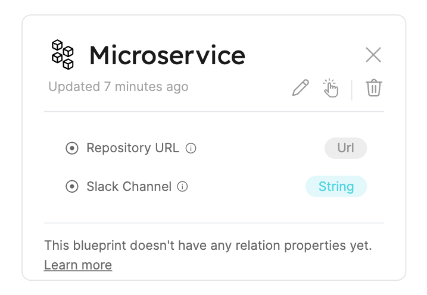
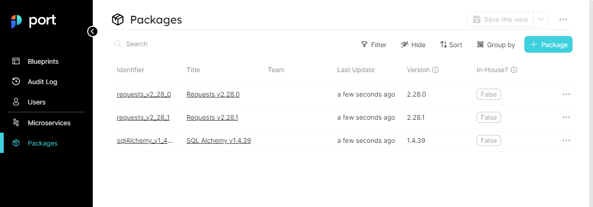
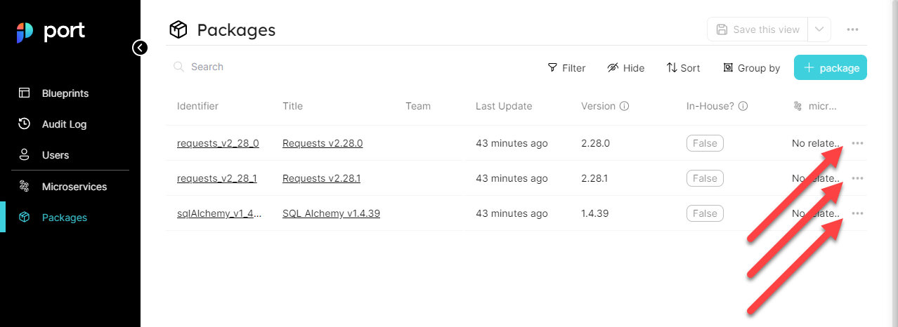
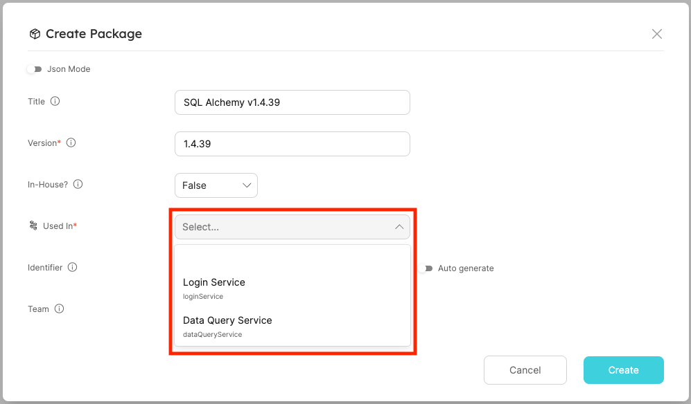
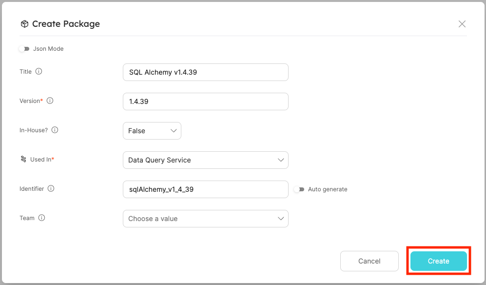

# Quickstart

## What is Port?

**Port** is a Developer Platform meant to make life easier for Developers and DevOps in an organization, by creating a single Platform that acts as a Source-Of-Truth for all of the infrastructure assets and operations that happen in the organization's tech stack.

Port then allows engineers to perform actions on these assets in a self-service fashion. From provisioning a Dev Environment, Understanding who is the owner of a Microservice, or any unique use case DevOps want to self-serve and automate.

### Port helps you to:

* Create a **comprehensive catalog** by mapping all your software and infrastructure components (microservices, monoliths, deployments, repos, databases, and more) and see all of them in one place
* Make your **catalog active** by assigning to it actions that can be used by you and your internal customers, while ensuring unified standards and governance over the processes inside your organization

Port's 3 core building blocks are *Blueprints*, *Entities* and *Relations*. This tutorial will walk you through your first steps on the platform and get you started on your DevPortal journey!🚢 

## Define a blueprint

We use Blueprints to model our data in Port. A Blueprint allows us to define what properties and fields an *Entity* will have.

In Port, you control how the data looks, any data format you can think of can be represented.

We know that every organization is a snowflake, and everybody have their own preferences and standards for representing their data and asset structure, we choose the **Blueprints** approach to enable that.

but for now, let's start with a simple example:

In your organization you are using a `Microservice` architecture, and different Microservices are using `Packages` to manage the different code pieces reused by different Microservices.

You want to manage your **Software Catalgo** in Port, and in order to do that You want to ingest and track your `Microservices`, and you also want to track which `Package` version is used in which Microservice, and which `Package` is used in multiple Microservices.

Let's head to [Port](https://app.getport.io/blueprints) and look at the Blueprints page, at the top right corner let's click on **New Blueprint** and configure our first blueprint - **Microservice** as shown in the image below:


After clicking the button, you should see a creation form similar to what is shown in the image below:


Our Microservice Blueprint is going to include the following properties:

- **Repo** - A URL to the source code repository storing the code for the Microservice
- **Slack Channel** - A URL to the Slack Channel of the team responsible for the Microservice

:::note
Don't worry if you feel like the `Microservice` blueprint should include more properties, you can always go back and add or remove properties later. 
:::

In order to create a Blueprint with the following properties, we will use the following JSON body:

```json
{
    "identifier": "microservice",
    "title": "Microservice",
    "icon": "Microservice",
    "dataSource": "Port",
    "formulaProperties": {},
    "schema": {
        "properties": {
            "slackChannel": {
                "type": "string",
                "title": "Slack Channel",
                "description": "The channel of the microservice\\'s maintainers"
            },
            "repoUrl": {
                "type": "string",
                "format": "url",
                "title": "Repository URL",
                "description": "A URL to the Git repository of the microservice"
            }
        },
        "required": []
    }
}
```

Click on the `save` button, and you should see your new Blueprint in the Blueprints graph:


If you click on the `expand` button as shown in the image below:



You should see an expanded view of the blueprint we just created, with all of the properties listed alongside the types we provided for them:



Congratulations! you have just created your first Blueprint! 🎉

In the next part, we will start creating `Entities` that match this new Blueprint, and we will see our **Software Catalog** coming together!

## Create your first entities

Now that we have a Blueprint for `Microservice`, we can add some *Entities*.

An **Entity** is an actual object that is of the type of a certain Blueprint. In our instance, every entity we create under the Microservice blueprint, is a Microservice in our organization.

Let's create our first Entity to make things clearer, In the sidebar on the left side of the page, you can already see the **Microservices** page, so let's click on it:


You should arrive at the Microservices page, now let's create a new Microservice **Entity** by clicking the `+ Microservice` button:


After clicking the button we should see a form to add a new Microservice, let's fill it up with the following details:

```
Title: Login Service
Team: - leave blank -
# For identifier, click on the "Auto generate" toggle to enter a custom identifier
Identifier: loginService
slackChannel: #login-service
repoUrl: https://www.github.com
```

After filling all of these details, your creation page should look like this:


You can go ahead and press the `Create` button at the bottom right corner (as shown in the image above), and you should see your new Microservice in the Microservices page:


Let's repeat the process again, click on the `+ Microservice` again, but this time let's add an entity using JSON by clicking the `Json Mode` button:


After clicking the button, you will have a JSON editor similar to the one we saw in the blueprints page, paste in the following content:

```json
{
    "identifier": "dataQueryService",
    "title": "Data Query Service",
    "team": "",
    "blueprint": "microservice",
    "properties": {
        "slackChannel": "#data-query",
        "repoUrl": "https://www.github.com"
    },
    "relations": {}
}
```

Then click on the create button at the bottom right corner:


Now you should see your 2 Microservices displayed in the page like shown in the image below:


Amazing! You have just created 2 awesome entities 🎉

As you can probably realize, we use Blueprints to define our data models, and Entities to store actual objects with data.

In the next part, we will look at our last building block - **Relations**, so let's get to it.

## Create a relation

A **Relation** allows us to create a connection between two Blueprints and the entities that are based on them. Using Relations we are able to create a dependency graph between multiple entities, allowing us to query our data more easily, and also view all related entities from a single simplified page.

Currently our Software Catalog only has Microservices, but everybody knows a Microservice uses all sorts of packages and libraries, our `Package` Blueprint will have the following fields:

- **Version** - The version of the package
- **In-House** - Whether the package was developed in house or is it external

In addition, this time we will mark the `version` field as `required`, so we can make sure that our package has a version value.

 so let's go ahead and create an **Package Blueprint**:

- Go back to the Blueprints page
- Click on the New Blueprint button
- Paste in the content shown below and then click create:

```json
{
    "identifier": "package",
    "title": "Package",
    "icon": "Package",
    "dataSource": "Port",
    "formulaProperties": {},
    "schema": {
        "properties": {
            "version": {
                "type": "string",
                "title": "Version",
                "description": "The version of the package"
            },
            "inHouse": {
                "type": "boolean",
                "title": "In-House?",
                "description": "Whether the package was developed in house"
            }
        },
        "required": ["version"]
    }
}
```

:::tip
**Remember**, if you are having trouble at any point, we performed the exact same steps with the **Microservice** Blueprint in the [Define a Blueprint section](#define-a-blueprint), so you can just go back to that part as reference.
:::

After you're finished, your blueprints page should look like this:


Next, we will create 3 packages to go with our microservices, in order to do that we'll go to the newly created **Packages** page, and create them using the JSON bodies written below (remember that you can also create the new packages from the UI, JSON is a bit faster when you already know the contents of your new entity):

**Requests 2.28.1 Package**

```json
{
    "identifier": "requests_v2_28_1",
    "title": "Requests v2.28.1",
    "team": "",
    "blueprint": "package",
    "properties": {
        "version": "2.28.1",
        "inHouse": false
    },
    "relations": {}
}
```

**Requests 2.28.0 Package**

```json
{
    "identifier": "requests_v2_28_0",
    "title": "Requests v2.28.0",
    "team": "",
    "blueprint": "package",
    "properties": {
        "version": "2.28.0",
        "inHouse": false
    },
    "relations": {}
}
```

**SQLAlchemy Package**

```json
{
    "identifier": "sqlAlchemy_v1_4_39",
    "title": "SQL Alchemy v1.4.39",
    "team": "",
    "blueprint": "package",
    "properties": {
        "version": "1.4.39",
        "inHouse": false
    },
    "relations": {}
}
```

In case you need a reminder on how to create both of these **Package Entities**, refer to the following steps:

- Go to the Packages page
- Click on the `+ Package` button
- Paste in (or manually type) the contents of the two engines and then click create

:::tip
If you are still having trouble, refer back to the [Create Your First Entities](#create-your-first-entities) section
:::

After you're finished, your Packages page should look like this:



Now that we have 2 Blueprints with Entities to match, we can create a relation between them.

:::info
Remember that our goal is to know which `Packages` are used in each `Microservice`, so that is exactly the relation we are going to create now
:::

### Package to Microservice relation

Our microservices need packages, so the relation we will map is one where a Package is **Used In** a Microservice, in order to create that relation, let's follow these steps:

Go to the Blueprints page and click on the `New Blueprints Relation` button like show below:


In the creation form that appears, paste in the following content:

```json
{
    "title": "Used In",
    "identifier": "package-to-microservice",
    "source": "package",
    "target": "microservice",
    "required": true,
    "many": false
}
```

Then click the `save` button at the bottom right corner, as shown in the image below:


Now your Blueprints graph should look like this:


:::note
Look at the dependency graph we just got, a **Package Entity is used in a Microservice Entity**, we modeled the relationship between our Blueprints in a way that shows which blueprint depends on the other.
:::

Now that we have a relationship, it's time to use it to show which Package is used in which Microservice

### Mapping Packages to Microservices

To use our new relations, we will go back to the **Packages** page.

We already have 2 packages that we use in our for our **Data Query Service** - those are `SQL Alchemy v1.4.39` and `Requests v2.28.1`.

We also know that the `Requests v2.28.0` is used in our `Login Service`.

At the right side of the page you should see 3 dots (`...`) in the line that matches each package like shown below:



Click on the 3 dots in the line of the `SQL Alchemy v1.4.39` package and you should see a menu with an option that says `Show all Properties`, as shown below:


Click on that option and you will once again see the form to edit the details of our `SQL Alchemy v1.4.39` package, this time you will see a new section at the bottom of the form that says `Relations` and a drop-down list which after clicking shows you the available microservices:



Select the `Data Query Service` option from the drop-down list and then click on the `Update` button:



Repeat the same process, only this time select the `Requests v2.28.1` package from the table, and in the relations drop-down, once again select the `Data Query Service` Microservice then click `update`.

And finally, select the `Requests v2.28.0` package, and in the relations drop-down, select the `Login Service` Microservice and then click `update`.

After attaching the Packages to the Microservices, your packages page should look like this (notice the marked column and its values):


Click on the `Data Query Service` link in the marked column and you will see what we call the **Specific Entity Page**, this page allows you to see the complete details and dependency graph of a specific entity.


:::info
In our case, the specific entity page for a Microservice, will also show us all of the Packages that it uses, because that is the relation we mapped.
:::

feel free to continue exploring the specific entity page and also the Packages and Microservices pages, notice the `Filter`, `Hide`, `Sort` and `Group By` controls you can find at the top right of Port's table widgets.

## What now?

Congratulations! you just modeled your first environment in Port! 🎉🚢

This quickstart was used to teach you the basic building blocks Port provides, now you have all the tools you need to get started cataloging and tracking your environment!

You can begin creating Blueprints that describe your `Services`, `Applications`, `Clusters`, `Infrastructure resources`.

:::tip Reuse or Restart?
Remember that the blueprints, entities and relations we created here were used as a basic example, but Port always allows you to go back and edit them until they match the infrastructure you want to catalog.

And if you want to do something completely different, you can simply delete what we created here, and start mapping things out exactly the way you want to
:::

### Recommended next steps

:::tip
These suggestions show the basic steps in creating your very own Developer Portal, if you want to learn more about Port before starting your DevPortal journey, look at [Diving deeper](#diving-deeper) or [Using the API](#using-the-api) below.
:::

1. Create [Blueprints](../setup-your-port/setup-catalog/blueprints) for your software and infrastructure components
2. Map out the [Relations](../setup-your-port/setup-catalog/relations) between your Blueprints
3. Ingest data to your catalog by creating [Entities](../setup-your-port/setup-catalog/entities) based on your Blueprints via Port's UI or using our API
4. Define Actions that can be used by you and your developers

### Diving deeper

If you want to learn more about Port's capabilities in a specific area, you can check out any of these resources:

- [Blueprints Deep Dive](../setup-your-port/setup-catalog/blueprints)
- [Relations Deep Dive](../setup-your-port/setup-catalog/relations)
- [Entities Deep Dive](../setup-your-port/setup-catalog/entities)
- [Pages Deep Dive](../setup-your-port/setup-catalog/pages)
- Mirror Properties Deep Dive

### Using the API

If you want to take advantage of Port's REST API Interface, take a look at these resources:

- API At a Glance
- Port API Reference
